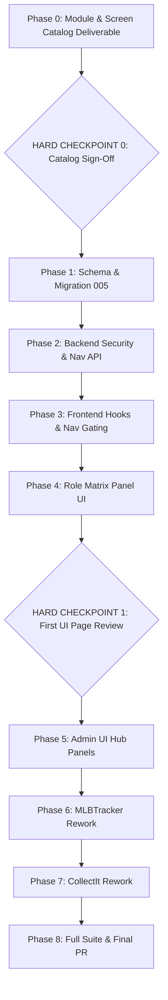

# Granular Security Model & Dynamic Navigation Implementation Plan

> **For agentic workers:** REQUIRED SUB-SKILL: Use `superpowers:subagent-driven-development` (recommended) or `superpowers:executing-plans` to implement this plan task-by-task. Steps use checkbox (`- [ ]`) syntax for tracking.

**Goal:** Implement a comprehensive granular authorization engine (`can_view`, `can_update`, `can_delete`, `can_execute`), dynamic menu navigation configuration with audit tracking, and a full Admin Security Hub across `bedrock`, `MLBTracker`, and `CollectIt`.

**Architecture:** 
Database-driven role-module capability matrix with tri-state per-user overrides (`NULL` = inherit, `1` = grant, `0` = deny) and dynamic navigation customizations. Backed by FastAPI route dependencies (`require_permission`) and React hooks/guards (`useSecurity`, `ProtectedRoute`, `AppSidebar`, `<Can>`). Admin UI delivers 5 integrated panels including an interactive capability matrix and dynamic menu navigation editor.

**Tech Stack:** Python 3.11, FastAPI, SQLite, Pydantic v2, TypeScript 5, React 18, TanStack Query v5, Tailwind CSS v4, Lucide React, Pytest, Vitest.

**Spec:** [`docs/superpowers/specs/2026-08-28-granular-security-model-design.md`](file:///C:/Dev/bedrock/docs/superpowers/specs/2026-08-28-granular-security-model-design.md)

---

## Global Constraints & Standards

- **§S1 (Bedrock UI Barrel Export)**: All platform UI components must be imported strictly from `@djntechnic/bedrock-ui`. Zero duplicated UI primitives in consumer repos.
- **§S2 (SQL `%s` Syntax)**: All SQLite queries in Python must use `%s` parameter syntax, never `?` (DatabaseManager rewrites dynamically).
- **§S7 (Schema Catalog)**: Zero bare string table names in application code. All table references must use `Tables as T` from `bedrock.core.schema_catalog` (or consumer catalog).
- **Audit Columns Invariant**: All in-scope tables (`auth_roles`, `auth_modules`, `auth_role_modules`, `auth_user_module_overrides`, `auth_user_roles`, `app_nav_item_settings`) must include `created_at`, `created_by`, `modified_at`, and `modified_by`.
- **Eager Import Rule**: Extension point registrations must execute as module import side-effects, never inside lifespan hooks.
- **Navigation Invariant**: Menu options for unauthorized pages must be completely hidden (not merely disabled). Direct URL access must be blocked with an in-place `<PermissionDenied>` screen.

---

## Agent Persona & Model Allocation Strategy

| Subsystem / Task Phase | Recommended Model | Thinking Level | Rationale |
| :--- | :--- | :--- | :--- |
| **Phase 0: Module/Screen Catalog Deliverable** | Claude 3.7 Sonnet / Gemini 3.7 Flash | High | Detailed cross-repo functional mapping & taxonomy |
| **Phase 1: Database & Migration 005** | Gemini 3.7 Flash | Medium | Precision SQL DDL, baseline updates, catalog synchronization |
| **Phase 2: Backend Security Engine & APIs** | Claude 3.7 Sonnet / Opus 4.6 | High | Multi-role bitwise resolution, tri-state overrides, route dependencies |
| **Phase 3: Frontend Primitives & Gating** | Claude 3.7 Sonnet / Gemini 3.7 Flash | High | TanStack caching, React tree pruning, route interception |
| **Phase 4: Admin UI Page 1 (Role Matrix)** | Claude 3.7 Sonnet | High | Interactive matrix state management, batch diffs, UI Polish |
| **Phase 5: Remaining Admin UI Panels** | Claude 3.7 Sonnet / Gemini 3.7 Flash | High | Navigation tree editor, User overrides drawer, Profile inspector |
| **Phase 6 & 7: Consumer Rework (MLB & CollectIt)**| Gemini 3.7 Flash | Medium | Systematic route & navigation migration across consumer repos |
| **Phase 8: Full Test Suite & Verification** | Gemini 3.7 Flash | High | End-to-end integration tests, linting, and PR audit gates |

---

## Task Decomposition & Execution Stages



---

### Phase 0: Module & Screen Catalog Specification Deliverable

#### Task 0.1: Detailed Cross-Repository Module & Screen Catalog
**Files:**
- Create: `docs/superpowers/specs/module-screen-catalog.md`

**Interfaces:**
- Produces: Exhaustive mapping of all modules, screens, URL paths, action requirements (`view` | `update` | `delete` | `execute`), API endpoint paths, and default role grants across `Bedrock`, `MLBTracker`, and `CollectIt`.

- [ ] **Step 1: Perform audit of all routes across Bedrock, MLBTracker, and CollectIt**
Scan FastAPI routers and React route trees to ensure zero orphaned pages or endpoints.

- [ ] **Step 2: Generate the detailed `module-screen-catalog.md` document**
Document each module's slug, display name, description, exact route paths, action requirements, API endpoint bindings, and baseline role access.

- [ ] **Step 3: Commit catalog document**
```bash
git add docs/superpowers/specs/module-screen-catalog.md
git commit -m "docs(security): add comprehensive module and screen catalog deliverable"
```

---

### 🛑 HARD CHECKPOINT 0: Human Partner Approval Gate of Module & Screen Catalog
> [!IMPORTANT]
> **Approval Gate**: Stop execution here. Present the comprehensive `module-screen-catalog.md` deliverable to the human partner for review. Implementation of database migrations (Phase 1) and downstream consumer rework (Phases 6 & 7) will only proceed upon explicit sign-off of this catalog.

---

### Phase 1: Database Schema, Baseline & Migration 005

#### Task 1.1: Migration 005 & Baseline Schema Updates
**Files:**
- Create: `packages/bedrock-api/bedrock/schema/migrations/005_granular_security_and_nav_model.sql`
- Modify: `packages/bedrock-api/bedrock/schema/baseline.sql`
- Modify: `packages/bedrock-api/bedrock/schema/seed.sql`
- Modify: `packages/bedrock-api/bedrock/core/schema_catalog.py`
- Test: `packages/bedrock-api/tests/test_platform_migrations.py`

**Interfaces:**
- Consumes: Approved catalog from Phase 0.
- Produces: `T.APP_NAV_ITEM_SETTINGS`, updated `T.AUTH_ROLE_MODULES`, updated `T.AUTH_USER_MODULE_OVERRIDES`, updated `T.AUTH_ROLES`, updated `T.AUTH_MODULES`, updated `T.AUTH_USER_ROLES` with full audit columns (`created_at`, `created_by`, `modified_at`, `modified_by`).

- [ ] **Step 1: Write failing test for Migration 005 & Schema Catalog**
```python
# packages/bedrock-api/tests/test_migration_005.py
from bedrock.core.database import db
from bedrock.core.schema_catalog import Tables as T

def test_migration_005_tables_and_columns(test_db):
    cols_rm = [r["name"] for r in test_db.query(f"PRAGMA table_info({T.AUTH_ROLE_MODULES})").to_dict(orient="records")]
    assert "can_view" in cols_rm
    assert "can_update" in cols_rm
    assert "can_delete" in cols_rm
    assert "can_execute" in cols_rm
    assert "created_by" in cols_rm
    assert "modified_by" in cols_rm

    cols_nav = [r["name"] for r in test_db.query(f"PRAGMA table_info({T.APP_NAV_ITEM_SETTINGS})").to_dict(orient="records")]
    assert "nav_key" in cols_nav
    assert "sort_order" in cols_nav
    assert "label_override" in cols_nav
    assert "icon_override" in cols_nav
```

- [ ] **Step 2: Run test to verify it fails**
Run: `pytest packages/bedrock-api/tests/test_migration_005.py -v`
Expected: FAIL (table/columns missing)

- [ ] **Step 3: Implement Migration 005, Baseline, Seed & Schema Catalog**
Write SQL migration in `005_granular_security_and_nav_model.sql` and update `baseline.sql`, `seed.sql`, and `schema_catalog.py` to register `APP_NAV_ITEM_SETTINGS` and updated column structures.

- [ ] **Step 4: Run test to verify it passes**
Run: `pytest packages/bedrock-api/tests/test_migration_005.py packages/bedrock-api/tests/test_platform_migrations.py -v`
Expected: PASS

- [ ] **Step 5: Commit**
```bash
git add packages/bedrock-api/bedrock/schema/ packages/bedrock-api/bedrock/core/schema_catalog.py packages/bedrock-api/tests/
git commit -m "feat(schema): add migration 005 for granular security and nav settings"
```

---

### Phase 2: Backend Security Engine, Dependencies & Navigation Service

#### Task 2.1: Granular Security Service
**Files:**
- Create: `packages/bedrock-api/bedrock/services/security_service.py`
- Test: `packages/bedrock-api/tests/test_security_service.py`

**Interfaces:**
- Consumes: `Tables as T`, `db` from `bedrock.core.database`.
- Produces: `resolve_user_permissions(user_id: int | None, *, is_superuser: bool = False) -> dict[str, dict[str, bool]]`, `set_user_override(...)`, `update_role_matrix(...)`, `create_custom_role(...)`.

- [ ] **Step 1: Write failing test for Security Service resolution**
```python
# packages/bedrock-api/tests/test_security_service.py
from bedrock.services import security_service as ss

def test_resolve_user_permissions_multi_role_union(test_db):
    # Setup user with 2 roles: viewer (view=1) and custom_importer (execute=1)
    perms = ss.resolve_user_permissions(user_id=42)
    assert perms["inventory"]["view"] is True
    assert perms["inventory"]["execute"] is True
    assert perms["inventory"]["update"] is False

def test_resolve_user_permissions_tri_state_overrides(test_db):
    # Setup override: update=1 (grant), view=0 (deny)
    perms = ss.resolve_user_permissions(user_id=42)
    assert perms["inventory"]["update"] is True
    assert perms["inventory"]["view"] is False
```

- [ ] **Step 2: Run test to verify it fails**
Run: `pytest packages/bedrock-api/tests/test_security_service.py -v`
Expected: FAIL

- [ ] **Step 3: Implement `security_service.py`**
Implement permission resolution formula:
1. Superuser / Admin role bypass $\to$ all `True`.
2. Anonymous (user_id is None) $\to$ `anon` role permissions in `auth_role_modules`.
3. Multi-role bitwise OR across `auth_user_roles` $\times$ `auth_role_modules`.
4. Apply non-null tri-state user overrides from `auth_user_module_overrides`.

- [ ] **Step 4: Run test to verify it passes**
Run: `pytest packages/bedrock-api/tests/test_security_service.py -v`
Expected: PASS

- [ ] **Step 5: Commit**
```bash
git add packages/bedrock-api/bedrock/services/security_service.py packages/bedrock-api/tests/test_security_service.py
git commit -m "feat(api): implement granular security resolution service"
```

---

#### Task 2.2: FastAPI Authorization Dependency `require_permission`
**Files:**
- Modify: `packages/bedrock-api/bedrock/dependencies.py`
- Test: `packages/bedrock-api/tests/test_dependencies.py`

**Interfaces:**
- Consumes: `security_service`, `oauth2_scheme`, `auth_activity_service`.
- Produces: `require_permission(module: str, action: Literal["view", "update", "delete", "execute"] = "view", *, allow_anon: bool = False)`.

- [ ] **Step 1: Write failing test for `require_permission`**
```python
# packages/bedrock-api/tests/test_dependencies.py
from fastapi import FastAPI, Depends
from fastapi.testclient import TestClient
from bedrock.dependencies import require_permission

app = FastAPI()
@app.get("/test/execute", dependencies=[require_permission("inventory", "execute")])
def execute_endpoint():
    return {"status": "ok"}
```

- [ ] **Step 2: Run test to verify it fails**
Run: `pytest packages/bedrock-api/tests/test_dependencies.py -v`
Expected: FAIL

- [ ] **Step 3: Implement `require_permission` in `dependencies.py`**
Include real IP client extraction from `request.headers.get('x-forwarded-for', request.client.host)` and security denial audit logging to `auth_activity_log`.

- [ ] **Step 4: Run test to verify it passes**
Run: `pytest packages/bedrock-api/tests/test_dependencies.py -v`
Expected: PASS

- [ ] **Step 5: Commit**
```bash
git add packages/bedrock-api/bedrock/dependencies.py packages/bedrock-api/tests/test_dependencies.py
git commit -m "feat(api): add require_permission FastAPI dependency"
```

---

#### Task 2.3: Security & Navigation API Routes
**Files:**
- Create: `packages/bedrock-api/bedrock/routes/security.py`
- Create: `packages/bedrock-api/bedrock/routes/navigation.py`
- Create: `packages/bedrock-api/bedrock/services/nav_service.py`
- Modify: `packages/bedrock-api/bedrock/core/app_factory.py`
- Test: `packages/bedrock-api/tests/test_security_routes.py`
- Test: `packages/bedrock-api/tests/test_nav_routes.py`

- [ ] **Step 1: Write failing tests for security & nav endpoints**
- [ ] **Step 2: Run tests to verify they fail**
- [ ] **Step 3: Implement `security.py`, `navigation.py`, and `nav_service.py`**
- [ ] **Step 4: Mount routers in `app_factory.py` and run tests**
- [ ] **Step 5: Commit**
```bash
git add packages/bedrock-api/bedrock/routes/ packages/bedrock-api/bedrock/services/nav_service.py packages/bedrock-api/bedrock/core/app_factory.py packages/bedrock-api/tests/
git commit -m "feat(api): add security and navigation REST endpoints"
```

---

### Phase 3: Frontend Platform Hooks & Navigation Primitives

#### Task 3.1: React Security Hook `useSecurity.ts`
**Files:**
- Create: `packages/bedrock-ui/src/hooks/useSecurity.ts`
- Modify: `packages/bedrock-ui/src/hooks/queryKeys.ts`
- Test: `packages/bedrock-ui/src/hooks/useSecurity.test.ts`

- [ ] **Step 1: Write failing tests for `useSecurity`**
- [ ] **Step 2: Run tests to verify they fail**
- [ ] **Step 3: Implement `useSecurity` hook**
- [ ] **Step 4: Run tests to verify they pass**
- [ ] **Step 5: Commit**
```bash
git add packages/bedrock-ui/src/hooks/ packages/bedrock-ui/src/hooks/queryKeys.ts
git commit -m "feat(ui): add useSecurity hook and queryKeys"
```

---

#### Task 3.2: Dynamic Navigation Primitives & AppSidebar Gating
**Files:**
- Modify: `packages/bedrock-ui/src/components/navRegistry.ts`
- Modify: `packages/bedrock-ui/src/components/AppSidebar.tsx`
- Modify: `packages/bedrock-ui/src/components/ProtectedRoute.tsx`
- Create: `packages/bedrock-ui/src/components/PermissionDenied.tsx`
- Create: `packages/bedrock-ui/src/components/Can.tsx`
- Create: `packages/bedrock-ui/src/components/PermissionButton.tsx`
- Test: `packages/bedrock-ui/src/components/navRegistry.test.ts`
- Test: `packages/bedrock-ui/src/components/ProtectedRoute.test.tsx`

- [ ] **Step 1: Write failing tests for navigation hiding and route protection**
- [ ] **Step 2: Run tests to verify they fail**
- [ ] **Step 3: Implement nav filtering, `PermissionDenied`, and UI guards**
- [ ] **Step 4: Run tests to verify they pass**
- [ ] **Step 5: Commit**
```bash
git add packages/bedrock-ui/src/components/ packages/bedrock-ui/src/
git commit -m "feat(ui): implement dynamic nav gating, ProtectedRoute, and Can primitives"
```

---

### Phase 4: Admin UI Page 1 — Role Permissions Matrix

#### Task 4.1: Role Matrix Panel (`RoleMatrixPanel.tsx`)
**Files:**
- Create: `packages/bedrock-ui/src/components/admin/RoleMatrixPanel.tsx`
- Create: `packages/bedrock-ui/src/components/admin/AddRoleModal.tsx`
- Modify: `packages/bedrock-ui/src/hooks/useAdminPlatform.ts`
- Test: `packages/bedrock-ui/src/components/admin/RoleMatrixPanel.test.tsx`

- [ ] **Step 1: Write failing tests for Role Matrix UI**
```tsx
// packages/bedrock-ui/src/components/admin/RoleMatrixPanel.test.tsx
import { render, screen, fireEvent } from "@testing-library/react";
import RoleMatrixPanel from "./RoleMatrixPanel";

test("renders modules and roles matrix with 4 capability toggles", async () => {
    render(<RoleMatrixPanel />);
    expect(await screen.findByText("Role Permissions Matrix")).toBeInTheDocument();
    expect(screen.getByTestId("cell-inventory-member-execute")).toBeInTheDocument();
});
```

- [ ] **Step 2: Run test to verify it fails**
Run: `npm test RoleMatrixPanel.test.tsx` (in packages/bedrock-ui)
Expected: FAIL

- [ ] **Step 3: Implement `RoleMatrixPanel.tsx` & `AddRoleModal.tsx`**
Interactive matrix with `[V] [U] [D] [E]` toggles, batch diff tracking, atomic save, and custom role creation.

- [ ] **Step 4: Run tests to verify they pass**
Run: `npm test packages/bedrock-ui/src/components/admin/RoleMatrixPanel.test.tsx`
Expected: PASS

- [ ] **Step 5: Commit**
```bash
git add packages/bedrock-ui/src/components/admin/ packages/bedrock-ui/src/hooks/
git commit -m "feat(ui): add RoleMatrixPanel and AddRoleModal in Admin UI"
```

---

### 🛑 HARD CHECKPOINT 1: Human Partner Review Gate of First UI Page
> [!IMPORTANT]
> **Approval Gate**: Stop here and present the completed `RoleMatrixPanel.tsx` and its interactive capabilities to the user for direct review and feedback before proceeding to the remaining admin screens.

---

### Phase 5: Remaining Admin UI Hub Panels

#### Task 5.1: User Accounts & Granular Overrides Drawer
**Files:**
- Create: `packages/bedrock-ui/src/components/admin/UserPermissionsDrawer.tsx`
- Modify: `packages/bedrock-ui/src/components/admin/UsersPanel.tsx`
- Test: `packages/bedrock-ui/src/components/admin/UsersPanel.test.tsx`

- [ ] **Step 1: Write failing tests for User Overrides Drawer**
- [ ] **Step 2: Implement `UserPermissionsDrawer.tsx` with tri-state toggles (Inherit / Grant / Deny)**
- [ ] **Step 3: Run tests and verify**
- [ ] **Step 4: Commit**
```bash
git add packages/bedrock-ui/src/components/admin/
git commit -m "feat(ui): add UserPermissionsDrawer for granular tri-state overrides"
```

---

#### Task 5.2: Compiled User Access Profile Inspector
**Files:**
- Create: `packages/bedrock-ui/src/components/admin/UserAccessProfileView.tsx`
- Modify: `packages/bedrock-ui/src/components/admin/ProfilePage.tsx`
- Test: `packages/bedrock-ui/src/components/admin/UserAccessProfileView.test.tsx`

- [ ] **Step 1: Write failing tests for Access Profile Inspector**
- [ ] **Step 2: Implement read-only compiled screen & action permission inspector**
- [ ] **Step 3: Run tests and verify**
- [ ] **Step 4: Commit**
```bash
git add packages/bedrock-ui/src/components/admin/
git commit -m "feat(ui): add UserAccessProfileView read-only compiled inspector"
```

---

#### Task 5.3: Dynamic Menu Navigation Editor Panel
**Files:**
- Create: `packages/bedrock-ui/src/components/admin/NavEditorPanel.tsx`
- Test: `packages/bedrock-ui/src/components/admin/NavEditorPanel.test.tsx`

- [ ] **Step 1: Write failing tests for Navigation Editor**
- [ ] **Step 2: Implement `NavEditorPanel.tsx` (drag/drop reordering, label/icon/tooltip overrides)**
- [ ] **Step 3: Run tests and verify**
- [ ] **Step 4: Commit**
```bash
git add packages/bedrock-ui/src/components/admin/NavEditorPanel.tsx packages/bedrock-ui/src/components/admin/NavEditorPanel.test.tsx
git commit -m "feat(ui): add NavEditorPanel for dynamic menu customization"
```

---

#### Task 5.4: Module Registry & Security Log Enhancements
**Files:**
- Create: `packages/bedrock-ui/src/components/admin/ModulesPanel.tsx`
- Modify: `packages/bedrock-ui/src/components/admin/SecurityLogViewer.tsx`
- Modify: `packages/bedrock-ui/src/index.ts` (barrel exports)
- Test: `packages/bedrock-ui/src/components/admin/adminScreens.test.tsx`

- [ ] **Step 1: Write failing tests for Modules panel and IP tracking log viewer**
- [ ] **Step 2: Implement `ModulesPanel.tsx` and update `SecurityLogViewer.tsx` with IP filters**
- [ ] **Step 3: Update barrel exports in `index.ts` and verify build**
- [ ] **Step 4: Commit**
```bash
git add packages/bedrock-ui/src/components/admin/ packages/bedrock-ui/src/index.ts
git commit -m "feat(ui): add ModulesPanel and enhanced SecurityLogViewer with IP tracking"
```

---

### Phase 6: Downstream Consumer Rework — MLBTracker

#### Task 6.1: MLBTracker Migration, Navigation & Route Protection
**Files:**
- Modify: `C:/Dev/MLBTracker/migrations/` (new migration for module seeds)
- Modify: `C:/Dev/MLBTracker/frontend/src/components/domain/navigation.ts`
- Modify: `C:/Dev/MLBTracker/frontend/src/App.tsx`
- Modify: `C:/Dev/MLBTracker/api/routes/`
- Test: `C:/Dev/MLBTracker/api/tests/`
- Test: `C:/Dev/MLBTracker/frontend/src/`

- [ ] **Step 1: Write MLBTracker migration seeding modules & default role-module capabilities**
- [ ] **Step 2: Update `MLBTracker/frontend/src/components/domain/navigation.ts` with granular action tags**
- [ ] **Step 3: Wrap routes in `<ProtectedRoute module="..." action="...">`**
- [ ] **Step 4: Update backend routes to enforce `require_permission(...)`**
- [ ] **Step 5: Run MLBTracker test suites and commit**
```bash
cd C:/Dev/MLBTracker && git add . && git commit -m "feat(security): implement granular security model and navigation in MLBTracker"
```

---

### Phase 7: Downstream Consumer Rework — CollectIt

#### Task 7.1: CollectIt Migration, Navigation & Route Protection
**Files:**
- Modify: `C:/Dev/CollectIt/migrations/` (new migration for module seeds)
- Modify: `C:/Dev/CollectIt/frontend/src/components/navigation.ts`
- Modify: `C:/Dev/CollectIt/frontend/src/App.tsx`
- Modify: `C:/Dev/CollectIt/api/routes/`
- Test: `C:/Dev/CollectIt/api/tests/`
- Test: `C:/Dev/CollectIt/frontend/src/`

- [ ] **Step 1: Write CollectIt migration seeding modules & domain capabilities**
- [ ] **Step 2: Update `CollectIt/frontend/src/components/navigation.ts` replacing hardcoded roles with module actions**
- [ ] **Step 3: Wrap routes in `<ProtectedRoute>`**
- [ ] **Step 4: Update backend routes with `require_permission(...)`**
- [ ] **Step 5: Run CollectIt test suites and commit**
```bash
cd C:/Dev/CollectIt && git add . && git commit -m "feat(security): implement granular security model and navigation in CollectIt"
```

---

### Phase 8: Full End-to-End Test Suite, Pre-Flight Audits & Final Single PR

#### Task 8.1: Full Platform Test Suite & CI Audit Scripts
**Files:**
- Run: `pytest packages/bedrock-api/tests/`
- Run: `npm test` in `packages/bedrock-ui`
- Run: `python -m bedrock.tools.audit_s1_duplicates`
- Run: `python -m bedrock.tools.audit_bedrock_pins`
- Run: `python -m bedrock.tools.audit_api_docs`
- Run: `python scripts/maintenance/audit_schema_names.py` (in consumer repos)

- [ ] **Step 1: Run all backend and frontend unit test suites across Bedrock, CollectIt, and MLBTracker**
- [ ] **Step 2: Run all audit scripts to verify zero duplicate UI exports and zero schema drift**
- [ ] **Step 3: Verify build outputs and dual-pin compliance**
- [ ] **Step 4: Prepare single consolidated PR**
