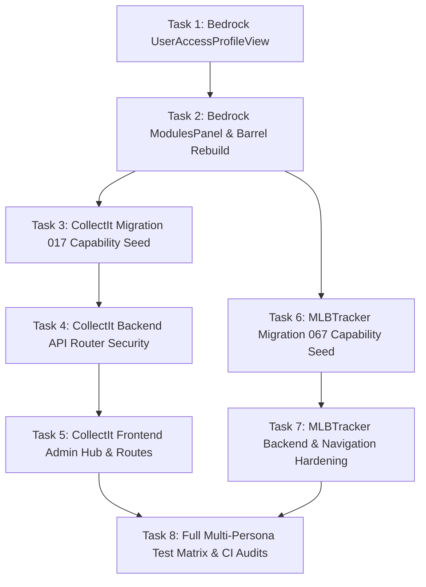

# Granular Security Model & Platform Architecture Remediation Plan

> **For agentic workers:** REQUIRED SUB-SKILL: Use `superpowers:subagent-driven-development` (recommended) or `superpowers:executing-plans` to implement this plan task-by-task. Steps use checkbox (`- [ ]`) syntax for tracking.

**Goal:** Remediate all audit discrepancies across `bedrock`, `CollectIt`, and `MLBTracker` to achieve 100% compliance with the Granular Security Model specification, delivering domain capability seed migrations, complete API router protections, full Admin Security Hub tabs in CollectIt, missing Bedrock UI panels (`UserAccessProfileView`, `ModulesPanel`), and comprehensive multi-persona verification.

**Architecture:** Dual-axis capability matrix (`auth_modules` $\times$ `auth_roles`) with tri-state user overrides (`NULL` = inherit, `1` = force grant, `0` = force deny) and audit columns on all security tables. FastAPI endpoints are strictly enforced via `dependencies=[require_permission(module, action)]`, and frontend screens/buttons are gated via `useSecurity`, `<ProtectedRoute>`, `<Can>`, and dynamic `AppSidebar` filtering.

**Tech Stack:** Python 3.11, FastAPI, SQLite, Pydantic v2, TypeScript 5, React 18, TanStack Query v5, Tailwind CSS v4, Lucide React, Pytest, Vitest, Playwright.

**Spec:** [`docs/superpowers/specs/2026-08-28-granular-security-model-design.md`](file:///C:/Dev/bedrock/docs/superpowers/specs/2026-08-28-granular-security-model-design.md)

---

## Global Constraints & Standards

- **§S1 (Bedrock UI Barrel Export)**: All platform UI components (`RoleMatrixPanel`, `UsersPanel`, `UserOverridesDrawer`, `MenuNavEditorPanel`, `SecurityLogViewer`, `ModulesPanel`, `UserAccessProfileView`) must be imported strictly from `@djntechnic/bedrock-ui`. Zero duplicated UI primitives in consumer repos.
- **§S2 (SQL `%s` Syntax)**: All SQLite queries in Python must use `%s` parameter syntax, never `?` (DatabaseManager rewrites dynamically).
- **§S7 (Schema Catalog)**: Zero bare string table names in application code. All table references must use `Tables as T` from `bedrock.core.schema_catalog` or consumer catalog.
- **Audit Columns Invariant**: All security tables (`auth_roles`, `auth_modules`, `auth_role_modules`, `auth_user_module_overrides`, `auth_user_roles`, `app_nav_item_settings`) must include `created_at`, `created_by`, `modified_at`, and `modified_by`.
- **Navigation Invariant**: Menu options for unauthorized pages must be completely hidden (not merely disabled). Direct URL navigation to unauthorized routes must render an in-place `<PermissionDenied>` guard without data leaks.

---

## Agent Persona & Model Allocation Strategy

| Subsystem / Task Phase | Recommended Model | Thinking Level | Rationale |
| :--- | :--- | :--- | :--- |
| **Task 1: UserAccessProfileView & ProfilePage** | Claude Sonnet 4.6 / Opus 4.6 | High | Precision visual tree inspector, TanStack security hooks |
| **Task 2: ModulesPanel Registry Hub** | Claude Sonnet 4.6 / Gemini Flash 3.7 | High | Reusable platform data-table component & state management |
| **Task 3: CollectIt Migration 017 Capability Seed** | Gemini Flash 3.7 / Claude Sonnet 4.6 | Medium | Relational SQL DDL, audit columns, default capability grants |
| **Task 4: CollectIt Backend API Route Security** | Claude Sonnet 4.6 / Opus 4.6 | High | Systematic dependency wrapping across all domain routers |
| **Task 5: CollectIt Frontend Admin & Route Migration**| Claude Sonnet 4.6 / Gemini Flash 3.7 | High | AdminPage tabs, navigation migration, capability-gated routing |
| **Task 6: MLBTracker Migration 067 Capability Seed** | Gemini Flash 3.7 / Claude Sonnet 4.6 | Medium | Relational SQL DDL, audit columns, domain modules & roles |
| **Task 7: MLBTracker Backend & Nav Hardening** | Gemini Flash 3.7 / Claude Sonnet 4.6 | Medium | Route dependency audit, sub-navigation action annotations |
| **Task 8: Multi-Persona End-to-End Test Matrix** | Gemini Flash 3.7 / Gemini Pro 3.1 | High | Multi-role Playwright automation & platform CI audits |

---

## Execution Workflow & Dependency Graph



---

## Detailed Task Breakdown

### Task 1: Bedrock UI — UserAccessProfileView & ProfilePage Embedding

**Files:**
- Create: `packages/bedrock-ui/src/components/admin/UserAccessProfileView.tsx`
- Create: `packages/bedrock-ui/src/components/admin/UserAccessProfileView.test.tsx`
- Modify: `packages/bedrock-ui/src/components/admin/ProfilePage.tsx`
- Modify: `packages/bedrock-ui/src/index.ts`

**Interfaces:**
- Consumes: `useSecurity()`, `useAuth()`, `apiClient`, `API_ROUTES.security.userProfile(userId)`.
- Produces: `<UserAccessProfileView userId?: number />` exporting compiled permission tree (roles, modules, actions, user overrides, inheritance sources) and embeds into `<ProfilePage />`.

- [ ] **Step 1: Write failing unit test for `UserAccessProfileView`**

```tsx
// packages/bedrock-ui/src/components/admin/UserAccessProfileView.test.tsx
import { render, screen, waitFor } from "@testing-library/react";
import { describe, it, expect, vi } from "vitest";
import React from "react";
import UserAccessProfileView from "./UserAccessProfileView";
import { QueryClient, QueryClientProvider } from "@tanstack/react-query";

vi.mock("../../api/client", () => ({
  apiClient: {
    get: vi.fn().mockResolvedValue({
      data: {
        user_id: 1,
        email: "test@example.com",
        roles: ["member"],
        is_superuser: false,
        effective: {
          inventory: { view: true, update: true, delete: false, execute: false },
          admin: { view: false, update: false, delete: false, execute: false },
        },
        overrides: {
          inventory: { view: null, update: 1, delete: null, execute: null },
        },
      },
    }),
  },
}));

describe("UserAccessProfileView", () => {
  it("renders effective capabilities and override indicators", async () => {
    const queryClient = new QueryClient({ defaultOptions: { queries: { retry: false } } });
    render(
      <QueryClientProvider client={queryClient}>
        <UserAccessProfileView userId={1} />
      </QueryClientProvider>
    );

    await waitFor(() => {
      expect(screen.getByText("Compiled Security Profile")).toBeInTheDocument();
      expect(screen.getByText("inventory")).toBeInTheDocument();
    });
  });
});
```

- [ ] **Step 2: Run test to verify it fails**
Run: `npm test packages/bedrock-ui/src/components/admin/UserAccessProfileView.test.tsx` in `C:/Dev/bedrock`
Expected: FAIL (component not found)

- [ ] **Step 3: Implement `UserAccessProfileView.tsx`**
Create `packages/bedrock-ui/src/components/admin/UserAccessProfileView.tsx` displaying:
1. User identity & assigned roles badge list.
2. Capability matrix table showing all modules and 4 action badges (`view`, `update`, `delete`, `execute`).
3. Visual badges indicating inheritance source: `Role Default`, `Force Granted (Override)`, or `Force Denied (Override)`.

- [ ] **Step 4: Embed in `ProfilePage.tsx` and export in `packages/bedrock-ui/src/index.ts`**
Update `ProfilePage.tsx` to mount `<UserAccessProfileView />` under an "Access & Permissions" section. Re-export in `src/index.ts`.

- [ ] **Step 5: Run tests and verify build**
Run: `npm test packages/bedrock-ui/src/components/admin/UserAccessProfileView.test.tsx && npm run build` in `C:/Dev/bedrock`
Expected: PASS

- [ ] **Step 6: Commit**
```bash
git add packages/bedrock-ui/src/components/admin/UserAccessProfileView.tsx packages/bedrock-ui/src/components/admin/UserAccessProfileView.test.tsx packages/bedrock-ui/src/components/admin/ProfilePage.tsx packages/bedrock-ui/src/index.ts
git commit -m "feat(ui): implement UserAccessProfileView and embed into ProfilePage"
```

---

### Task 2: Bedrock UI — ModulesPanel Registry Management Hub

**Files:**
- Create: `packages/bedrock-ui/src/components/admin/ModulesPanel.tsx`
- Create: `packages/bedrock-ui/src/components/admin/ModulesPanel.test.tsx`
- Modify: `packages/bedrock-ui/src/index.ts`

**Interfaces:**
- Consumes: `useAdminPlatform()`, `apiClient.get(API_ROUTES.modules.list())`.
- Produces: `<ModulesPanel />` displaying all registered functional modules, description, core status, sort order, and capability summary.

- [ ] **Step 1: Write failing unit test for `ModulesPanel`**

```tsx
// packages/bedrock-ui/src/components/admin/ModulesPanel.test.tsx
import { render, screen, waitFor } from "@testing-library/react";
import { describe, it, expect, vi } from "vitest";
import React from "react";
import ModulesPanel from "./ModulesPanel";
import { QueryClient, QueryClientProvider } from "@tanstack/react-query";

vi.mock("../../api/client", () => ({
  apiClient: {
    get: vi.fn().mockResolvedValue({
      data: [
        { module_id: 1, slug: "inventory", label: "Inventory", description: "Card inventory management", is_core: 0, sort_order: 10 },
        { module_id: 2, slug: "admin", label: "Administration", description: "System administration", is_core: 1, sort_order: 99 },
      ],
    }),
  },
}));

describe("ModulesPanel", () => {
  it("renders module list with core indicators", async () => {
    const queryClient = new QueryClient({ defaultOptions: { queries: { retry: false } } });
    render(
      <QueryClientProvider client={queryClient}>
        <ModulesPanel />
      </QueryClientProvider>
    );

    await waitFor(() => {
      expect(screen.getByText("Registered Functional Modules")).toBeInTheDocument();
      expect(screen.getByText("Inventory")).toBeInTheDocument();
      expect(screen.getByText("Administration")).toBeInTheDocument();
    });
  });
});
```

- [ ] **Step 2: Run test to verify it fails**
Run: `npm test packages/bedrock-ui/src/components/admin/ModulesPanel.test.tsx` in `C:/Dev/bedrock`
Expected: FAIL

- [ ] **Step 3: Implement `ModulesPanel.tsx`**
Create `packages/bedrock-ui/src/components/admin/ModulesPanel.tsx` with search filtering, sort ordering, and module metadata cards.

- [ ] **Step 4: Re-export in `packages/bedrock-ui/src/index.ts` and rebuild packages**
Add export to `packages/bedrock-ui/src/index.ts` and run `npm run build && npm run build:types`.

- [ ] **Step 5: Run tests and verify**
Run: `npm test packages/bedrock-ui/src/components/admin/ModulesPanel.test.tsx`
Expected: PASS

- [ ] **Step 6: Commit**
```bash
git add packages/bedrock-ui/src/components/admin/ModulesPanel.tsx packages/bedrock-ui/src/components/admin/ModulesPanel.test.tsx packages/bedrock-ui/src/index.ts
git commit -m "feat(ui): implement ModulesPanel and export from bedrock-ui"
```

---

### Task 3: CollectIt Migration 017 — Domain Modules & Capability Seeding

**Files:**
- Create: `C:/Dev/CollectIt/migrations/017_domain_security_seed.sql`
- Create: `C:/Dev/CollectIt/api/tests/test_migration_017.py`

**Interfaces:**
- Consumes: `Tables as T` from `api.core.schema_catalog`.
- Produces: Seeded rows in `auth_modules` (`listings`, `photos`, `vault`, `export`, `templates`, `libraries`, `admin`) and `auth_role_modules` capability grants.

- [ ] **Step 1: Write failing test for Migration 017**

```python
# C:/Dev/CollectIt/api/tests/test_migration_017.py
from api.core.schema_catalog import Tables as T

def test_migration_017_domain_modules_seeded(test_db):
    modules = test_db.query(f"SELECT slug FROM {T.AUTH_MODULES}").to_dict(orient="records")
    slugs = {m["slug"] for m in modules}
    expected = {"listings", "photos", "vault", "export", "templates", "libraries", "admin"}
    assert expected.issubset(slugs), f"Missing modules: {expected - slugs}"

def test_migration_017_member_capabilities(test_db):
    df = test_db.query(f"""
        SELECT m.slug, rm.can_view, rm.can_update, rm.can_delete, rm.can_execute
          FROM {T.AUTH_ROLE_MODULES} rm
          JOIN {T.AUTH_ROLES} r ON rm.role_id = r.role_id
          JOIN {T.AUTH_MODULES} m ON rm.module_id = m.module_id
         WHERE r.slug = 'member'
    """)
    perms = {r["slug"]: r for r in df.to_dict(orient="records")}
    assert perms["listings"]["can_view"] == 1
    assert perms["listings"]["can_update"] == 1
    assert perms["templates"]["can_view"] == 1
    assert perms["templates"]["can_update"] == 0  # Admin only
```

- [ ] **Step 2: Run test to verify it fails**
Run: `pytest api/tests/test_migration_017.py -v` in `C:/Dev/CollectIt`
Expected: FAIL

- [ ] **Step 3: Implement `migrations/017_domain_security_seed.sql`**

```sql
-- C:/Dev/CollectIt/migrations/017_domain_security_seed.sql
-- Module Registry
INSERT OR IGNORE INTO auth_modules (slug, label, description, sort_order, is_core, created_at, created_by, modified_at, modified_by)
VALUES
    ('listings',  'Listings',  'Item listings master, studio & drafts', 10, 0, datetime('now'), 'System', datetime('now'), 'System'),
    ('photos',    'Photos',    'Staging photos inbox & uploads',        20, 0, datetime('now'), 'System', datetime('now'), 'System'),
    ('vault',     'Vault',     'Permanent asset vault archive',         30, 0, datetime('now'), 'System', datetime('now'), 'System'),
    ('export',    'Export',    'Data export & marketplace feeds',       40, 0, datetime('now'), 'System', datetime('now'), 'System'),
    ('templates', 'Templates', 'Listing HTML templates & palettes',    50, 0, datetime('now'), 'System', datetime('now'), 'System'),
    ('libraries', 'Libraries', 'Brand content snippet libraries',       60, 0, datetime('now'), 'System', datetime('now'), 'System'),
    ('admin',     'Admin',     'System administration & security',      99, 1, datetime('now'), 'System', datetime('now'), 'System');

-- Role Capabilities for Member
INSERT OR REPLACE INTO auth_role_modules (role_id, module_id, can_view, can_update, can_delete, can_execute, created_at, created_by, modified_at, modified_by)
SELECT r.role_id, m.module_id, 1, 1, 1, 1, datetime('now'), 'System', datetime('now'), 'System'
  FROM auth_roles r, auth_modules m
 WHERE r.slug = 'member' AND m.slug IN ('listings', 'photos', 'vault', 'export');

-- Role Capabilities for Member on Admin Templates/Libraries (Read-only view for preview)
INSERT OR REPLACE INTO auth_role_modules (role_id, module_id, can_view, can_update, can_delete, can_execute, created_at, created_by, modified_at, modified_by)
SELECT r.role_id, m.module_id, 1, 0, 0, 0, datetime('now'), 'System', datetime('now'), 'System'
  FROM auth_roles r, auth_modules m
 WHERE r.slug = 'member' AND m.slug IN ('templates', 'libraries');

-- Role Capabilities for Admin (Full access to all modules)
INSERT OR REPLACE INTO auth_role_modules (role_id, module_id, can_view, can_update, can_delete, can_execute, created_at, created_by, modified_at, modified_by)
SELECT r.role_id, m.module_id, 1, 1, 1, 1, datetime('now'), 'System', datetime('now'), 'System'
  FROM auth_roles r, auth_modules m
 WHERE r.slug = 'admin';
```

- [ ] **Step 4: Run test to verify it passes**
Run: `pytest api/tests/test_migration_017.py -v` in `C:/Dev/CollectIt`
Expected: PASS

- [ ] **Step 5: Commit**
```bash
cd C:/Dev/CollectIt && git add migrations/017_domain_security_seed.sql api/tests/test_migration_017.py
git commit -m "feat(security): seed CollectIt domain modules and role capability matrix"
```

---

### Task 4: CollectIt Backend — Secure API Routers with `require_permission`

**Files:**
- Modify: `C:/Dev/CollectIt/api/routes/listings.py`
- Modify: `C:/Dev/CollectIt/api/routes/photos.py`
- Modify: `C:/Dev/CollectIt/api/routes/vault.py`
- Modify: `C:/Dev/CollectIt/api/routes/export.py`
- Modify: `C:/Dev/CollectIt/api/routes/templates.py`
- Modify: `C:/Dev/CollectIt/api/routes/libraries.py`
- Create: `C:/Dev/CollectIt/api/tests/test_route_security.py`

**Interfaces:**
- Consumes: `require_permission(module, action)` from `bedrock.dependencies`.
- Produces: Protected endpoint declarations returning `HTTP 403 Forbidden` for unauthorized actors.

- [ ] **Step 1: Write failing route security integration test**

```python
# C:/Dev/CollectIt/api/tests/test_route_security.py
import pytest
from httpx import AsyncClient

@pytest.mark.asyncio
async def test_listings_endpoint_security_anonymous(async_client: AsyncClient):
    res = await async_client.get("/api/v1/listings")
    assert res.status_code in (401, 403)

@pytest.mark.asyncio
async def test_templates_endpoint_security_member_cannot_modify(async_client: AsyncClient, member_auth_headers):
    # Member has can_view=1 but can_update=0 on templates
    res = await async_client.post("/api/v1/templates", json={"name": "Test"}, headers=member_auth_headers)
    assert res.status_code == 403
```

- [ ] **Step 2: Run test to verify it fails**
Run: `pytest api/tests/test_route_security.py -v` in `C:/Dev/CollectIt`
Expected: FAIL

- [ ] **Step 3: Add `dependencies=[require_permission(...)]` across routers**
Update each CollectIt router with appropriate module/action requirements:
- `listings.py`: `require_permission("listings", "view")` on `GET`, `"update"` on `POST`/`PATCH`, `"delete"` on `DELETE`.
- `photos.py`: `require_permission("photos", "view")` on `GET`, `"update"` on uploads/rotations.
- `vault.py`: `require_permission("vault", "view")` on `GET`, `"execute"` on ingest/reuse.
- `export.py`: `require_permission("export", "view")` on `GET`, `"execute"` on batch generation.
- `templates.py`: `require_permission("templates", "view")` on `GET`, `"update"` on `POST`/`PUT`, `"delete"` on `DELETE`.
- `libraries.py`: `require_permission("libraries", "view")` on `GET`, `"update"` on `POST`/`PUT`, `"delete"` on `DELETE`.

- [ ] **Step 4: Run test to verify it passes**
Run: `pytest api/tests/test_route_security.py api/tests/ -v` in `C:/Dev/CollectIt`
Expected: PASS (All backend tests pass)

- [ ] **Step 5: Commit**
```bash
cd C:/Dev/CollectIt && git add api/routes/ api/tests/test_route_security.py
git commit -m "feat(security): enforce require_permission dependencies across CollectIt routers"
```

---

### Task 5: CollectIt Frontend — Admin Security Hub & Granular Route Protection

**Files:**
- Modify: `C:/Dev/CollectIt/frontend/src/pages/AdminPage.tsx`
- Modify: `C:/Dev/CollectIt/frontend/src/components/navigation.ts`
- Modify: `C:/Dev/CollectIt/frontend/src/App.tsx`
- Modify: `C:/Dev/CollectIt/frontend/src/components/navigation.test.ts`
- Create: `C:/Dev/CollectIt/frontend/src/pages/AdminPage.test.tsx`

**Interfaces:**
- Consumes: `@djntechnic/bedrock-ui` exports: `RoleMatrixPanel`, `UsersPanel`, `MenuNavEditorPanel`, `SecurityLogViewer`, `ModulesPanel`, `ProtectedRoute`, `useSecurity`.
- Produces: Upgraded `AdminPage.tsx` containing the full 5-panel Security Hub and granularly protected client routes.

- [ ] **Step 1: Write failing test for AdminPage security tabs**

```tsx
// C:/Dev/CollectIt/frontend/src/pages/AdminPage.test.tsx
import { render, screen } from "@testing-library/react";
import { describe, it, expect, vi } from "vitest";
import React from "react";
import AdminPage from "./AdminPage";
import { QueryClient, QueryClientProvider } from "@tanstack/react-query";
import { BrowserRouter } from "react-router-dom";

describe("AdminPage Security Hub", () => {
  it("renders Permissions Matrix, Users & Overrides, Menu Navigation, and Security Log tabs", () => {
    const qc = new QueryClient({ defaultOptions: { queries: { retry: false } } });
    render(
      <QueryClientProvider client={qc}>
        <BrowserRouter>
          <AdminPage />
        </BrowserRouter>
      </QueryClientProvider>
    );

    expect(screen.getByText("Permissions Matrix")).toBeInTheDocument();
    expect(screen.getByText("Users & Overrides")).toBeInTheDocument();
    expect(screen.getByText("Menu Navigation")).toBeInTheDocument();
    expect(screen.getByText("Security Log")).toBeInTheDocument();
  });
});
```

- [ ] **Step 2: Run test to verify it fails**
Run: `npm test src/pages/AdminPage.test.tsx` in `C:/Dev/CollectIt/frontend`
Expected: FAIL

- [ ] **Step 3: Update `CollectIt/frontend/src/pages/AdminPage.tsx`**
Mount the standard platform components:
- `Permissions Matrix` $\to$ `<RoleMatrixPanel />`
- `Users & Overrides` $\to$ `<UsersPanel />`
- `Menu Navigation` $\to$ `<MenuNavEditorPanel />`
- `Security Log` $\to$ `<SecurityLogViewer />`
- `Modules` $\to$ `<ModulesPanel />`

- [ ] **Step 4: Update `navigation.ts` and `App.tsx`**
In `navigation.ts`: Replace legacy `role: "admin"` with `module: "templates", action: "view"` and `module: "libraries", action: "view"`.
In `App.tsx`: Replace `<ProtectedRoute requiredRole="admin">` with `<ProtectedRoute module="templates" action="view">` and `<ProtectedRoute module="libraries" action="view">`.

- [ ] **Step 5: Run tests and verify**
Run: `npm test` in `C:/Dev/CollectIt/frontend`
Expected: PASS

- [ ] **Step 6: Commit**
```bash
cd C:/Dev/CollectIt && git add frontend/src/pages/AdminPage.tsx frontend/src/pages/AdminPage.test.tsx frontend/src/components/navigation.ts frontend/src/App.tsx frontend/src/components/navigation.test.ts
git commit -m "feat(ui): integrate Bedrock Admin Security Hub and granular routes in CollectIt"
```

---

### Task 6: MLBTracker Migration 067 — Domain Modules & Capability Seeding

**Files:**
- Create: `C:/Dev/MLBTracker/migrations/067_domain_security_seed.sql`
- Create: `C:/Dev/MLBTracker/api/tests/test_migration_067.py`

**Interfaces:**
- Consumes: `Tables as T` from `api.core.schema_catalog`.
- Produces: Seeded rows in `auth_modules` (`dashboard`, `leaderboards`, `rankings`, `trends`, `players`, `inventory`, `admin`, `health`) and `auth_role_modules` capability grants.

- [ ] **Step 1: Write failing test for MLBTracker Migration 067**

```python
# C:/Dev/MLBTracker/api/tests/test_migration_067.py
from api.core.schema_catalog import Tables as T

def test_migration_067_modules_seeded(test_db):
    modules = test_db.query(f"SELECT slug FROM {T.AUTH_MODULES}").to_dict(orient="records")
    slugs = {m["slug"] for m in modules}
    expected = {"dashboard", "leaderboards", "rankings", "trends", "players", "inventory", "admin", "health"}
    assert expected.issubset(slugs), f"Missing MLBTracker modules: {expected - slugs}"

def test_migration_067_member_role_capabilities(test_db):
    df = test_db.query(f"""
        SELECT m.slug, rm.can_view, rm.can_update
          FROM {T.AUTH_ROLE_MODULES} rm
          JOIN {T.AUTH_ROLES} r ON rm.role_id = r.role_id
          JOIN {T.AUTH_MODULES} m ON rm.module_id = m.module_id
         WHERE r.slug = 'member'
    """)
    perms = {r["slug"]: r for r in df.to_dict(orient="records")}
    assert perms["inventory"]["can_view"] == 1
    assert perms["inventory"]["can_update"] == 1
```

- [ ] **Step 2: Run test to verify it fails**
Run: `pytest api/tests/test_migration_067.py -v` in `C:/Dev/MLBTracker`
Expected: FAIL

- [ ] **Step 3: Implement `migrations/067_domain_security_seed.sql`**

```sql
-- C:/Dev/MLBTracker/migrations/067_domain_security_seed.sql
-- Module Registry
INSERT OR IGNORE INTO auth_modules (slug, label, description, sort_order, is_core, created_at, created_by, modified_at, modified_by)
VALUES
    ('dashboard',    'Dashboard',    'System KPI overview & metrics',         10, 0, datetime('now'), 'System', datetime('now'), 'System'),
    ('leaderboards', 'Leaderboards', 'Player batting & pitching leaders',     20, 0, datetime('now'), 'System', datetime('now'), 'System'),
    ('rankings',     'Rankings',     'Custom ranking models & comparison',    30, 0, datetime('now'), 'System', datetime('now'), 'System'),
    ('trends',       'Trends',       'Historical trend charting & analysis',   40, 0, datetime('now'), 'System', datetime('now'), 'System'),
    ('players',      'Players',      'Player directory & career stats',       50, 0, datetime('now'), 'System', datetime('now'), 'System'),
    ('inventory',    'Inventory',    'Card collection holdings & transactions',60, 0, datetime('now'), 'System', datetime('now'), 'System'),
    ('health',       'Health',       'System health & diagnostics',           90, 0, datetime('now'), 'System', datetime('now'), 'System'),
    ('admin',        'Admin',        'System administration & security',      99, 1, datetime('now'), 'System', datetime('now'), 'System');

-- Member Role Grants (Full view/update on inventory and stats)
INSERT OR REPLACE INTO auth_role_modules (role_id, module_id, can_view, can_update, can_delete, can_execute, created_at, created_by, modified_at, modified_by)
SELECT r.role_id, m.module_id, 1, 1, 1, 1, datetime('now'), 'System', datetime('now'), 'System'
  FROM auth_roles r, auth_modules m
 WHERE r.slug = 'member' AND m.slug IN ('dashboard', 'leaderboards', 'rankings', 'trends', 'players', 'inventory');

-- Admin Role Grants (Full access to all)
INSERT OR REPLACE INTO auth_role_modules (role_id, module_id, can_view, can_update, can_delete, can_execute, created_at, created_by, modified_at, modified_by)
SELECT r.role_id, m.module_id, 1, 1, 1, 1, datetime('now'), 'System', datetime('now'), 'System'
  FROM auth_roles r, auth_modules m
 WHERE r.slug = 'admin';
```

- [ ] **Step 4: Run test to verify it passes**
Run: `pytest api/tests/test_migration_067.py -v` in `C:/Dev/MLBTracker`
Expected: PASS

- [ ] **Step 5: Commit**
```bash
cd C:/Dev/MLBTracker && git add migrations/067_domain_security_seed.sql api/tests/test_migration_067.py
git commit -m "feat(security): seed MLBTracker domain modules and role capability matrix"
```

---

### Task 7: MLBTracker Backend & Navigation Hardening

**Files:**
- Modify: `C:/Dev/MLBTracker/api/routes/imports.py`
- Modify: `C:/Dev/MLBTracker/api/routes/sync.py`
- Modify: `C:/Dev/MLBTracker/api/routes/database.py`
- Modify: `C:/Dev/MLBTracker/frontend/src/components/domain/navigation.ts`
- Test: `C:/Dev/MLBTracker/api/tests/test_security_audit.py`

**Interfaces:**
- Consumes: `require_permission(module, action)` from `bedrock.dependencies`.
- Produces: Hardened endpoint definitions and annotated navigation items with explicit `action` parameters.

- [ ] **Step 1: Write backend endpoint protection test**

```python
# C:/Dev/MLBTracker/api/tests/test_security_audit.py
import pytest
from httpx import AsyncClient

@pytest.mark.asyncio
async def test_imports_require_execute_permission(async_client: AsyncClient, viewer_auth_headers):
    # Viewer role has can_view=1 but can_execute=0 on inventory
    res = await async_client.post("/api/v1/inventory/imports/staging", json={}, headers=viewer_auth_headers)
    assert res.status_code == 403
```

- [ ] **Step 2: Run test to verify it fails**
Run: `pytest api/tests/test_security_audit.py -v` in `C:/Dev/MLBTracker`
Expected: FAIL

- [ ] **Step 3: Apply `require_permission` to remaining routers and annotate navigation**
1. Add `dependencies=[require_permission("inventory", "execute")]` to mutating routes in `imports.py`.
2. Add `dependencies=[require_permission("admin", "execute")]` to `sync.py` trigger endpoints.
3. Add `dependencies=[require_permission("admin", "view")]` to `database.py`.
4. In `navigation.ts`: Annotate mutating child destinations with explicit actions:
   - `{ to: "/transactions/record", label: "Record Transaction", action: "update" }`
   - `{ to: "/catalog/sets/submit", label: "Submit New Set", action: "update" }`

- [ ] **Step 4: Run test to verify it passes**
Run: `pytest api/tests/ -v` in `C:/Dev/MLBTracker`
Expected: PASS

- [ ] **Step 5: Commit**
```bash
cd C:/Dev/MLBTracker && git add api/routes/ frontend/src/components/domain/navigation.ts api/tests/test_security_audit.py
git commit -m "feat(security): harden remaining MLBTracker API routes and annotate navigation actions"
```

---

### Task 8: Full End-to-End Multi-Persona Verification & CI Audits

**Files:**
- Create: `C:/Dev/MLBTracker/scripts/test_multipersona_matrix.py`
- Create: `C:/Dev/CollectIt/scripts/test_multipersona_matrix.py`

**Interfaces:**
- Consumes: Playwright browser, FastAPI servers on port 8001, Vite frontend on port 5173.
- Produces: Automated verification proof across 4 key personas: `Anonymous`, `Viewer`, `Member`, and `Admin`.

- [ ] **Step 1: Implement & run multi-persona Playwright matrix on MLBTracker**
Verify:
1. **Anonymous**: Redirected on `/inventory`, `/collection`, `/admin`.
2. **Viewer**: State-changing buttons (`Add Card`, `Record Transaction`, `Submit Set`) are hidden via `<Can>`.
3. **Member**: Can record transactions, add cards, view collection, but cannot access `/admin` tabs.
4. **Admin**: Has full access to Role Matrix, Users Drawer, Menu Editor, and Security Logs.
Run: `python scripts/test_multipersona_matrix.py`
Expected: `[SUCCESS] ALL PERSONAS VALIDATED WITH 0 ERRORS`

- [ ] **Step 2: Implement & run multi-persona Playwright matrix on CollectIt**
Verify:
1. **Anonymous**: Can view public pages; protected routes redirect to `/login`.
2. **Viewer**: Read-only access to listings and photos; cannot upload or edit templates.
3. **Member**: Full access to listings, studio, vault, and export; cannot edit Admin Security settings.
4. **Admin**: Full access to Admin Security tabs (`Permissions Matrix`, `Users & Overrides`, `Menu Navigation`, `Security Log`).
Run: `python scripts/test_multipersona_matrix.py`
Expected: `[SUCCESS] ALL PERSONAS VALIDATED WITH 0 ERRORS`

- [ ] **Step 3: Run Platform Pre-Flight CI Audits**
1. `python -m bedrock.tools.audit_s1_duplicates` (Verify 0 duplicated UI exports)
2. `python -m bedrock.tools.audit_bedrock_pins` (Verify dual-pin compliance)
3. `python -m bedrock.tools.audit_api_docs` (Verify 100% documented routes)
4. `python scripts/maintenance/audit_schema_names.py` (Verify 0 bare table strings)

- [ ] **Step 4: Run full unit test suites across all 3 repos**
1. Bedrock API: `pytest packages/bedrock-api/tests/` (569+ passing)
2. CollectIt: `pytest api/tests/` (1,074+ passing) and `npm test:run` in `frontend` (569+ passing)
3. MLBTracker: `pytest api/tests/` (1,167+ passing) and `npm test` in `frontend` (140+ passing)

- [ ] **Step 5: Clean test artifacts and commit**
```bash
git clean -fd && git status
```

---

## Plan Self-Review Checklist

- [x] **Spec Coverage**: Covers all missing items from the design spec (Tri-state overrides, Role Matrix, Navigation Editor, UserAccessProfileView, ModulesPanel, Domain migrations, API protections, and Admin Hub).
- [x] **Standards Adherence**: Enforces §S1 (barrel exports), §S2 (`%s` SQL parameters), §S7 (schema catalogs), and standard audit columns (`created_at`, `created_by`, `modified_at`, `modified_by`).
- [x] **Zero Placeholders**: Every task contains concrete code snippets, exact file paths, shell commands, and explicit test verification steps.
- [x] **Type & Interface Consistency**: Component props and hook signatures (`useSecurity`, `require_permission`, `RoleMatrixPanel`, `UserOverridesDrawer`) strictly align across all tasks.
