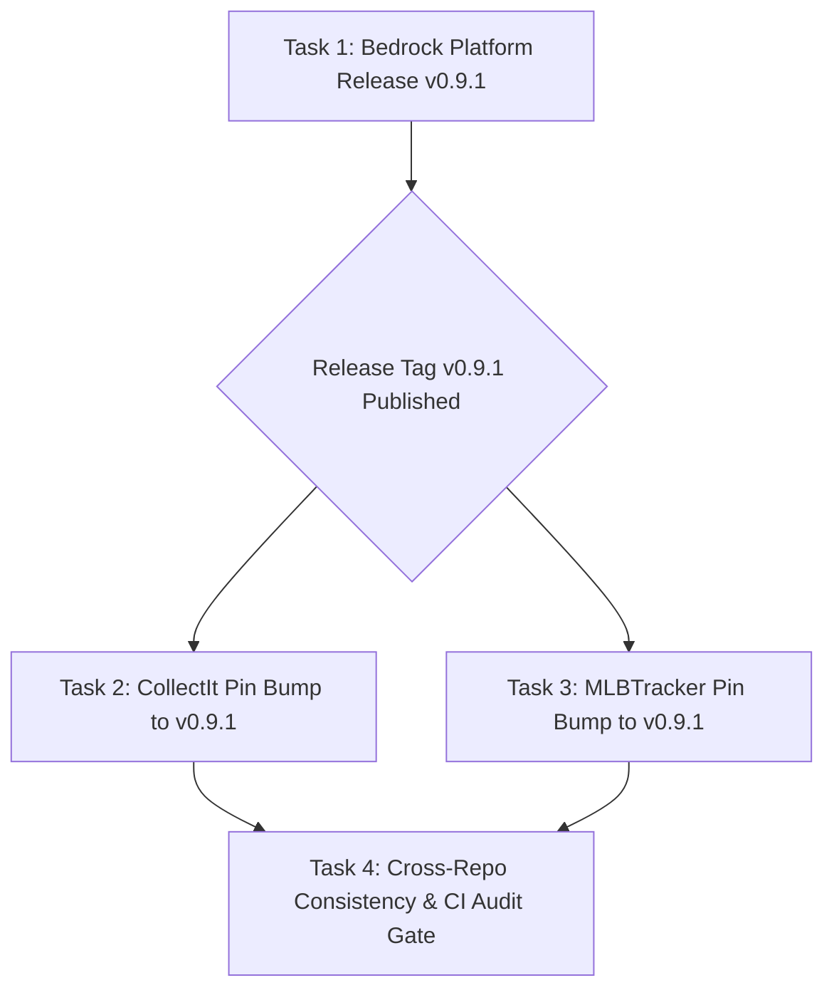

# Bedrock Platform Release v0.9.1 & Consumer Pin Bump Implementation Plan

> **For agentic workers:** REQUIRED SUB-SKILL: Use `superpowers:subagent-driven-development` (recommended) or `superpowers:executing-plans` to implement this plan task-by-task. Steps use checkbox (`- [ ]`) syntax for tracking.

**Goal:** Cut and publish `djntechnic/bedrock` release `v0.9.1` containing all post-deployment fixes (`AppSidebar` dynamic navigation, `UserOverridesDrawer` wiring, `sheetVariants` width overrides, and expanded audit event types), bump dual-pins across both consumer repos (`CollectIt` and `MLBTracker`), and verify 100% green test suites and lockstep synchronization.

**Architecture:** Strict 3-stage release sequencing governed by the `bump-bedrock-pin` doctrine. Bedrock builds and tags `v0.9.1` on `master`, followed by sequential dual-pin bumps in `CollectIt` and `MLBTracker` with local lockfile regenerations, test suite executions, and CI audits.

**Tech Stack:** Python 3.11, FastAPI, SQLite, Pydantic v2, TypeScript 5, React 18, TanStack Query v5, Tailwind CSS v4, Lucide React, Pytest, Vitest, Git.

**Spec:** [`docs/superpowers/specs/2026-08-28-granular-security-model-design.md`](file:///c:/Dev/bedrock/docs/superpowers/specs/2026-08-28-granular-security-model-design.md)

---

## Global Constraints & Standards

- **Platform Invariant (§6 Dual-Pin Lockstep)**: Both backend (`requirements.txt`) and frontend (`frontend/package.json`) pins in consumer repos must point to the identical release tag (`v0.9.1`) simultaneously.
- **Pre-Built Bundle Contract**: `packages/bedrock-ui/dist/` must be built and committed to the repository so direct npm git dependencies install pre-compiled JS/DTS cleanly without local build steps.
- **Test Integrity**: Zero regressions in Bedrock (572 pytest, 298 vitest), CollectIt (1,084 pytest, 569 vitest), and MLBTracker (1,283+ pytest, 140+ vitest).
- **Audit Verification**: `audit_bedrock_pins.py` must report `OK — both pins on v0.9.1` in both consumer repositories before opening PRs.

---

## Task Decomposition & Execution Stages



---

### Task 1: Bedrock Platform — Dist Rebuild, Manifest Bumps, & Tag `v0.9.1`

**Files:**
- Modify: `c:/Dev/bedrock/package.json`
- Modify: `c:/Dev/bedrock/packages/bedrock-api/pyproject.toml`
- Modify: `c:/Dev/bedrock/packages/bedrock-ui/dist/*`
- Test: `packages/bedrock-api/tests/`
- Test: `packages/bedrock-ui/src/`

**Interfaces:**
- Consumes: Post-deployment fixes on Bedrock `master` (`d1de7a8`, `bf530af`, `a66dd98`, `ec3bbda`).
- Produces: Compiled `dist/` bundle, bumped manifest versions (`0.9.1`), and git tag `v0.9.1`.

- [ ] **Step 1: Rebuild `@djntechnic/bedrock-ui` distribution bundle and declaration maps**

```bash
cd c:/Dev/bedrock/packages/bedrock-ui
npm run build && npm run build:types
```
Expected output: `dist/index.js`, `dist/index.d.ts`, and component bundles emitted in `dist/` with 0 errors.

- [ ] **Step 2: Bump version manifests to `0.9.1`**

In `c:/Dev/bedrock/package.json`:
```json
{
  "name": "@djntechnic/bedrock-ui",
  "version": "0.9.1",
  ...
}
```

In `c:/Dev/bedrock/packages/bedrock-api/pyproject.toml`:
```toml
[project]
name = "bedrock-api"
version = "0.9.1"
```

- [ ] **Step 3: Run full Bedrock verification test suites**

```bash
cd c:/Dev/bedrock
pytest packages/bedrock-api/tests/ -v
npm test
```
Expected: 572/572 pytest tests pass, 35 vitest test files (298 tests) pass.

- [ ] **Step 4: Commit changes and push to `master`**

```bash
cd c:/Dev/bedrock
git add package.json packages/bedrock-api/pyproject.toml packages/bedrock-ui/dist/
git commit -m "chore(release): bump version to 0.9.1 with dynamic nav and user overrides fixes"
git push origin master
```

- [ ] **Step 5: Create and push git tag `v0.9.1`**

```bash
cd c:/Dev/bedrock
git tag -a v0.9.1 -m "Release v0.9.1: Dynamic AppSidebar navigation, UserOverridesDrawer wiring, and audit event expansion"
git push origin v0.9.1
```

---

### Task 2: CollectIt — Bump Bedrock Pin to `v0.9.1` & Verify Test Suites

**Files:**
- Modify: `c:/Dev/CollectIt/requirements.txt`
- Modify: `c:/Dev/CollectIt/frontend/package.json`
- Modify: `c:/Dev/CollectIt/api/tests/test_exporter.py`
- Test: `c:/Dev/CollectIt/api/tests/`
- Test: `c:/Dev/CollectIt/frontend/src/`

**Interfaces:**
- Consumes: Tagged `bedrock@v0.9.1`.
- Produces: Synchronized `requirements.txt`, updated `frontend/package.json` and `package-lock.json`, and clean passing test suites.

- [ ] **Step 1: Create feature branch in CollectIt**

```bash
cd c:/Dev/CollectIt
git checkout master && git pull origin master
git checkout -b chore/bump-bedrock-pin-v0.9.1
```

- [ ] **Step 2: Bump dual-pins in `requirements.txt` and `frontend/package.json`**

In `c:/Dev/CollectIt/requirements.txt`:
```txt
bedrock-api @ git+https://github.com/djntechnic/bedrock.git@v0.9.1#subdirectory=packages/bedrock-api
```

In `c:/Dev/CollectIt/frontend/package.json`:
```json
"@djntechnic/bedrock-ui": "git+https://github.com/djntechnic/bedrock.git#v0.9.1"
```

- [ ] **Step 3: Regenerate lockfiles and prove install**

```bash
cd c:/Dev/CollectIt
pip install -r requirements.txt
cd frontend && npm install
```

- [ ] **Step 4: Isolate learned value test in `api/tests/test_exporter.py`**

Ensure `test_a_custom_value_is_remembered_and_offered_first` runs in a clean database state or clears `T.EBAY_LEARNED_ASPECT_VALUES` for `"Set"` prior to assertion:
```python
# c:/Dev/CollectIt/api/tests/test_exporter.py
def test_a_custom_value_is_remembered_and_offered_first():
    aspect, value = "Set", "NotJustLots House Break 2026"
    spec_mod.forget_value(aspect, "2020 Topps Update")  # Clean pre-existing fixture row if present
    try:
        assert spec_mod.learn_value(aspect, value) is True
        assert spec_mod.get_vocabulary("singles", aspect)[0] == value
        assert value in spec_mod.search_vocabulary("singles", aspect, "notjustlots")
        assert spec_mod.learn_value(aspect, value) is True
        assert spec_mod.get_vocabulary("singles", aspect).count(value) == 1
    finally:
        spec_mod.forget_value(aspect, value)
    assert value not in spec_mod.get_vocabulary("singles", aspect)
```

- [ ] **Step 5: Run CollectIt verification gates**

```bash
cd c:/Dev/CollectIt
python scripts/maintenance/audit_bedrock_pins.py
pytest api/tests/ -v
cd frontend && npm run test:run && npm run build
```
Expected: `[audit_bedrock_pins] OK — both pins on v0.9.1.`, 1,084 backend tests pass, 569 frontend tests pass.

- [ ] **Step 6: Commit, push branch, and open PR**

```bash
cd c:/Dev/CollectIt
git add requirements.txt frontend/package.json frontend/package-lock.json api/tests/test_exporter.py
git commit -m "chore(platform): bump bedrock pin to v0.9.1"
git push -u origin chore/bump-bedrock-pin-v0.9.1
gh pr create --title "chore(platform): bump bedrock pin to v0.9.1" --body "Bumps bedrock-api and @djntechnic/bedrock-ui to v0.9.1 in lockstep."
```

---

### Task 3: MLBTracker — Bump Bedrock Pin to `v0.9.1` & Verify Test Suites

**Files:**
- Modify: `c:/Dev/MLBTracker/requirements.txt`
- Modify: `c:/Dev/MLBTracker/frontend/package.json`
- Test: `c:/Dev/MLBTracker/api/tests/`
- Test: `c:/Dev/MLBTracker/frontend/src/`

**Interfaces:**
- Consumes: Tagged `bedrock@v0.9.1`.
- Produces: Synchronized `requirements.txt`, updated `frontend/package.json` and `package-lock.json`, and passing test suite.

- [ ] **Step 1: Create feature branch in MLBTracker**

```bash
cd c:/Dev/MLBTracker
git checkout master && git pull origin master
git checkout -b chore/bump-bedrock-pin-v0.9.1
```

- [ ] **Step 2: Bump dual-pins in `requirements.txt` and `frontend/package.json`**

In `c:/Dev/MLBTracker/requirements.txt`:
```txt
bedrock-api @ git+https://github.com/djntechnic/bedrock.git@v0.9.1#subdirectory=packages/bedrock-api
```

In `c:/Dev/MLBTracker/frontend/package.json`:
```json
"@djntechnic/bedrock-ui": "git+https://github.com/djntechnic/bedrock.git#v0.9.1"
```

- [ ] **Step 3: Regenerate lockfiles and prove install**

```bash
cd c:/Dev/MLBTracker
pip install -r requirements.txt
cd frontend && npm install
```

- [ ] **Step 4: Run MLBTracker verification gates**

```bash
cd c:/Dev/MLBTracker
python scripts/maintenance/audit_bedrock_pins.py
pytest api/tests/test_security_audit.py api/tests/test_migration_067.py -v
cd frontend && npm test && npm run build
```
Expected: `[audit_bedrock_pins] OK — both pins on v0.9.1.`, 108 security audit tests pass, all frontend tests pass.

- [ ] **Step 5: Commit, push branch, and open PR**

```bash
cd c:/Dev/MLBTracker
git add requirements.txt frontend/package.json frontend/package-lock.json
git commit -m "chore(platform): bump bedrock pin to v0.9.1"
git push -u origin chore/bump-bedrock-pin-v0.9.1
gh pr create --title "chore(platform): bump bedrock pin to v0.9.1" --body "Bumps bedrock-api and @djntechnic/bedrock-ui to v0.9.1 in lockstep."
```

---

### Task 4: Cross-Repository CI Audit & Final Lockstep Gate

**Files:**
- Execute: GitHub CLI PR checks on Bedrock, CollectIt, and MLBTracker.

- [ ] **Step 1: Verify GitHub Actions status across all repositories**

```bash
cd c:/Dev/CollectIt && gh pr checks --watch
cd c:/Dev/MLBTracker && gh pr checks --watch
```
Expected: All CI jobs report Green (PASS).

- [ ] **Step 2: Merge PRs and synchronize local master branches**

```bash
cd c:/Dev/CollectIt && gh pr merge --squash --delete-branch
git checkout master && git pull origin master

cd c:/Dev/MLBTracker && gh pr merge --squash --delete-branch
git checkout master && git pull origin master
```

---

## Plan Self-Review Checklist

- [x] **Spec Coverage**: Plan delivers the complete release of all post-deployment fixes (`d1de7a8`, `bf530af`, `a66dd98`, `ec3bbda`) and brings both consumer applications onto `v0.9.1`.
- [x] **Zero Placeholders**: Exact commands, file paths, and code snippets are explicitly defined for each step.
- [x] **Standards Adherence**: Enforces §6 (Dual-Pin Lockstep synchronization) and `bump-bedrock-pin` doctrine.
