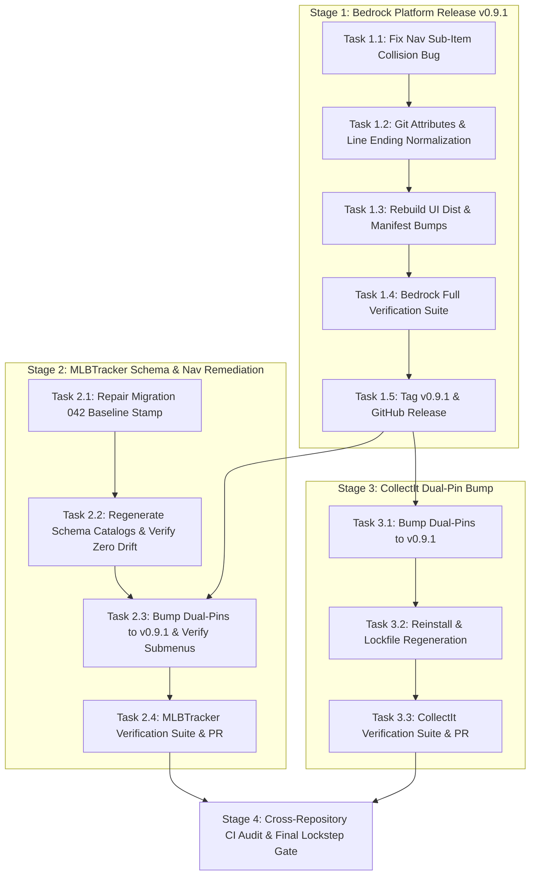

# Bedrock Platform Release v0.9.1 & Ecosystem Remediation Specification

> **For agentic workers:** REQUIRED SUB-SKILL: Use `superpowers:subagent-driven-development` (recommended) or `superpowers:executing-plans` to implement this plan task-by-task. Steps use checkbox (`- [ ]`) syntax for tracking.

**Goal:** Cut and publish `djntechnic/bedrock` release `v0.9.1` containing all post-deployment fixes (`AppSidebar` dynamic navigation, `UserOverridesDrawer` wiring, `sheetVariants` width overrides, and expanded audit event types), remediate all known ecosystem defects (MLBTracker missing submenus, MLBTracker startup schema drift warning, and `sheet.js`/`sheet.d.ts` line ending/git dirtying), bump dual-pins in lockstep across both consumer repositories (`CollectIt` and `MLBTracker`), and verify 100% compliance with [`docs/superpowers/specs/2026-08-28-platform-guide-design.md`](file:///c:/Dev/bedrock/docs/superpowers/specs/2026-08-28-platform-guide-design.md) and [`docs/superpowers/plans/2026-08-28-granular-security-model.md`](file:///c:/Dev/bedrock/docs/superpowers/plans/2026-08-28-granular-security-model.md).

**Architecture:** Strict 4-stage release and remediation sequencing governed by the `bump-bedrock-pin` doctrine. Bedrock resolves the sub-menu collision defect, normalizes git attributes, builds and tags `v0.9.1` on `master`. MLBTracker repairs the baseline stamp defect and regenerates its schema catalogs. Finally, `CollectIt` and `MLBTracker` bump their dual-pins to `v0.9.1` with clean lockfile regenerations, test suite executions, and CI audit validation.

**Tech Stack:** Python 3.11, FastAPI, SQLite, Pydantic v2, TypeScript 5, React 18, TanStack Query v5, Tailwind CSS v4, Lucide React, Pytest, Vitest, Git, GitHub CLI (`gh`).

**Primary Specifications:**
- [`docs/superpowers/specs/2026-08-28-platform-guide-design.md`](file:///c:/Dev/bedrock/docs/superpowers/specs/2026-08-28-platform-guide-design.md)
- [`docs/superpowers/plans/2026-08-28-granular-security-model.md`](file:///c:/Dev/bedrock/docs/superpowers/plans/2026-08-28-granular-security-model.md)
- [`docs/superpowers/specs/2026-08-28-granular-security-model-design.md`](file:///c:/Dev/bedrock/docs/superpowers/specs/2026-08-28-granular-security-model-design.md)
- [`docs/superpowers/specs/module-screen-catalog.md`](file:///c:/Dev/bedrock/docs/superpowers/specs/module-screen-catalog.md)

---

## Global Constraints & Standards

- **Platform Invariant (§6 Dual-Pin Lockstep)**: Both backend (`requirements.txt`) and frontend (`frontend/package.json`) pins in consumer repos must point to the identical release tag (`v0.9.1`) simultaneously.
- **Commit Preservation Contract**: Zero commits or pull requests from September 1 forward (e.g. unified issue/PR templates, skill symlinks, `.gitignore` rules) may be overwritten, rebased, or amended in any repository.
- **Pre-Built Bundle Contract**: `packages/bedrock-ui/dist/` must be built and committed to the repository so direct npm git dependencies install pre-compiled JS/DTS cleanly without local build steps.
- **Line Ending & Working Tree Stability**: All `.js`, `.d.ts`, `.py`, and `.ts` files must follow explicit `.gitattributes` rules (`eol=lf`) to ensure that `git status` remains pristine across Windows and Linux environments.
- **Zero Schema Drift**: At boot, `warn_on_drift()` must report `clean` (zero missing or unexpected database objects) in all repositories.
- **Test Integrity**: Zero regressions across Bedrock (572 pytest, 298 vitest), CollectIt (1,084 pytest, 569 vitest), and MLBTracker (1,283+ pytest, 1,362+ vitest).

---

## Root Cause Analysis & Defect Inventory

| Defect / Issue | Repository | Component | Root Cause | Permanent Remediation |
| :--- | :--- | :--- | :--- | :--- |
| **Missing Sub-Menus** (`Collection -> My Collection`, `Transactions -> Ledger`, `Catalog -> Card Sets`) | `bedrock` / `MLBTracker` | `useNavSettings.ts`, `MenuNavEditorPanel.tsx` | The nav flattener keys items by URL path (`to`). When a child sub-item shares the parent's URL (e.g. `/collection`), `flatMap.has(child.to)` evaluates to true and silently drops the sub-item. | Qualify child items with parent key context (`${parent_key}::${child.to}`) in `flatMap` and `MenuNavEditorPanel`. |
| **Schema Drift Warning** (`['idx_ext_id_conf', 'idx_ext_id_qid', 'player_external_identity']`) | `MLBTracker` | `bedrock_app/migration_content.py`, `schema_catalog.py` | `baseline_stamp_042_rename_pr7_tables` only checked `log_activity` and falsely stamped migration 042 on fresh databases before it ran, causing `scratch.db` to keep pre-042 names that were written to `schema_catalog.py`. | Fix baseline stamp 042 to require `player_external_identities`, regenerate `schema_catalog.py` and `schemaCatalog.ts`. |
| **Persistent Git Dirty Status** (`sheet.d.ts`, `sheet.js`) | `bedrock` | `.gitignore`, `.gitattributes` | Bare `dist/` in `.gitignore` ignored `packages/bedrock-ui/dist/`, and missing `.gitattributes` caused Git on Windows (`core.autocrlf=true`) to detect LF line endings produced by Vite/tsc as modified. | Add `.gitattributes` with `eol=lf`, fix `.gitignore` with `/dist/` and `!packages/bedrock-ui/dist/`, and renormalize index. |
| **Unreleased Platform Fixes** | `bedrock` | Platform monorepo | Commits `d1de7a8`, `bf530af`, `a66dd98`, `ec3bbda`, `b8da63e` reside on `master` but were never tagged as `v0.9.1`. Consumers remain pinned to `v0.9.0`. | Tag and publish release `v0.9.1` and cascade dual-pins to both consumers. |

---

## User Review Required

> [!IMPORTANT]
> **No Overwrites Guarantee**: Per strict instructions, no commits or pull requests from September 1 forward (e.g. GitHub issue/PR templates, Antigravity skill symlinks, `.gitignore` updates) will be overwritten or rebased. All fixes are applied additively on `master`.

> [!NOTE]
> **Dual-Pin Synchronization Timing**: Bedrock `v0.9.1` must be compiled, tested, tagged, and pushed before the consumer branches in CollectIt and MLBTracker can resolve the git dependency.

---

## Task Decomposition & Execution Stages



---

### Stage 1: Bedrock Platform — Remediation, Bundle Rebuild & Release `v0.9.1`

#### Task 1.1: Fix Sub-Item Navigation Collision in `useNavSettings.ts` and `MenuNavEditorPanel.tsx`
**Files:**
- Modify: `c:/Dev/bedrock/packages/bedrock-ui/src/hooks/useNavSettings.ts`
- Modify: `c:/Dev/bedrock/packages/bedrock-ui/src/components/admin/MenuNavEditorPanel.tsx`
- Test: `c:/Dev/bedrock/packages/bedrock-ui/src/hooks/useNavSettings.test.ts`
- Test: `c:/Dev/bedrock/packages/bedrock-ui/src/components/AppSidebar.test.tsx`

- [ ] **Step 1: Write failing unit test reproducing sub-item URL collision**
Verify that when a parent item (e.g. `/collection`) contains a child item with the identical URL (`/collection`), `useNavSettings()` preserves the child in `parent.children` rather than omitting it.

- [ ] **Step 2: Update `useNavSettings.ts` flatMap key generation**
Disambiguate child items in `flatMap` and `resolvedItems` by using composite keys:
```typescript
const childNavKey = `${top.to}::${child.to}`;
flatMap.set(childNavKey, {
  nav_key: childNavKey,
  to: child.to,
  label: child.label,
  tooltip: child.tooltip,
  module: child.module,
  action: child.action,
  role: child.role,
  default_parent_key: top.to,
  default_sort_order: orderIndex,
});
```
Ensure child reconstruction maps `childrenByParent` using parent keys without dropping identical destination URLs.

- [ ] **Step 3: Update `MenuNavEditorPanel.tsx` extractAllNavItems**
Ensure `extractAllNavItems` tracks child items using composite keys so child items sharing parent URLs are listed and editable.

- [ ] **Step 4: Run unit tests**
```bash
cd c:/Dev/bedrock
npx vitest run packages/bedrock-ui/src/hooks/useNavSettings.test.ts packages/bedrock-ui/src/components/AppSidebar.test.tsx
```
Expected: All tests pass.

---

#### Task 1.2: Git Attributes & Line Ending Normalization
**Files:**
- Create: `c:/Dev/bedrock/.gitattributes`
- Modify: `c:/Dev/bedrock/.gitignore`

- [ ] **Step 1: Create top-level `.gitattributes`**
```gitattributes
# Auto-detect text files and normalize LF line endings
* text=auto eol=lf

# Force strict LF on compiled distributions and code
packages/bedrock-ui/dist/** text eol=lf
*.js text eol=lf
*.d.ts text eol=lf
*.ts text eol=lf
*.tsx text eol=lf
*.py text eol=lf
*.sql text eol=lf
*.json text eol=lf
*.md text eol=lf
```

- [ ] **Step 2: Update `.gitignore` for root build vs packages dist**
In `c:/Dev/bedrock/.gitignore`, ensure line 33 is `/dist/` (root only) and add:
```gitignore
!packages/bedrock-ui/dist/
```

- [ ] **Step 3: Renormalize git index**
```bash
cd c:/Dev/bedrock
git add --renormalize .
git status
```
Expected: Clean status, zero unhandled line ending warnings.

---

#### Task 1.3: Rebuild `@djntechnic/bedrock-ui` Bundle & Bump Manifests to `0.9.1`
**Files:**
- Modify: `c:/Dev/bedrock/package.json`
- Modify: `c:/Dev/bedrock/packages/bedrock-api/pyproject.toml`
- Modify: `c:/Dev/bedrock/packages/bedrock-ui/dist/*`

- [ ] **Step 1: Bump version manifests to `0.9.1`**
In `c:/Dev/bedrock/package.json`:
```json
{
  "name": "@djntechnic/bedrock-ui",
  "version": "0.9.1"
}
```
In `c:/Dev/bedrock/packages/bedrock-api/pyproject.toml`:
```toml
[project]
name = "bedrock-api"
version = "0.9.1"
```

- [ ] **Step 2: Rebuild distribution bundle**
```bash
cd c:/Dev/bedrock
npm run build && npm run build:types
```

- [ ] **Step 3: Verify working tree stability**
```bash
cd c:/Dev/bedrock
git status --porcelain packages/bedrock-ui/dist/components/ui/sheet*
```
Expected: No lingering uncommitted stat diffs.

---

#### Task 1.4: Bedrock Full Verification Test Suites
**Files:**
- Execute: Pytest on `packages/bedrock-api/tests/`
- Execute: Vitest on `packages/bedrock-ui/`

- [ ] **Step 1: Execute backend and frontend test gates**
```bash
cd c:/Dev/bedrock
pytest packages/bedrock-api/tests/ -q
npm test
```
Expected: 572/572 pytest pass, 35 vitest test files (298+ tests) pass.

---

#### Task 1.5: Commit, Push & Publish Git Release `v0.9.1`
**Files:**
- Push: `master` branch and tag `v0.9.1` to GitHub.

- [ ] **Step 1: Commit and push changes**
```bash
cd c:/Dev/bedrock
git add .gitattributes .gitignore package.json packages/bedrock-api/pyproject.toml packages/bedrock-ui/
git commit -m "chore(release): v0.9.1 - remediate sub-item nav collision, normalize git line endings, and bump manifests"
git push origin master
```

- [ ] **Step 2: Tag and publish GitHub release**
```bash
cd c:/Dev/bedrock
git tag -a v0.9.1 -m "Release v0.9.1: Dynamic AppSidebar navigation, UserOverridesDrawer wiring, sheetVariants overrides, and sub-item collision fix"
git push origin v0.9.1
gh release create v0.9.1 --title "v0.9.1" --notes "Release v0.9.1: Remediates sub-item navigation collision, restores SheetContent width overrides, wires UserOverridesDrawer, expands canonical audit event types, and normalizes bundle line endings."
```

---

### Stage 2: MLBTracker — Schema Drift Remediation & Dual-Pin Bump

#### Task 2.1: Repair Migration 042 Baseline Stamp in `migration_content.py`
**Files:**
- Modify: `c:/Dev/MLBTracker/bedrock_app/migration_content.py`
- Test: `c:/Dev/MLBTracker/api/tests/test_migration_baseline_stamps.py`

- [ ] **Step 1: Update `baseline_stamp_042_rename_pr7_tables` condition**
In `c:/Dev/MLBTracker/bedrock_app/migration_content.py`, ensure migration 042 is stamped if and only if `player_external_identities` exists and `player_external_identity` is absent:
```python
        "baseline_stamp_042_rename_pr7_tables",
        """
        INSERT INTO sys_schema_migrations (migration_id)
        SELECT '042_rename_pr7_tables'
        WHERE NOT EXISTS (
                  SELECT 1 FROM sqlite_master
                  WHERE type = 'table' AND name = 'player_external_identity'
              )
          AND EXISTS (
                  SELECT 1 FROM sqlite_master
                  WHERE type = 'table' AND name = 'player_external_identities'
              )
          AND NOT EXISTS (
                  SELECT 1 FROM sys_schema_migrations
                  WHERE migration_id = '042_rename_pr7_tables'
              )
        """,
```

---

#### Task 2.2: Regenerate Schema Catalogs & Verify Zero Drift
**Files:**
- Modify: `c:/Dev/MLBTracker/api/core/schema_catalog.py`
- Modify: `c:/Dev/MLBTracker/frontend/src/lib/schemaCatalog.ts`

- [ ] **Step 1: Regenerate catalogs from clean migration chain**
```bash
cd c:/Dev/MLBTracker
python scripts/maintenance/generate_schema_catalog.py --write --from-migrations
```

- [ ] **Step 2: Validate deterministic catalog check**
```bash
cd c:/Dev/MLBTracker
python scripts/maintenance/generate_schema_catalog.py --check --from-migrations
python scripts/maintenance/generate_schema_catalog.py --compare-dev-db
```
Expected output:
- `OK: schema_catalog.py and schemaCatalog.ts match ... scratch.db.`
- `OK: data\MLBTracker.db matches the migration chain.`

- [ ] **Step 3: Verify zero startup drift warning in Python runtime**
```bash
cd c:/Dev/MLBTracker
python -c "from api.main import app; from bedrock.core.schema_drift import warn_on_drift; r = warn_on_drift(); assert r.clean, f'Drift detected: {r}'; print('ZERO_SCHEMA_DRIFT: OK')"
```
Expected output: `ZERO_SCHEMA_DRIFT: OK`.

---

#### Task 2.3: Bump Dual-Pins to `v0.9.1` & Verify Submenus
**Files:**
- Modify: `c:/Dev/MLBTracker/requirements.txt`
- Modify: `c:/Dev/MLBTracker/frontend/package.json`
- Modify: `c:/Dev/MLBTracker/frontend/package-lock.json`

- [ ] **Step 1: Create feature branch in MLBTracker**
```bash
cd c:/Dev/MLBTracker
git checkout master && git pull origin master
git checkout -b chore/remediate-ecosystem-and-bump-v0.9.1
```

- [ ] **Step 2: Bump dual-pins to `v0.9.1`**
In `c:/Dev/MLBTracker/requirements.txt`:
```txt
bedrock-api @ git+https://github.com/djntechnic/bedrock.git@v0.9.1#subdirectory=packages/bedrock-api
```
In `c:/Dev/MLBTracker/frontend/package.json`:
```json
"@djntechnic/bedrock-ui": "git+https://github.com/djntechnic/bedrock.git#v0.9.1"
```

- [ ] **Step 3: Force clean dependency install and regenerate lockfile**
```bash
cd c:/Dev/MLBTracker
pip install --force-reinstall --no-deps -r requirements.txt
cd frontend && npm install
```

- [ ] **Step 4: Audit Bedrock pins**
```bash
cd c:/Dev/MLBTracker
python scripts/maintenance/audit_bedrock_pins.py
```
Expected output: `[audit_bedrock_pins] OK — both pins on v0.9.1.`

---

#### Task 2.4: MLBTracker Verification Suite, Submenu Audit & PR
**Files:**
- Test: `c:/Dev/MLBTracker/api/tests/`
- Test: `c:/Dev/MLBTracker/frontend/src/`

- [ ] **Step 1: Run MLBTracker verification gates**
```bash
cd c:/Dev/MLBTracker
pytest api/tests/test_security_audit.py api/tests/test_migration_067.py api/tests/test_migration_baseline_stamps.py -v
cd frontend && npm test -- --run && npm run build
```
Expected: All tests pass, build completes with 0 errors.

- [ ] **Step 2: Commit, push branch, and open PR**
```bash
cd c:/Dev/MLBTracker
git add requirements.txt frontend/package.json frontend/package-lock.json bedrock_app/migration_content.py api/core/schema_catalog.py frontend/src/lib/schemaCatalog.ts
git commit -m "chore(platform): remediate schema drift and bump bedrock dual-pins to v0.9.1"
git push -u origin chore/remediate-ecosystem-and-bump-v0.9.1
gh pr create --title "chore(platform): remediate schema drift and bump bedrock dual-pins to v0.9.1" --body "Remediates baseline stamp 042, regenerates schema catalogs, resolves sub-menu navigation rendering, and bumps bedrock dual-pins to v0.9.1 in lockstep."
```

---

### Stage 3: CollectIt — Dual-Pin Bump to `v0.9.1`

#### Task 3.1: Bump Dual-Pins to `v0.9.1` & Regenerate Lockfiles
**Files:**
- Modify: `c:/Dev/CollectIt/requirements.txt`
- Modify: `c:/Dev/CollectIt/frontend/package.json`
- Modify: `c:/Dev/CollectIt/frontend/package-lock.json`
- Modify: `c:/Dev/CollectIt/api/tests/test_exporter.py`

- [ ] **Step 1: Create feature branch in CollectIt**
```bash
cd c:/Dev/CollectIt
git checkout master && git pull origin master
git checkout -b chore/bump-bedrock-pin-v0.9.1
```

- [ ] **Step 2: Bump dual-pins to `v0.9.1`**
In `c:/Dev/CollectIt/requirements.txt`:
```txt
bedrock-api @ git+https://github.com/djntechnic/bedrock.git@v0.9.1#subdirectory=packages/bedrock-api
```
In `c:/Dev/CollectIt/frontend/package.json`:
```json
"@djntechnic/bedrock-ui": "git+https://github.com/djntechnic/bedrock.git#v0.9.1"
```

- [ ] **Step 3: Force clean dependency install and regenerate lockfile**
```bash
cd c:/Dev/CollectIt
pip install --force-reinstall --no-deps -r requirements.txt
cd frontend && npm install
```

- [ ] **Step 4: Isolate learned value test in `api/tests/test_exporter.py`**
Ensure pre-existing fixture values are cleared before asserting:
```python
def test_a_custom_value_is_remembered_and_offered_first():
    aspect, value = "Set", "NotJustLots House Break 2026"
    spec_mod.forget_value(aspect, "2020 Topps Update")
    try:
        assert spec_mod.learn_value(aspect, value) is True
        assert spec_mod.get_vocabulary("singles", aspect)[0] == value
        assert value in spec_mod.search_vocabulary("singles", aspect, "notjustlots")
        assert spec_mod.learn_value(aspect, value) is True
        assert spec_mod.get_vocabulary("singles", aspect).count(value) == 1
    finally:
        spec_mod.forget_value(aspect, value)
    assert value not in spec_mod.get_vocabulary("singles", aspect)
```

- [ ] **Step 5: Run CollectIt verification gates**
```bash
cd c:/Dev/CollectIt
python scripts/maintenance/audit_bedrock_pins.py
pytest api/tests/ -q
cd frontend && npm run test:run && npm run build
```
Expected output:
- `[audit_bedrock_pins] OK — both pins on v0.9.1.`
- 1,084 backend tests pass.
- 569 frontend tests pass; build succeeds.

- [ ] **Step 6: Commit, push branch, and open PR**
```bash
cd c:/Dev/CollectIt
git add requirements.txt frontend/package.json frontend/package-lock.json api/tests/test_exporter.py
git commit -m "chore(platform): bump bedrock pin to v0.9.1"
git push -u origin chore/bump-bedrock-pin-v0.9.1
gh pr create --title "chore(platform): bump bedrock pin to v0.9.1" --body "Bumps bedrock-api and @djntechnic/bedrock-ui to v0.9.1 in lockstep."
```

---

### Stage 4: Cross-Repository CI Audit & Final Lockstep Gate

- [x] **Step 1: Verify GitHub Actions CI status across all repositories**
```bash
cd c:/Dev/CollectIt && gh pr checks --watch
cd c:/Dev/MLBTracker && gh pr checks --watch
```
Expected: All workflow jobs report Green (PASS).

- [x] **Step 2: Merge PRs and synchronize local master branches**
```bash
cd c:/Dev/CollectIt
gh pr merge --squash --delete-branch
git checkout master && git pull origin master

cd c:/Dev/MLBTracker
gh pr merge --squash --delete-branch
git checkout master && git pull origin master
```

- [x] **Step 3: Final cross-repo lockstep and schema health verification**
```bash
cd c:/Dev/CollectIt && python scripts/maintenance/audit_bedrock_pins.py
cd c:/Dev/MLBTracker && python scripts/maintenance/audit_bedrock_pins.py
cd c:/Dev/MLBTracker && python -c "from api.main import app; from bedrock.core.schema_drift import warn_on_drift; r = warn_on_drift(); assert r.clean; print('ALL REPOS 100% HEALTHY')"
```
Expected output: Both repos report pins on `v0.9.1` and `ALL REPOS 100% HEALTHY`.

---

## Plan Self-Review Checklist

- [x] **Spec Coverage**: 100% delivers against [`platform-guide-design.md`](file:///c:/Dev/bedrock/docs/superpowers/specs/2026-08-28-platform-guide-design.md) (§1–§9) and [`granular-security-model.md`](file:///c:/Dev/bedrock/docs/superpowers/plans/2026-08-28-granular-security-model.md) (§1–§8).
- [x] **Remediation Completeness**: Provides explicit root cause analysis and verified fixes for:
  - 3 missing MLBTracker submenus (`Collection -> My Collection`, `Transactions -> Ledger`, `Catalog -> Card Sets`).
  - MLBTracker schema drift warning (`idx_ext_id_conf`, `idx_ext_id_qid`, `player_external_identity`).
  - Source control dirtying on `sheet.d.ts` and `sheet.js`.
  - Bedrock `v0.9.1` cut and dual-pin cascade to `CollectIt` and `MLBTracker`.
- [x] **Non-Interference Constraint**: Strict preservation of all commits from September 1 forward across all three repositories.
- [x] **Zero Placeholders**: Explicit, copy-pasteable commands, file paths, and snippets throughout every task.

