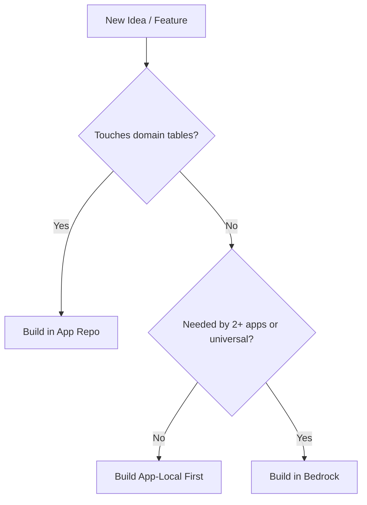

# Bedrock Platform Guide

## 1. Executive Summary & The Core Platform Invariant

Bedrock is a foundational application framework providing standardized, non-business infrastructure for its consumer applications. This infrastructure includes a FastAPI app factory, authentication & RBAC, a grid engine, application configuration, a database migration runner, schema drift detection, media and mail providers, and administrative management panels.

### The Core Platform Invariant

Bedrock contains **zero business domain logic or vocabulary**. There are no cards, no listings, no players, no teams, no leagues, and no pricing concepts within this repository. 

**The Boundary Rule / Test:**
*A backend service or endpoint belongs to the consumer app if and only if it accesses application-specific tables.*
If a service operates exclusively against platform tables (such as `app_grid_settings`, `auth_users`, or `app_config_settings`) or abstract interfaces, it belongs to Bedrock.

### Safe Degradation

Bedrock is designed for absolute consumer independence. The platform must always be able to boot and operate with zero registered domain contributions. All extension points degrade gracefully to safe defaults. A Bedrock application with no domain specific logic registered still boots successfully and presents a functional admin panel.

## 2. The Repository Ecosystem

The Bedrock ecosystem currently consists of one upstream foundation repository and two distinct consumer applications. 

*   **Monorepo Upstream:** `djntechnic/bedrock` produces two primary artifacts: `bedrock-api` (Python/FastAPI) and `@djntechnic/bedrock-ui` (React/TypeScript).
*   **Consumer 1:** `djntechnic/MLBTracker` is the historical origin of the extracted platform. It operates within the baseball analytics domain, dealing with rankings, players, rosters, and transactions.
*   **Consumer 2:** `djntechnic/CollectIt` operates in the collectibles marketplace domain (cards, listings, marketplace integrations). Its existence proves the complete decoupling of the platform from its baseball origins.

### Extraction Background

Bedrock was born from the need to eliminate code duplication across consumers. As a second application required the same grid engine, authentication stack, and admin console as MLBTracker, these shared abstractions were extracted into the Bedrock platform. This ensures bug fixes, security patches, and platform enhancements are made once and distributed to all consumer applications seamlessly.

## 3. Change Evaluation Rubric & Decision Framework

When proposing a new feature, enhancement, or capability, it is critical to determine where the code belongs and how it should be integrated.

### Decision Flowchart

### The Rule of Two for Generalization

Avoid premature generalization. If a capability is currently only needed by one consumer, build it in that consumer first. Promote to Bedrock only when a second consumer requires the capability. Premature generalization is the primary way a foundation repository becomes bloated and rigid.

### Extension Point Selection Matrix

When Bedrock requires application knowledge, it exposes an extension point. There are two primary kinds of extension points, plus a variation for early boot sequences. 

| Kind | Purpose | Behavior | Resolution | Example |
| :--- | :--- | :--- | :--- | :--- |
| **Registry** | *"What else should the platform include?"* | Additive / All Win | Code-Driven | `register_health_counter`, `register_canonical_tables`, `register_schema_objects`, `navRegistry` |
| **Provider** | *"Who performs this capability?"* | Swappable / Exactly One Wins | Config-Driven | `mail_provider`, `storage_provider` |
| **Dotted-Path** | Early Boot Additive | Additive (Resolved early) | Import / Module Path | `APP_CATEGORIES`, `ADD_COLUMN_MIGRATIONS` |

*   **Registries** are additive; every registration runs. They are defined in code and executed at import time.
*   **Providers** are swappable implementations where exactly one wins, backed by rows in `app_config_settings` and resolved lazily.
*   **Dotted-Path** is used for registries required *before* the application module runs imports (e.g., inline schema migrations).

For a comprehensive guide on adding new registries or providers and their failure policies, see [`docs/extension_points.md`](extension_points.md).

## 4. Backend Platform Contract & Lifecycle

### Unified App Factory

The entry point for building a Bedrock application is `bedrock.core.app_factory.create_app()`. This factory handles the mounting order, CORS configuration, platform error handlers, rate-limiting, the 7 platform routers, and SEO routes. (See [`docs/app_assembly.md`](app_assembly.md)).

Crucially, it registers the `DatabaseQueryError` handler which ensures proper error envelopes are returned rather than failing silently and causing empty grids on the frontend. It also overrides the default slowapi rate limiter with Bedrock's custom 429 handler.

### Lifespan Boot Pipeline

The application lifecycle follows a strict sequence during boot:

1.  `validate_connection()`
2.  `before_migrations` hooks
3.  `apply_migrations()`
4.  `warn_on_drift()`
5.  `assert_database_healthy()`
6.  `after_bootstrap` hooks
7.  *Serving requests*
8.  `on_shutdown` hooks
9.  `close_pool()`

### The Hook Contracts

*   `before_migrations`: For actions requiring a validated connection but running before migrations (e.g., baseline bootstraps).
*   `after_bootstrap`: For actions running once the database is healthy (e.g., background workers, schedulers).
*   `on_shutdown`: For clean teardown before the connection pool closes.

### The Eager-Import Rule (Hard Invariant)

**All extension point registrations must execute as eager module-import side-effects** (e.g., `import api.domain`). They must **NEVER** be placed inside lifespan hooks. This is a hard invariant because ASGI test transports do not execute lifespan, meaning anything registered there is invisible to endpoint tests.

## 5. Frontend Platform Contract & Build System

### Barrel Import Rule

All platform components must be imported strictly via `@djntechnic/bedrock-ui`. Deep path imports (e.g., `@djntechnic/bedrock-ui/components/ui/button`) are completely unsupported for application code.

### Grid Engine

The grid subsystem centers around `<DataGrid>` and `useGridConfig`, acting as the single location for `useReactTable`. Custom column or media rendering is not handled directly in the grid code but registered through the `cellRegistry` and `rowAccentRegistry`.

### Design Tokens & Theming

Bedrock dictates the token contract names in `styles/tokens.css`. Consumers must supply the actual theme values in their local `index.css`. This enforces consistency while allowing each application its own branding.

### 3 Load-Bearing Build Rules

To successfully compile the TypeScript source provided by Bedrock, consumers must follow three load-bearing configuration rules:

1.  `vite.config.ts`: Must include `esbuild.jsx` and `optimizeDeps.exclude` for the Bedrock package to prevent esbuild's classic JSX transform from throwing "React is not defined".
2.  `vite.config.ts`: Must include `test.server.deps.inline` for Vitest so dependencies resolve correctly on their own path.
3.  `src/index.css`: Must include an `@source` directive scanning the Bedrock package so Tailwind v4 compiles platform UI classes. Without this, the UI renders unstyled.

## 6. The Dual-Pin Dependency Contract

### The Dual Pin Rule

Because Bedrock provides both backend and frontend artifacts, both must be pinned to the exact same git release tag simultaneously. `bedrock-api` (in `requirements.txt`) and `@djntechnic/bedrock-ui` (in `frontend/package.json`) must always match (e.g., `v0.8.1`). 

### Repo-Root NPM Layout

The Bedrock `package.json` resides at the repository root, not inside `packages/bedrock-ui/`. This is because npm cannot install from a git subdirectory. The `exports` map points to `packages/bedrock-ui/dist/`, which is built dynamically at install time via the `prepare` script. 

### Install Gotchas

Never use `npm install --ignore-scripts` when installing Bedrock. Doing so skips the `prepare` script, resulting in no `dist/` directory and causing Vitest to fail resolving the package. Additionally, to properly update pins, explicitly name the package and ref (e.g., `npm install "@djntechnic/bedrock-ui@github:djntechnic/bedrock#<tag>"`) to force the lockfile to update the `resolved` SHA.

## 7. Cross-Repository Development & Release Lifecycle

### Local Dev Workflow

For day-to-day development across repositories, use an editable Python install: `pip install -e ../bedrock/packages/bedrock-api`. Changes in Bedrock will instantly reflect in the consumer's dev server. **Never** commit `file:` or `link:` paths into the consumer's `package.json` or `requirements.txt`.

### Release Choreography

Releases always happen in Bedrock first, cascading to consumers:

1.  Bedrock PR is merged to `master`.
2.  The `/cut-release <tag>` command generates release notes, explicitly including a `## For consumers` adoption section.
3.  The git tag is pushed using the full 40-char SHA.
4.  The GitHub Action `.github/workflows/cascade.yml` automatically opens `cascade:pending` issues in CollectIt and MLBTracker.
5.  Consumers run `/bump-bedrock-pin <tag>` and resolve the adoption issues as either `boarded` or `declined-with-reason`.

## 8. Consumer Profiles & Divergence Matrix

While Bedrock standardizes infrastructure, consumers utilize its features differently based on their domains.

| Capability / Feature | CollectIt | MLBTracker | Notes |
| :--- | :--- | :--- | :--- |
| **Domain** | Collectibles Marketplace | Baseball Analytics | Proves multi-domain platform decoupling. |
| **Current Season Resolver** | Omitted | Registered | CollectIt has no season concept; degrades safely to current year. |
| **Dashboard Pinning** | Omitted | Registered | CollectIt lacks a dashboard; omits `registerDashboardPinHost()`. |
| **Storage Provider** | App-Local (R2) | Bedrock | CollectIt requires S3/R2 listing capabilities not in Bedrock's protocol ([`docs/object_storage.md`](object_storage.md), [`docs/media.md`](media.md)). |
| **Extraction Status** | Fully Decoupled | Fully Decoupled | Legacy MLBTracker artifacts (e.g. `collector` role) have been scrubbed. |

### "Absence as a Feature"

CollectIt intentionally omits the `current_season` and `registerDashboardPinHost()` registrations. Since CollectIt has no dashboard, registering the pin host would expose UI toggles that do nothing visible. The platform is designed such that the absence of these registrations is handled gracefully—the feature is simply off. Do not "fix" this by adding dummy registrations.

## 9. Guardrails, Common Pitfalls & Audit Gates

### SQL `%s` Placeholder Rule

Bedrock enforces the use of the `%s` parameter syntax across all SQLite queries. These are rewritten dynamically by the `DatabaseManager` at runtime. **Never use the `?` placeholder.**

### Database Schema Drift

Bedrock runs a drift check uniting the platform's schema catalog with the consumer's registered catalog (`api/domain/schema_objects.py`). This prevents unknown tables from turning boot warnings into a wall of noise and ensures integrity.

### Automated CI Audit Gates

Bedrock enforces consistency through automated CI scripts:
*   `audit_bedrock_pins.py`: Asserts both dependency pins match, are release tags, and are not local paths.
*   `audit_s1_duplicates.py`: Prevents duplicate entries in platform systems.
*   `audit_design_tokens.py`: Verifies token contract adherence.
*   `audit_api_docs.py`: Ensures API documentation stays current with route definitions.

For deployment configuration, Dockerfiles, and compose templates, see [`docs/deployment.md`](deployment.md).
