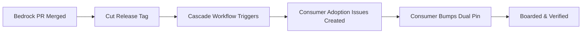

# Platform Architecture & Evolution Roadmap

This document outlines the architectural vision, strategic priorities, and evolution roadmap for Bedrock. It details the platform's core pillars, future capabilities, and the release adoption lifecycle.

For historical extraction milestones and initial consolidation records, see the [Historical Platform Extraction Roadmap (August 2026)](../archive/2026-08-historical-extraction-roadmap.md).

---

## 1. Architectural Pillars

Bedrock's evolution is organized around five core infrastructure pillars:

### Pillar 1: High-Performance Data Grid & UI Engine
*   **Virtualization & Rendering:** Continuous optimization of `@tanstack/react-table` integration with virtualized DOM windows for handling massive datasets (100k+ rows).
*   **Grid Customization:** Persistent user column state, server-side sorting/filtering protocols, dynamic filter builders, and composite cell formatters.
*   **Design Token Synchronization:** Seamless synchronization between token design specifications (`.stitch/DESIGN.md`) and runtime Tailwind/CSS-variable themes.

### Pillar 2: Identity, RBAC & Security Infrastructure
*   **Authentication Engine:** Standardized JWT cookie handling, refresh rotation, and session management.
*   **Role-Based Access Control:** Fine-grained permission trees, declarative route guards, and audit-logged role elevation.
*   **Security Event Auditing:** Centralized platform security log streaming, threat telemetry, and suspicious activity detection.

### Pillar 3: Schema Catalog & Migration Orchestration
*   **Zero Raw Literals:** Complete catalogization of database schema objects via code-generated catalogs (`schema_catalog.py`), eliminating bare string literals.
*   **Schema Drift Guardrails:** Automated validation reconciling application tables with platform schemas at application startup.
*   **Multi-Engine Prepared Statements:** Unified SQL abstraction enforcing `%s` parameterization and dynamic query translation.

### Pillar 4: Platform Tooling & Verification Gates
*   **Boundary Enforcement:** Automated audits (`audit_s1_duplicates`, `audit_design_tokens`, `audit_api_docs`) verifying strict separation between platform infrastructure and domain logic.
*   **Dual-Pin Governance:** Automated integrity verification ensuring backend and frontend dependencies stay perfectly aligned to release tags.
*   **Documentation Reconciliation:** Continuous automated validation of API documentation against exposed FastAPI routes.

### Pillar 5: Extension Points & Provider Ecosystem
*   **Pluggable Storage Providers:** Modular object storage abstraction with swappable local, S3, and cloud object store adapters.
*   **Modular Notifications:** Standardized mail and messaging provider protocols with transactional fallback chains.
*   **Safe Degradation:** Resilient fallback behavior ensuring all platform interfaces operate smoothly even when optional consumer hooks are unregistered.

---

## 2. Release & Cascading Adoption Lifecycle

Platform capabilities are delivered to consumers through a decoupled, asynchronous release lifecycle:

1.  **Platform Release:** Releases are tagged in Bedrock using semantic release tags. Every release note includes a dedicated `## For consumers` adoption section.
2.  **Automated Cascade Dispatch:** The cascade workflow extracts the consumer guidance and files `cascade:pending` tracking issues in all registered downstream repositories.
3.  **Consumer Boarding:** Consumer applications bump their dual dependency pins (`bedrock-api` and `@djntechnic/bedrock-ui`) concurrently, execute local test suites, and resolve adoption issues as either `boarded` or `declined-with-reason`.

---

## 3. Guiding Principles for Platform Growth

*   **The Rule of Two:** Never build for hypothetical consumers. Generalize an abstraction into Bedrock only when required by two or more distinct operational domains.
*   **Zero Domain Knowledge:** Bedrock remains completely agnostic of specific business domains. Domain models, business entities, and product logic strictly belong to consumer applications.
*   **Absence as a Feature:** Consumers only implement the extension points relevant to their domain. Omitted hooks degrade gracefully without requiring mock or dummy implementations.
