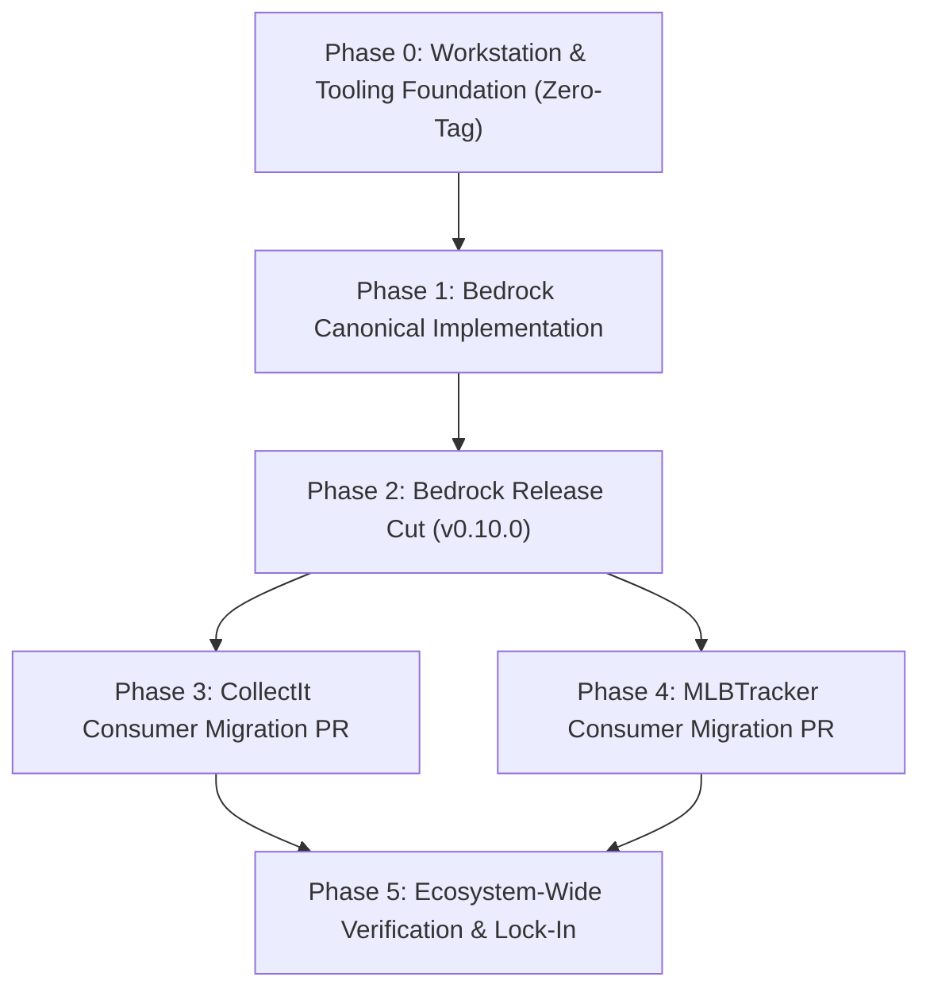

# Consolidated Ecosystem Standards, Tooling, and Testing Architecture Roadmap

**Document ID**: `SPEC-2026-09-12-CONSOLIDATED-ECOSYSTEM-ROADMAP`
**Status**: Approved Architectural Design
**Date**: 2026-09-12
**Ecosystem Scope**:
- `bedrock` (`C:\Dev\bedrock`) — Platform substrate (`bedrock-api`, `@djntechnic/bedrock-ui`)
- `CollectIt` (`C:\Dev\CollectIt`) — Domain consumer: Collectibles & eBay listing engine
- `MLBTracker` (`C:\Dev\MLBTracker`) — Domain consumer: Baseball analytics & inventory ledger
- `claude-kit` (`C:\Dev\claude-kit`) — Canonical authority for shared doctrine, skills, and agents
- Workstation Automation & Windows Environment: Windows 11 Pro, PowerShell 7, Task Scheduler

---

## 1. Executive Summary & Synthesis

This architectural specification consolidates and reconciles four foundational initiatives across the Bedrock ecosystem:
1. **Unified Automated Testing Architecture** (`docs/specs/2026-09-11-automated-testing-architecture.md`)
2. **Agentic Tooling Standardization & Zero-Duplication Substrate** (`docs/specs/2026-09-12-agentic-tooling-standardization.md`)
3. **Cross-Repository Standards, Directory Taxonomy, and Kebab-Case File Naming** (`docs/specs/2026-09-12-cross-repo-standards-tooling-and-naming-architecture.md`)
4. **Ecosystem Standards & Tooling Architecture (S001–S012)** (`docs/specs/2026-09-12-ecosystem-standards-and-tooling-architecture.md`)

### Core Architectural Decisions & Invariants
- **Zero Business Logic Changes (MANDATORY)**: This entire initiative strictly encompasses tooling, standards enforcement, directory taxonomy, workflow automation, and testing architecture. There are **zero intended business logic modifications**. If any step attempts or requires modifying domain calculations, persistence logic, business rules, or database models, it is **out of scope and considered a defect**.
- **Python Environment Realities**: `C:\Dev\CollectIt\.venv\Scripts\python.exe` is the only repository-scoped virtualenv in the ecosystem. `bedrock` and `MLBTracker` deliberately do not use local virtualenvs; they execute directly on the host Python 3.11 environment (`python` on PATH).
- **Platform-First Delivery (`v0.10.0`)**: Bedrock centralizes all platform standards (`s001`–`s012`), 1:1 audit tools (`bedrock.tools.audit_s###`), declarative config (`bedrock.toml`), taxonomy remediation engine, and QA orchestrator (`run_qa.py`). Bedrock releases as `v0.10.0`, allowing `CollectIt` and `MLBTracker` to migrate in a single, coordinated PR without intermediate release thrashing.
- **Canonical 3-Digit Standards Taxonomy with Lowercase Kebab-Case on Disk**:
  - `s001`–`s099`: Reserved strictly for Bedrock platform contracts.
  - `s100`–`s999`: Reserved for application-level domain doctrines.
  - Files on disk are strictly lowercase kebab-case (`docs/standards/s001-no-duplicate-ui-code.md`).
  - Text citations use 3-digit padded references: `§S001` or `[§S001](s001-no-duplicate-ui-code.md)`.
- **1-to-1 Audit Script Parity**: Every standard has exactly one corresponding audit script (`bedrock.tools.audit_s001_duplicates.py`, `scripts/audits/audit_s101_ebay_compliance.py`). No standard is purely "review-enforced."
- **Declarative Manifest Configuration (`bedrock.toml`)**: Tools source exemptions additively from `bedrock.toml`. Every tool section requires an explicit `exemptions = [...]` list.
- **Shared Tooling Authority in `claude-kit`**: `claude-kit` is the single canonical source of truth for all shared skills, agents, and hooks. Shared assets are tracked only in `claude-kit` and deployed to consumer repositories as untracked NTFS directory junctions.
- **Automated Workstation Synchronization**: Scheduled Windows tasks execute background maintenance to ensure directory junctions and superpowers paths stay continuously synchronized.
- **Automated Workstation Synchronization & Token Hygiene**: Scheduled Windows tasks execute background maintenance to ensure directory junctions and superpowers paths stay continuously synchronized while actively purging stale symlinks, redundant agents, and dead hooks to prevent token bloat.

---

## 2. Directory Taxonomy & Repository Boundaries

### 2.1 Ecosystem Repository Topology

```text
C:\Dev\
├── claude-kit/     --> Canonical source of truth for shared skills, doctrine plugins,
│                       NTFS junction compiler (Sync-AgenticTooling.ps1), and dual-target agent schemas.
│                       Tracked in git: plugins/, scripts/, .claude-plugin/.
│
├── bedrock/        --> Platform Substrate (bedrock-api and @djntechnic/bedrock-ui):
│                       Owns platform standards (s001-s012), bedrock.tools audit engine,
│                       run_qa.py orchestrator, and base bedrock.toml schemas.
│
├── CollectIt/      --> Domain Consumer: Collectibles & eBay listing engine.
│                       Owns domain standards (s101-s102), listing templates (templates/),
│                       and domain audit gates (scripts/audits/).
│
└── MLBTracker/     --> Domain Consumer: Baseball analytics & inventory ledger.
                        Owns domain standards (s101-s102), player statistics pipelines,
                        and domain audit gates (scripts/audits/).
```

### 2.2 Canonical Six-Folder Documentation Taxonomy
Every documentation file under `docs/` in every repository must reside in one of exactly six authorized folders:

```text
docs/
├── guide/          # User-facing manuals, operational runbooks, and API guides
├── reference/      # Durable technical deep dives, architectural notes, and schemas
├── standards/      # Non-negotiable contracts: s001-s099 (Platform), s100-s999 (Domain)
├── specs/          # Formal architectural designs (YYYY-MM-DD-<slug>-design.md)
├── plans/          # Execution plans and roadmaps (YYYY-MM-DD-<slug>-plan.md)
└── project/        # Active, multi-phase scoped initiatives (evicted upon cutover)
```

* **Universal Root Exceptions**: `README.md`, `CLAUDE.md`, and `GEMINI.md` remain uppercase at designated repository roots.
* **The `scratch/` Invariant**: Ephemeral punchlists, QA notes, screenshot captures, and diagnostic scratch scripts live in root `<repo>/scratch/` (globally gitignored in all repositories).
* **Superpowers Path Alignment**: Workstation automation sets `-CustomSpecPath "docs/specs"` and `-CustomPlanPath "docs/plans"` so agent skills emit directly into canonical folders.

### 2.3 Strict Casing & NTFS Two-Stage Rename Invariant
* **Documentation**: Lowercase kebab-case (`^[a-z0-9-]+(\.[a-z0-9-]+)*\.md$`).
* **Listing Templates**: Lowercase kebab-case (`^[a-z0-9-]+(\.[a-z0-9-]+)*\.(html|j2)$`).
* **Python Scripts**: Lowercase snake_case (`^[a-z0-9_]+\.py$`).
* **Service Launchers**: Lowercase snake_case (`^[a-z0-9_]+\.(bat|ps1|cmd|vbs)$`).
* **Agent & Git Hooks**: Lowercase kebab-case (`^[a-z0-9-]+\.(sh|bash)$`).
* **Windows Two-Stage Staging Invariant (MANDATORY)**:
  To prevent NTFS case-insensitivity collisions and index corruption, case-altering renames (e.g. `Templates/` -> `templates/` or `S01_...` -> `s001-...`) must stage through an intermediate unique identifier:
  ```powershell
  git mv <SourcePath> <SourcePath>__tmp
  git mv <SourcePath>__tmp <target-path>
  ```

### 2.4 Consumer Script Partitioning Contract
Consumer repositories (`CollectIt`, `MLBTracker`) enforce strict subdirectory partitioning under `scripts/`:
* **`scripts/audits/` (Blocking Quality Gates)**:
  - Contains **only** automated audit scripts enforcing domain contracts (`audit_s101_*.py`, `audit_s102_*.py`).
  - Zero duplicate platform audit scripts; all platform audits run from `bedrock.tools`.
  - Scripts compose `bedrock.tools._reporter.AuditReporter` for uniform UX, assertion output, and exit codes.
* **`scripts/maintenance/` (Operational / Repo Maintenance)**:
  - Contains operational tools, ETL jobs, database backup/restore scripts, and generation utilities (`generate_schema_catalog.py`, `backup_database.py`, `run_etl_players.py`).
  - These scripts are operational utilities, not blocking CI quality gates.

---

## 3. Shared & Domain Tooling Canonical Ownership in `claude-kit`

### 3.1 Total Tooling Authority & Immutability Contract
- **Universal Canonical Owner**: `C:\Dev\claude-kit` is the **sole authoring authority for ALL agents, skills, rules, and hooks** across the entire ecosystem — including both cross-cutting core doctrine and application-specific domain doctrine (e.g. CollectIt's `audit-ebay-compliance` and listing studio agents; MLBTracker's `check-grid` and `grid-guru`).
- **Git Tracking Exclusivity**: All skills, agents, rules, and hooks are committed to git **exclusively** in `claude-kit`. Consumer repositories (`bedrock`, `CollectIt`, `MLBTracker`) do **not** track `.agents/skills/`, `.agents/agents/`, `.claude/skills/`, `.claude/agents/`, or `.claude/hooks/` in git; these paths are explicitly gitignored.
- **Read-Only Junction Deployment**: In each consumer repository, skills, agents, and hooks are deployed strictly as read-only NTFS Directory Junctions (`New-Item -ItemType Junction`) pointing into `claude-kit`. All updates, additions, and refactors must originate within `claude-kit` and be deployed down to consumers.
- **Comprehensive Tooling Directory Layout (`claude-kit/plugins/`)**:
  - `bedrock-doctrine`: `bump-bedrock-pin`, `cut-release`, `quality-gatekeeper.json`.
  - `dev-doctrine`: `anti-ui-slop`, `issue-triage`, `react-best-practices`, `sql-sentinel`, `triage-plan`, `implement-issue`, `run-tests`, `finalize-changes`.
  - `collectit-doctrine`: `audit-ebay-compliance`, `exporter-pipeline-specialist.json`, `listing-studio-engineer.json`, `route-security-engineer.json`, `schema-domain-architect.json`, `post-edit-check.sh`.
  - `mlbtracker-doctrine`: `check-grid`, `grid-guru`, `compaction_brief.py`, `session_context.py`, `stop-reminder.sh`. (Deprecated `grid-refact` is permanently purged).
- **Authoring & Deployment Runbook**: `claude-kit/docs/guide/authoring-and-deploying-agentic-tooling.md` serves as the authoritative operational runbook explaining how to author new multi-target agents, write frontmatter skills, define hooks, configure target repo manifests in `Sync-AgenticTooling.ps1`, and verify junction propagation.

### 3.2 Scheduled Windows Maintenance Tasks
To ensure that local junctions and tool configurations never drift across reboots, branch switches, or workstation updates, two Windows Scheduled Tasks are registered:

1. **`Bedrock-Sync-AgenticTooling`**:
   - **Trigger**: Daily at workstation startup / user logon and every 12 hours.
   - **Action**: Runs `pwsh -File C:\Dev\claude-kit\scripts\Sync-AgenticTooling.ps1`.
   - **Contract**: Deploys/rebuilds NTFS Directory Junctions from `claude-kit` into all consumer repos and global discovery paths (`~/.gemini/skills`, `~/.claude/skills`), compiles dual-target agents, and verifies link health.
   - **Pruning & Token Mitigation**: Explicitly scans and deletes stale/broken symlinks, orphaned directory junctions, deprecated skills (e.g. `grid-refact` in MLBTracker), and unused agent/hook files across all repositories and global directories, eliminating agent context bloat and token waste.
2. **`Bedrock-Align-SuperpowersPaths`**:
   - **Trigger**: Daily at user logon and on plugin update.
   - **Action**: Runs `pwsh -File C:\Dev\TheLab\WorkstationTools\SuperpowersUpdates\update-superpowers-paths.ps1 -CustomSpecPath "docs/specs" -CustomPlanPath "docs/plans"`.
   - **Contract**: Patches newly updated global superpower skills to ensure all generated artifacts emit directly into canonical `docs/specs` and `docs/plans`.

---

## 4. Platform Standards & Declarative Audit Suite

### 4.1 1:1 Standards-to-Audit Parity Matrix

| Standard | On-Disk Standard File | Canonical Audit Tool (`bedrock.tools`) | Scope & Invariant Enforced |
| :--- | :--- | :--- | :--- |
| **§S001** | `docs/standards/s001-no-duplicate-ui-code.md` | `bedrock.tools.audit_s001_duplicates` | Scans for UI component twins against `@djntechnic/bedrock-ui`; enforces single `queryKeys`, single `API_ROUTES`, single HTTP client export. |
| **§S002** | `docs/standards/s002-all-grids-wired-to-admin-config.md` | `bedrock.tools.audit_s002_grids` | Promoted from MLBTracker 69KB engine: verifies migration-seeded `gridId` parity, bans raw `@tanstack/react-query` in pages, verifies column labels and preview bindings. |
| **§S003** | `docs/standards/s003-logging-protocol.md` | `bedrock.tools.audit_s003_logging` | Automated AST/regex gate: bans bare `console.*` in frontend (requires `log` from `@djntechnic/bedrock-ui`); bans bare `print` in backend (requires `loguru.logger`). |
| **§S004** | `docs/standards/s004-no-hardcoded-config-settings.md` | `bedrock.tools.audit_s004_config` | Promoted from MLBTracker 27KB engine: verifies AppConfigKey enum authority, DB seed matching, and bans bypassing DB settings via raw `os.environ`. |
| **§S005** | `docs/standards/s005-test-coverage-mandatory.md` | `bedrock.tools.audit_s005_testing` | Structural test pairing: verifies route/component test pairing, AST ban on skipped tests (`@pytest.mark.skip`, `it.skip`), and error assertion presence. |
| **§S006** | `docs/standards/s006-defect-isolation-and-pr-workflow.md`| `bedrock.tools.audit_s006_pr_workflow` | Reconciles issue ledger freshness (`bedrock_issues_to_file.md` vs `gh issue list`), verifies git branch naming, and validates single-concern boundaries. |
| **§S007** | `docs/standards/s007-schema-catalog.md` | `bedrock.tools.audit_s007_schema_catalog`| Enforces `schema_catalog.py` imports for tables/views/columns; bans bare SQL object literals; asserts catalog freshness. |
| **§S008** | `docs/standards/s008-documentation-layout-and-naming.md`| `bedrock.tools.audit_s008_guidance` | Merges `audit_guidance.py` and `check_claude_md_length.py`: verifies link/path resolution, gate veracity, and enforces ≤200 line limit on `CLAUDE.md`/`GEMINI.md`. |
| **§S009** | `docs/standards/s009-design-system.md` | `bedrock.tools.audit_s009_design_tokens` | Promoted from `audit_design_tokens`: bans raw color literals (`#hex`, `rgb`, `hsl`); verifies `ThemePalette` resolution and token doc parity. |
| **§S010** | `docs/standards/s010-granular-security-model.md` | `bedrock.tools.audit_s010_security` | Automated route AST gate: ensures every route declares module and action; enforces tri-state RBAC; bans raw role comparisons (`user.role == "admin"`). |
| **§S011** | `docs/standards/s011-config-driven-navigation.md` | `bedrock.tools.audit_s011_navigation` | Merges navigation and target audits: validates `registerNavItems`, unique sort orders, and asserts that all sidebar/nav targets resolve in `App.tsx`. |
| **§S012** | `docs/standards/s012-dual-pin-platform-governance.md` | `bedrock.tools.audit_s012_pins` | Promoted from `audit_bedrock_pins`: validates that `requirements.txt` and `package.json` reference identical semver release tags (`vX.Y.Z`). |
| **Core** | `docs/standards/s008-documentation-layout-and-naming.md`| `bedrock.tools.audit_taxonomy_and_casing` | Validates 6-folder docs structure, kebab-case naming rules, and directory `README.md` indexes across all repos. |
| **Core** | N/A | `bedrock.tools.remediate_taxonomy_and_casing` | Automated, graph-aware two-stage NTFS renamer, eviction engine, and markdown/source link rewriter. |

### 4.2 Substrate Framework Modules
1. **`bedrock.tools._reporter.AuditReporter`**:
   - Standardizes console reporting across all tools: 80-column banner, sub-check items `[CHECK X/N]`, microsecond timings, formatted failure context, and remediation hints.
   - Standard exit codes: `0` (clean pass), `1` (contract violation / blocking CI gate), `2` (environment / configuration error).
2. **`bedrock.tools._config.load_bedrock_config`**:
   - Parses root `bedrock.toml` using `tomllib`.
   - Merges consumer exemptions additively with Bedrock platform baseline defaults.
   - Mandates that every `[tool.bedrock.audit.s###]` section declare `exemptions = [...]`.
3. **`bedrock.tools.sync_standards`**:
   - Copies platform standards `s001`–`s012` into consumer `docs/standards/` with an immutable generated header.
   - `--check` flag: Compares consumer mirror against canonical Bedrock definitions; exits `0` if synchronized, `1` on drift.
4. **`bedrock.tools.run_all`**:
   - Orchestrates execution of `audit_s001` through `audit_s012` with total timing summary and aggregated exit codes.

### 4.3 Declarative Manifest Schema (`bedrock.toml`)
Root manifest deployed to `bedrock`, `CollectIt`, and `MLBTracker`:

```toml
[tool.bedrock]
schema_catalog = "api/core/schema_catalog.py"
frontend_src = "frontend/src"
app_routes = "frontend/src/App.tsx"
navigation_file = "frontend/src/components/navigation.ts"
api_preview_bindings = "frontend/src/api/apiPreviewBindings.ts"
migrations_dir = "migrations"
requirements_file = "requirements.txt"
package_json_file = "frontend/package.json"
package_lock_file = "frontend/package-lock.json"

[tool.bedrock.standards]
standards_dir = "docs/standards"
core_range = "001-099"
domain_range = "100-999"

[tool.bedrock.audit.s001]
allowlist_duplicates = []
exemptions = []

[tool.bedrock.audit.s002]
presentational_tables = []
grid_component_paths = ["frontend/src/components/grids"]
dynamic_grid_ids = {}
exemptions = []

[tool.bedrock.audit.s003]
exempt_paths = ["scripts/**"]
exemptions = []

[tool.bedrock.audit.s004]
app_config_enum = "api.core.config.AppConfigKey"
env_exemptions = ["DATABASE_URL", "PORT"]
exemptions = []

[tool.bedrock.audit.s005]
test_roots = ["tests", "frontend/src"]
banned_decorators = ["pytest.mark.skip", "test.skip"]
exempt_paths = ["frontend/src/types/**"]
exemptions = []

[tool.bedrock.audit.s006]
ledger_file = "docs/reference/bedrock_issues_to_file.md"
require_issue_link = true
exemptions = []

[tool.bedrock.audit.s007]
schema_catalog_path = "api/core/schema_catalog.py"
exempt_tables = []
exemptions = []

[tool.bedrock.audit.s008]
tracked_indices = ["CLAUDE.md", "GEMINI.md"]
max_index_lines = 200
exempt_historical_markers = ["<!-- audit-guidance: historical -->"]
exemptions = []

[tool.bedrock.audit.s009]
palette_registry = "frontend/src/theme/palettes.ts"
exempt_files = []
exemptions = []

[tool.bedrock.audit.s010]
role_modules_table = "auth_role_modules"
user_overrides_table = "auth_user_module_overrides"
public_routes = ["/api/public/*"]
exemptions = []

[tool.bedrock.audit.s011]
navigation_file = "frontend/src/components/navigation.ts"
app_routes_file = "frontend/src/App.tsx"
exempt_routes = []
exemptions = []

[tool.bedrock.audit.s012]
py_package_name = "bedrock-api"
npm_package_name = "@djntechnic/bedrock-ui"
exemptions = []
```

---

## 5. Unified Automated Testing Architecture & Orchestration

### 5.1 Tri-Marking Taxonomy Model
Every test across backend (`pytest`) and frontend (`vitest`) is classified along three orthogonal axes:
- **Axis 1: Subsystem / Module**: `module_auth`, `module_grids`, `module_listings`, `module_players`, etc.
- **Axis 2: Test Type / Layer**: `unit` (<15ms, in-memory mocked), `integration` (seeded DB fixtures, server lifespan), `audit` (codebase analysis), `e2e` (browser workflows).
- **Axis 3: Severity / Business Impact**: `blocker` (DB canaries, security, catalog invariants), `critical` (domain calculations, mutations), `normal` (standard workflows), `low` (formatting, auxiliary).

### 5.2 Deterministic Delta & Dead-Code Elimination
- **Frontend Delta**: `npx vitest related <changed_files> --run --reporter=dot` via Vitest module transform graph.
- **Backend Delta**: `python -m pytest --testmon -m "not integration and (blocker or critical)" -q` via AST dependency tracking.
- **Python AST Dead-Code Elimination (`vulture`)**: Mandatory check in full tier and CI. Whitelist maintained in `scripts/maintenance/vulture_whitelist.py` for dynamic FastAPI overrides and Pydantic models.
- **TypeScript Dead-Code Elimination (`knip`)**: Configured via `knip.json` to detect unused exports, dangling packages, and unreferenced components.

### 5.3 Token Preservation & Anti-Polling Invariant
- **Buffered Stdout**: Stdout and stderr are captured in memory; passing stdout is suppressed.
- **Single-Line Machine Output**:
  ```json
  {"status": "pass", "exit": 0, "duration_ms": 7820, "vitest": "38 passed", "pytest": "94 passed", "audits": "12 passed"}
  ```
- **Capped Failure Frames**: On failure, only the failing assertion frame and the last 60 lines of error logs are emitted.
- **Anti-Polling Invariant**: Background runs notify via system wakeups; busy-wait polling and sleep loops are prohibited.

### 5.4 Unified QA Orchestrator (`scripts/run_qa.py`)
```bash
python scripts/run_qa.py --mode {fast,scoped,full} [--subsystem <name>] [--severity <level>] [--dead-code] [--json] [--verbose]
```

| Mode | Scope | Trigger | Target Runtime | Checks Executed |
| :--- | :--- | :--- | :--- | :--- |
| **`fast`** | Delta changes only | Agent commit loop | < 20s | `vitest related`, `pytest --testmon -m "not integration and (blocker or critical)"`, delta audits |
| **`scoped`**| Touched subsystems | Pre-PR verification | < 60s | Full Vitest for touched projects, full Pytest for touched modules, affected audits |
| **`full`** | Entire repository | Pre-merge / CI | 2–3m | All Vitest projects, all Pytest suites, `bedrock.tools.run_all`, domain audits, `tsc -b --noEmit`, `vulture`, `knip` |

* **Relationship with `scripts/run_audit.ps1`**: `run_audit.ps1` is a dedicated runner for the audit suite (`bedrock.tools.run_all` + domain audits). `run_qa.py` is the full test suite orchestrator that invokes `bedrock.tools.run_all` and domain audits during its verification phase.

---

## 6. Phased Implementation Roadmap & Release Orchestration



### Phase 0: Workstation & Tooling Foundation (Zero-Tag, Immediate)
1. **PowerShell `$PROFILE` Guard**: Deploy non-interactive early bailout to `C:\Users\SuperDan\Documents\PowerShell\Microsoft.PowerShell_profile.ps1`. Verify `pwsh -Command "Write-Output 'CLEAN'"` emits zero startup banners or tokens.
2. **Unified `.gitignore` Baseline**: Deploy standard block (`.antigravityrc.local`, `.claude/state/`, `scratch/`, `.testmondata*`) across `claude-kit`, `bedrock`, `CollectIt`, and `MLBTracker`.
3. **NTFS Junctions & Scheduled Tasks**:
   - Execute `C:\Dev\claude-kit\scripts\Sync-AgenticTooling.ps1` to link shared skills into consumer repositories as read-only junctions.
   - Register Windows Scheduled Task `Bedrock-Sync-AgenticTooling` running daily and every 12 hours.
4. **Superpowers Path Alignment & Scheduled Task**:
   - Execute `C:\Dev\TheLab\WorkstationTools\SuperpowersUpdates\update-superpowers-paths.ps1 -CustomSpecPath "docs/specs" -CustomPlanPath "docs/plans"`.
   - Register Windows Scheduled Task `Bedrock-Align-SuperpowersPaths` running at user logon and daily.

### Phase 1: Bedrock Canonical Implementation
1. **Platform Standards (`s001`–`s012`)**:
   - Author `s001-no-duplicate-ui-code.md` through `s012-dual-pin-platform-governance.md` in `bedrock/docs/standards/`.
   - **Find-and-Replace Sweep**: Perform repository-wide find-and-replace updating all citations to `§S001`–`§S012` and kebab-case file paths.
2. **Substrate Engine**: Implement `_reporter.py` (timings/UX), `_config.py` (manifest parser with additive exemptions), `sync_standards.py`, and `run_all.py` in `packages/bedrock-api/bedrock/tools/`.
3. **1:1 Audit Suite**:
   - Implement `audit_s001_duplicates.py` through `audit_s012_pins.py` in `packages/bedrock-api/bedrock/tools/`.
   - **Find-and-Replace Sweep**: Perform repository-wide find-and-replace for renamed tools (e.g. `audit_s1_duplicates` -> `audit_s001_duplicates`).
4. **Taxonomy & Remediation Tools**: Implement `audit_taxonomy_and_casing.py` and `remediate_taxonomy_and_casing.py`.
5. **Bedrock Docs Restructuring**: Consolidate loose `docs/*.md` into `docs/reference/`, evict punchlists to `scratch/`, and ensure directory `README.md` indexes exist.
6. **Testing Harness**: Implement `scripts/run_qa.py`, `vitest.workspace.ts`, `pytest.ini` (tri-marking), `knip.json`, and `scripts/maintenance/vulture_whitelist.py`.
7. **Manifest & Self-Audit**: Commit `bedrock/bedrock.toml`; verify `pytest packages/bedrock-api/tests` and `python -m bedrock.tools.run_all` pass cleanly with exit code 0.

### Phase 2: Bedrock Platform Release Cut (`v0.10.0`)
1. **Version Manifest Bumps**: Set `version = "0.10.0"` in `packages/bedrock-api/pyproject.toml` and `packages/bedrock-ui/package.json`.
2. **Changelog**: Add CHANGELOG entry documenting standards `s001`–`s012`, `bedrock.toml`, `run_qa.py`, and the unified audit engine.
3. **Pre-Flight Sweep**: Verify all unit tests and `bedrock.tools.run_all` pass with exit code 0.
4. **Tag & Push**: Tag commit as `v0.10.0` and push tag to GitHub remote (`git push origin master --tags`).

### Phase 3: CollectIt Consumer Migration PR
1. **Lockstep Dual-Pin Bump**: Move `requirements.txt` (`bedrock-api`) and `frontend/package.json` (`@djntechnic/bedrock-ui`) to tag `v0.10.0`; regenerate `package-lock.json`.
2. **Automated Remediation**: Run `python -m bedrock.tools.remediate_taxonomy_and_casing --root .` to:
   - Execute two-stage NTFS rename of `Templates/` -> `templates/` and kebab-case template files.
   - Relocate `docs/ebay_templates_csv/` -> `templates/ebay-import-csv/`.
   - Evict `docs/punchlists/`, `docs/archive/`, and `docs/design/` to `scratch/`.
3. **Manifest & Standards Sync**: Commit `CollectIt/bedrock.toml`; run `sync_standards.py` to populate mirrored `s001`–`s012`; renumber domain standards to `s101-ebay-sanitizer-and-vault.md` and `s102-listing-engine-templates-and-export.md`.
4. **Script Partitioning**:
   - Create `scripts/audits/audit_s101_ebay_compliance.py` and `audit_s102_listing_templates.py`.
   - Delete all duplicated platform audit scripts from `scripts/maintenance/`.
   - Retain operational utilities (`generate_schema_catalog.py`, `generate_ebay_specs.py`) in `scripts/maintenance/`.
5. **Testing Architecture Deployment**: Deploy `scripts/run_qa.py`, `scripts/run_audit.ps1`, `frontend/vitest.workspace.ts`, `pytest.ini` (tri-marking), `frontend/knip.json`, and `scripts/maintenance/vulture_whitelist.py`.
6. **CI & Guidance Updates**: Update `.github/workflows/ci.yml` consistency jobs to run `sync_standards --check`, `run_all`, and `scripts/audits/`; update `CLAUDE.md` and `GEMINI.md` (≤200 lines).
7. **Verification & Merge**: Verify `run_qa.py --mode full`, wait for CI checks, verify clean working tree, and merge to master.

### Phase 4: MLBTracker Consumer Migration PR
1. **Lockstep Dual-Pin Bump**: Move `requirements.txt` and `frontend/package.json` to tag `v0.10.0`; regenerate `package-lock.json`.
2. **Automated Remediation**: Run `python -m bedrock.tools.remediate_taxonomy_and_casing --root .` to:
   - Evict `docs/reference/punchlists/` to `scratch/`.
   - Normalize standards references and inbound links.
3. **Manifest & Standards Sync**: Commit `MLBTracker/bedrock.toml`; run `sync_standards.py` to populate mirrored `s001`–`s012`; renumber domain standards to `s101-rankings-pipeline-and-stat-invariants.md` and `s102-ledger-transactions-and-audit-trail.md`.
4. **Script Partitioning**:
   - Create `scripts/audits/audit_s101_rankings_pipeline.py` and `audit_s102_ledger_transactions.py`.
   - Delete duplicate platform audit scripts from `scripts/maintenance/`.
   - Retain operational utilities (ETL, database backups, headshots, diagnostics) in `scripts/maintenance/`.
5. **Testing Architecture Deployment**: Deploy `scripts/run_qa.py`, `scripts/run_audit.ps1`, `frontend/vitest.workspace.ts`, `pytest.ini` (tri-marking), `frontend/knip.json`, `vulture_whitelist.py`, and update `api/tests/test_repo_hygiene.py`.
6. **CI & Guidance Updates**: Update `.github/workflows/ci.yml`, `CLAUDE.md`, and `GEMINI.md` (≤200 lines).
7. **Verification & Merge**: Verify `run_qa.py --mode full`, wait for CI checks, verify clean working tree, and merge to master.

### Phase 5: Ecosystem Cross-Repo Verification & Enshrinement
1. **Cross-Repo Audit Sweep**:
   - `python -m bedrock.tools.audit_taxonomy_and_casing` passes clean (exit 0) across all 3 repos.
   - `python -m bedrock.tools.sync_standards --check` passes clean (exit 0) across `CollectIt` and `MLBTracker`.
   - `audit_s012_pins` verifies lockstep pins to `v0.10.0` in both consumer repos.
2. **Working Tree Cleanliness**: Confirm `git status --porcelain` is 100% empty across `claude-kit`, `bedrock`, `CollectIt`, and `MLBTracker`.

---

## 7. Verification & Acceptance Gates

1. **Zero Duplicate Platform Scripts**: `git status` in `CollectIt` and `MLBTracker` shows zero platform `audit_*.py` scripts under `scripts/`.
2. **Strict Script Partitioning**: In consumer repos, `scripts/audits/` contains strictly quality-gate audit scripts (1:1 with `s101+`), while `scripts/maintenance/` contains strictly operational utilities.
3. **Deterministic Standards Mirroring**: Running `python -m bedrock.tools.sync_standards --check` in CI exits `0` when synchronized and `1` on drift or local modification.
4. **Execution Transparency**: Running `.\scripts\run_audit.ps1 -All` reports check-by-check progress with execution times for every standard `s001` through `s012` plus domain audits.
5. **Sub-30s Commit Loop Speed**: `python scripts/run_qa.py --mode fast --json` runs in < 25s across all three repos.
6. **Dual-Pin Lockstep Integrity**: `audit_s012_pins` passes across all repositories, validating that `bedrock-api` and `@djntechnic/bedrock-ui` remain pinned to identical release tags (`v0.10.0`).
7. **Zero Hardcoded Exceptions**: Code audits across all `bedrock.tools.audit_s*` confirm zero hardcoded table, route, component, or config lists; all exemptions are supplied via `bedrock.toml` merged additively with bedrock default baselines.
8. **Clean Working Tree**: `git status --porcelain` is 100% empty across all 4 repositories.
