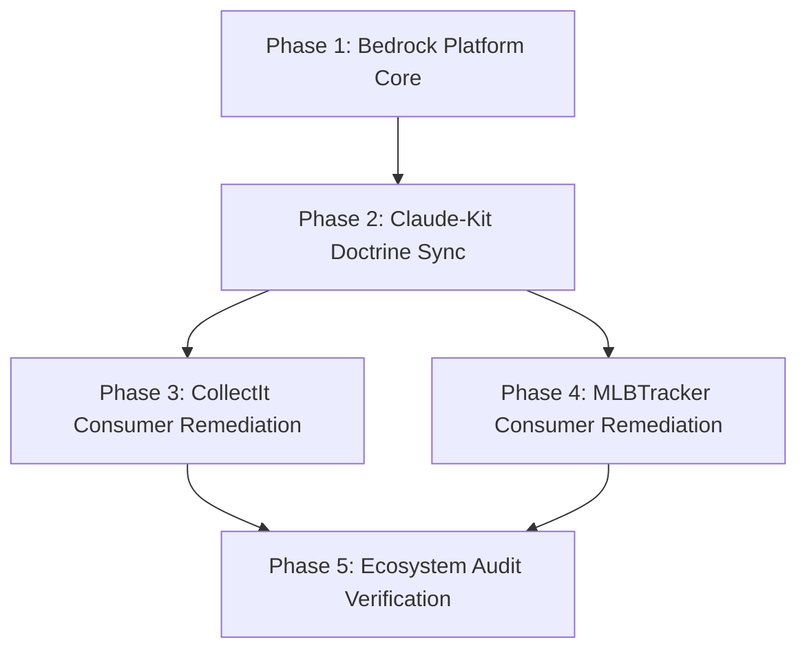

# Cross-Repository Standards, Directory Taxonomy, Kebab-Case File Naming, and Remediation Architecture

**Status**: Approved Architectural Specification
**Date**: 2026-09-12
**Ecosystem Scope**:

- `bedrock` (`C:\Dev\bedrock`) — Platform substrate (`bedrock-api`, `@djntechnic/bedrock-ui`)
- `CollectIt` (`C:\Dev\CollectIt`) — Domain consumer: Collectibles & eBay listing engine
- `MLBTracker` (`C:\Dev\MLBTracker`) — Domain consumer: Baseball analytics & inventory ledger
- `claude-kit` (`C:\Dev\claude-kit`) — Shared doctrine plugins & skill authority
- Global Agent Configurations: `C:\Users\SuperDan\.gemini` & `C:\Users\SuperDan\.claude`

---

## 1. Executive Summary & Core Directives

Across the Bedrock ecosystem, repository file structures, documentation directories, listing templates, and agent configurations have developed organizational drift:

1. **Case & Casing Collision**: UpperCamelCase, PascalCase, mixed snake_case, and filenames containing whitespace (e.g. `Templates/RynoGuy.com Premium eBay Template.html`, `S01_No_Duplicate_UI_Code.md`) conflict with cross-platform CI runners (Linux case-sensitive vs. Windows NTFS case-insensitive).
2. **Directory Taxonomy Inconsistency**: `bedrock` holds loose root docs in `docs/*.md`; `CollectIt` retains deprecated `archive/`, `design/`, `punchlists/`, and PascalCase `Templates/` and `Exports/`; `MLBTracker` maintains older punchlists under `docs/reference/punchlists/`.
3. **Tool Boundary Fragmentation**: Platform maintenance audits (`audit_guidance.py`, `audit_schema_names.py`) have drifted across consumer repos rather than leveraging `bedrock.tools` as the canonical platform engine.
4. **Agent Harness Synchronization Gaps**: Antigravity (`.agents/`) and Claude Code (`.claude/`) subagent definitions, hooks, and skills require explicit synchronization to guarantee uniform quality gating and prevent uncontrolled commits.

This specification defines the canonical cross-repository standard and an automated, idempotent remediation engine.

---

## 2. Strict File Naming Standards & Case Sensitivity Handling

### 2.1 Casing Rules Across File Categories

| File Category                | Allowed Path Pattern                                        | Example Valid Name                                    | Forbidden Anti-Patterns                            | Rationale                                                                                 |
| :--------------------------- | :---------------------------------------------------------- | :---------------------------------------------------- | :------------------------------------------------- | :---------------------------------------------------------------------------------------- | ----------------------- |
| **Documentation**            | `^[a-z0-9-]+(\.[a-z0-9-]+)*\.md$`                           | `docs/standards/s01-no-duplicate-ui-code.md`          | `S01_No_Duplicate_UI_Code.md`, `GRID_BLUEPRINT.md` | Universal cross-platform consistency.                                                     |
| **Listing Templates**        | `^[a-z0-9-]+(\.[a-z0-9-]+)*\.(html\|j2)$`                   | `templates/rynoguy-premium-ebay-template.html`        | `RynoGuy.com Standard eBay Template.html`          | Case-insensitive and web asset standard.                                                  |
| **Config & Metadata**        | `^[a-z0-9_.-]+(\.[a-z0-9_.-]+)*\.(json\|ya?ml\|ini\|toml)$` | `tsconfig.json`, `pytest.ini`, `vite.config.ts`       | Mixed-case configs                                 | System conventions.                                                                       |
| **Python Modules & Scripts** | `^[a-z0-9_]+\.py$`                                          | `scripts/maintenance/audit_taxonomy_and_casing.py`    | `audit-taxonomy.py`, `CleanBranches.py`            | Python `import` and `python -m` require valid Python identifiers (hyphens break imports). |
| **Service & Task Launchers** | `^[a-z0-9_]+\.(bat\|ps1\|cmd\|vbs)$`                        | `scripts/start_dev.bat`, `scripts/clean_branches.bat` | `start-dev.bat`, `StartDev.bat`                    | Matches companion `.py` scripts and preserves Windows Task Scheduler compatibility.       |
| **Agent & Git Hooks**        | `^[a-z0-9-]+\.(sh\|bash)$`                                  | `.claude/hooks/post-edit-check.sh`, `pre-commit.sh`   | `post_edit_check.sh`                               | POSIX hook standards.                                                                     |
| **Console Entry Points**     | `^[a-z0-9-]+$`                                              | `bedrock-healthcheck`, `agy`                          | `bedrock_healthcheck`                              | Universal CLI command convention.                                                         |
| **Data Imports / Fixtures**  | `^(YYYYMMDD-[a-z0-9-]+                                      | [a-z0-9_-]+)\.(csv\|json\|sql)$`                      | `templates/ebay-import-csv/20260912-lots.csv`      | Space-delimited filenames, unversioned batch dumps                                        | Sortable data tracking. |
| **Data Exports / Dumps**     | `^YYYYMMDD-[0-9]{4}-[a-z0-9-]+\.(csv\|json\|sql)$`          | `exports/20260912-1933-njl-file-exchange.csv`         | `Exports/20260902_1933/NJL_FileExchange_lots.csv`  | Chronological sort order.                                                                 |

_Universal Exceptions_: `README.md`, `CLAUDE.md`, and `GEMINI.md` remain uppercase as universal index entry points.

### 2.2 Standards Naming (§S01–§S11)

- On-disk filenames are strictly normalized to lowercase kebab-case: `docs/standards/s<nn>-<kebab-title>.md` (e.g., `s01-no-duplicate-ui-code.md`, `s08-documentation-layout-and-naming.md`).
- Text citations in documentation and source comments normalize to standard format: `§S1` or `§S01` (e.g. `[§S01](s01-no-duplicate-ui-code.md)`).

### 2.3 Windows NTFS Case-Insensitivity Renaming Invariant

Windows NTFS filesystems are case-preserving but case-insensitive. Running `git mv Templates templates` or `git mv S01_... s01-...` on Windows causes index corruption or silent failure because NTFS considers the source and destination paths identical.

**The Two-Stage Staging Invariant (MANDATORY)**:
All renames altering only case MUST proceed through an intermediate temporary stage:

```powershell
# Step 1: Stage to intermediate unique identifier
git mv <SourcePath> <SourcePath>__tmp

# Step 2: Stage from intermediate to target lowercase kebab path
git mv <SourcePath>__tmp <target-path>
```

---

## 3. Unified Directory Taxonomy

### 3.1 The Canonical Six-Folder Documentation Taxonomy

Every documentation file under `docs/` must live in one of exactly six authorized folders:

```
docs/
├── guide/          # User-facing manuals, operational runbooks, API guides
├── reference/      # Durable technical deep dives, architectural notes, schemas
├── standards/      # Non-negotiable engineering contracts (s01 through s11)
├── specs/          # Formal architectural designs (YYYY-MM-DD-<slug>-design.md)
├── plans/          # Execution plans & punchlist plans (YYYY-MM-DD-<slug>-plan.md)
└── project/        # Active, multi-phase scoped initiatives (evicted upon cutover)
```

### 3.2 Relocations & Evictions

1. **`bedrock` Documentation Cleanup**:
   - Move all root docs (`bedrock/docs/*.md`: `app_assembly.md`, `deployment.md`, `extension_points.md`, `mail.md`, `media.md`, `object_storage.md`, `pagination.md`, `platform_guide.md`, `roadmap.md`, `seo.md`) into `docs/reference/`.
   - Relocate `docs/superpowers/specs/*` to `docs/specs/` and `docs/superpowers/plans/*` to `docs/plans/`.
2. **`CollectIt` Directory Restructuring**:
   - `Templates/` -> `templates/` (root-level, kebab-case HTML files).
   - `CollectIt/docs/ebay_templates_csv/` -> `templates/ebay-import-csv/`.
   - `Exports/` -> `exports/` (root-level, gitignored).
   - Evict `docs/punchlists/`, `docs/archive/`, `docs/design/`, and `docs/screenshots/` to untracked `scratch/`.
3. **`MLBTracker` Evictions**:
   - Evict `docs/reference/punchlists/` to untracked `scratch/`.
   - Ensure `scratch/` and `imports/*` remain strictly uncommitted.
4. **The `scratch/` Invariant**:
   - Ephemeral working notes, review packages, test diffs, screenshot captures, and diagnostic scratch scripts live in root `<repo>/scratch/`.
   - `scratch/` is globally gitignored in all repositories. No scratch file may be tracked in git.
5. **Superpowers Plugin Path Alignment (`WorkstationTools`)**:
   - The workstation automation script [`update-superpowers-paths.ps1`](file:///C:/Dev/TheLab/WorkstationTools/SuperpowersUpdates/update-superpowers-paths.ps1) manages plugin path overrides across installed skills (`brainstorming`, `writing-plans`, `executing-plans`, etc.).
   - Configure `-CustomSpecPath "docs/specs"` and `-CustomPlanPath "docs/plans"` (overriding legacy `docs/superpowers/specs` and `docs/superpowers/plans`) so agent skills emit directly into the canonical six-folder taxonomy without requiring post-hoc relocation.

---

## 4. Cross-Repo Tool Boundary & Platform Remediator

### 4.1 Platform Substrate: `bedrock.tools`

Reusable auditing and remediation tooling resides in `packages/bedrock-api/bedrock/tools/`:

```
packages/bedrock-api/bedrock/tools/
├── __init__.py
├── audit_taxonomy_and_casing.py   # [NEW] Canonical validator for naming & docs structure
├── remediate_taxonomy_and_casing.py # [NEW] Automated reference rewriter & two-stage renamer
├── audit_s1_duplicates.py
├── audit_design_tokens.py
├── audit_ledger_freshness.py
├── audit_api_docs.py
└── healthcheck.py
```

### 4.2 Module Contracts

#### `bedrock.tools.audit_taxonomy_and_casing`

Validates:

1. **No Forbidden Directories**: Flags unapproved folders under `docs/` (e.g. `docs/punchlists/`, `docs/archive/`).
2. **Kebab-Case Naming**: Inspects all tracked markdown, templates, configs, and export files against kebab-case regex rules.
3. **Index Parity**: Ensures every folder under `docs/` contains a valid `README.md` index referencing all folder documents.
4. **Exit Codes**: Returns `0` if clean, `1` if violations exist.

#### `bedrock.tools.remediate_taxonomy_and_casing`

Executes an idempotent migration:

1. **Reference Graph Builder**: Scans repository for inbound links to files slated for rename/move (`.md` links, source string references, config paths).
2. **Reference Rewriting**: Rewrites inbound markdown links, Vite paths, and import citations before moving files.
3. **Two-Stage Windows Git Renamer**: Performs NTFS-safe renames via intermediate `__tmp` tags.
4. **Eviction Engine**: Moves deprecated files (`punchlists/`, screenshots) to `scratch/` and updates `.gitignore`.
5. **Self-Verification**: Runs `audit_taxonomy_and_casing` and `audit_guidance` to prove clean status (exit 0).

### 4.3 Consumer Maintenance Wrappers

Consumer repos (`CollectIt`, `MLBTracker`) expose thin delegation scripts in `scripts/maintenance/`:

- `scripts/maintenance/audit_taxonomy_and_casing.py` -> invokes `python -m bedrock.tools.audit_taxonomy_and_casing`.

---

## 5. Agent Guardrails, Subagent Dialects, and Hooks

### 5.1 Global vs. Project-Local Architecture

```
Global Scope (C:\Users\SuperDan\)
├── .gemini/
│   └── antigravity/mcp/
└── .claude/
    ├── settings.json       # Universal security & path guard hooks
    └── hooks/
        └── pre-write-guard.sh # Global hook blocking writes to unapproved roots

Repository / Project-Local Scope (C:\Dev\<repo>\)
├── .antigravityrc          # Autonomous execution permissions & allowed tools
├── .agents/
│   ├── agents/             # NTFS junction/symlink to .claude/agents/
│   └── skills/             # NTFS junction/symlink to claude-kit/plugins/*/skills/
├── .claude/
│   ├── settings.json       # PostToolUse and PreToolUse validators
│   ├── agents/             # Canonical subagent role schemas
│   │   ├── quality-gatekeeper.md
│   │   └── <domain-specialists>.md
│   └── hooks/
│       └── post-edit-check.sh # Pre-flight syntax, secret guard, template linter
```

### 5.2 PreToolUse / PostToolUse Guardrails

Update local `.claude/settings.json` and hooks to enforce:

1. **Pre-Write Casing Block**: Rejects `Write` or `Edit` creating non-kebab-case Markdown or HTML files.
2. **Protected Paths Guard**: Rejects writes directly into `docs/punchlists/`, `docs/archive/`, or outside the workspace.
3. **eBay Template Linter**: Enforces zero `<style>`, `<script>`, or external HTTP links in `templates/*.html`.

### 5.3 `@quality-gatekeeper` Contract

The quality gatekeeper is standardized across `bedrock`, `CollectIt`, and `MLBTracker`:

- **§S05 Zero-Tolerance Defect Contract**: Zero broken tests ship to master.
- **Strict Working Tree Hygiene**: `git status --porcelain` must be 100% empty (no untracked files or scratch data).
- **Direct Exit Code Inspection**: Always verify script exit codes directly (`echo "exit=$?"`).
- **Taxonomy & Casing Compliance**: `audit_taxonomy_and_casing.py` must pass with exit 0 before drafting PR.

---

## 6. Phased Rollout & Staged Migration Plan

The rollout is executed in 4 sequential phases, starting with Bedrock as the platform substrate:



### Phase 1: Bedrock Platform Core

1. Implement `packages/bedrock-api/bedrock/tools/audit_taxonomy_and_casing.py`.
2. Implement `packages/bedrock-api/bedrock/tools/remediate_taxonomy_and_casing.py`.
3. Consolidate `bedrock/docs/*.md` into `bedrock/docs/reference/`.
4. Evict `bedrock/docs/punchlists/` to `scratch/`.
5. Normalize standards naming to lowercase kebab-case (`s01-no-duplicate-ui-code.md` ...).
6. Verify clean working tree and exit code 0; land in `master` and tag release.

### Phase 2: Claude-Kit Doctrine & Skill Authority

1. Update shared doctrine skills (`anti-ui-slop`, `bump-bedrock-pin`, `issue-triage`).
2. Sync `.agents/skills` and `.claude/skills` junctions.
3. Align subagent schemas between `.agents/agents/` and `.claude/agents/`.

### Phase 3: CollectIt Remediation

1. Bump `bedrock-api` and `@djntechnic/bedrock-ui` pins.
2. Run `python -m bedrock.tools.remediate_taxonomy_and_casing` to:
   - Rename `Templates/` -> `templates/` with two-stage NTFS staging.
   - Rename `Exports/` -> `exports/` and verify gitignore.
   - Relocate `docs/ebay_templates_csv/` -> `templates/ebay-import-csv/`.
   - Evict `docs/punchlists/`, `docs/archive/`, `docs/design/` to `scratch/`.
   - Normalize standards to `s01-no-duplicate-ui-code.md` ... `s11-config-driven-navigation.md`.
3. Run `audit_taxonomy_and_casing.py`, `audit_guidance.py`, `audit_ebay_compliance.py`.
4. Commit atomically on feature branch, test, and merge.

### Phase 4: MLBTracker Remediation

1. Bump bedrock pins.
2. Run `python -m bedrock.tools.remediate_taxonomy_and_casing` to:
   - Evict `docs/reference/punchlists/` to `scratch/`.
   - Normalize standards to `s01-no-duplicate-ui-code.md` ... `s11-config-driven-navigation.md`.
3. Update `api/tests/test_repo_hygiene.py` to assert kebab-case standards and docs taxonomy.
4. Commit atomically on feature branch, test, and merge.

### Phase 5: Final Cross-Repo Audit & CI Enshrinement

1. Add `audit_taxonomy_and_casing.py` to CI workflows (`.github/workflows/ci.yml`) in all 3 repos.
2. Run ecosystem-wide verification across `bedrock`, `CollectIt`, and `MLBTracker`.
3. Confirm 100% clean status across all repos.
