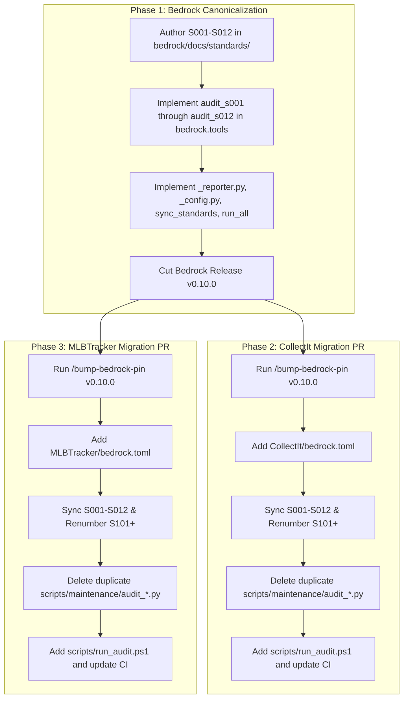

# Ecosystem Standards & Tooling Architecture (S001–S012)

## Canonical Authority, Tooling Harmonization, and Repository Boundaries across `bedrock`, `CollectIt`, and `MLBTracker`

**Document ID**: `SPEC-2026-09-12-ECOSYSTEM-STANDARDS-TOOLING`
**Status**: Approved / Ready for Implementation Plan
**Target Repositories**:

- `C:\Dev\bedrock` (Platform substrate, `@djntechnic/bedrock-ui`, `bedrock-api`)
- `C:\Dev\CollectIt` (Domain consumer: Collectibles & eBay Listing Engine)
- `C:\Dev\MLBTracker` (Domain consumer: Baseball Analytics & Collection Ledger)
  **Authoritative Location**: `C:\Dev\bedrock\docs\specs\2026-09-12-ecosystem-standards-and-tooling-architecture.md`
  **Supersedes**: Ad-hoc, fragmented maintenance scripts in consumer `scripts/maintenance/`

---

## 1. Executive Summary & Core Invariants

### 1.1 The Architectural Problem

`bedrock` was extracted from `CollectIt` and `MLBTracker` to serve as a reusable platform substrate (`bedrock-api` and `@djntechnic/bedrock-ui`). However, the engineering standards (S01–S11) and foundational audit scripts (`audit_grids.py`, `audit_config.py`, `audit_guidance.py`, `audit_schema_names.py`, `audit_targets.py`, `audit_bedrock_pins.py`, `check_claude_md_length.py`) remained duplicated in the consumer repositories.

Over time, this duplication caused:

1. **Silent Drift**: `MLBTracker` developed a 69KB AST-aware version of `audit_grids.py` with diff/fix capabilities, while `CollectIt` stayed on a 19KB baseline.
2. **Fragmented Standards**: Neither consumer's documentation was canonical, and `bedrock` lacked a `docs/standards/` directory altogether.
3. **Inconsistent Quality Gates**: Certain standards were enforced by automated gates in one repo and treated as "review-enforced" in another. Readout formatting, log outputs, and execution mechanics varied wildly.

### 1.2 Core Architectural Invariants

1. **Bedrock as Canonical Authority**: `bedrock` is the single source of truth for platform standards `S001` through `S099`.
2. **3-Digit Padded Taxonomy**:
   - `S001`–`S099`: Reserved strictly for Bedrock platform architectural contracts.
   - `S100`–`S999`: Reserved for application-level domain doctrines (e.g., eBay sanitizer in CollectIt, rankings pipeline in MLBTracker).
3. **1-to-1 Standard to Audit Script Parity**: Every standard `S###` has exactly one corresponding enforcement script named `audit_s###.py`. There are no untracked, unverified, or purely review-enforced platform standards.
4. **Complete Coverage (Zero Gaps)**: Each audit script must verify every single rule, constraint, and invariant defined in its corresponding `S###` standard document.
5. **Zero Outdated/Legacy Baggage**: All legacy workarounds, deprecated checks, and temporary phase-transition logic from past extractions are purged.
6. **Zero Hardcoded Exceptions**: Every tool sources exemptions exclusively through declarative manifests. Platform-level baseline exemptions are formally declared in Bedrock's default configuration, and consumer manifests add domain exemptions on top (concatenated/merged). Every tool manifest section requires an `exemptions` key (even if `exemptions = []`).
7. **Consistent Readout UX & Timing**: Every audit tool emits standardized, high-transparency console reporting: header banner, individual sub-check assertions, microsecond timings, failure summaries, and uniform exit codes.
8. **Declarative Configuration (`bedrock.toml`)**: Tools are strictly application-agnostic, parameterizing paths, symbols, and exemptions through a root `bedrock.toml` manifest.
9. **Generated Consumer Mirror**: Consumers do not modify platform standards; they synchronize a read-only mirror via `python -m bedrock.tools.sync_standards`, checked for drift in CI.
10. **Clean Consumer Boundary**: All duplicated `audit_*.py` scripts in consumer `scripts/maintenance/` are removed, replaced by direct invocations of `bedrock.tools.*` and a standardized `scripts/run_audit.ps1` orchestrator.

---

## 2. Standards Taxonomy & 1-to-1 Audit Tool Parity Review

Every platform contract maps to a dedicated automated tool in `packages/bedrock-api/bedrock/tools/`. Each script is systematically reviewed and architected against four non-negotiable review criteria:

1. **Full Standard Coverage (Zero Gaps)**: Every rule and constraint in the standard markdown is actively audited.
2. **Purged Legacy Checks**: Any outdated, dead, or deprecated checks from earlier phases are purged.
3. **Zero Hardcoded Exceptions**: Every tool sources its exemptions from the configuration manifest.
4. **Additive Exemption Model**: Bedrock defines platform baseline exemptions, and consumers declare additive domain exemptions in `bedrock.toml` (merged additively). Every tool section in `bedrock.toml` must carry an `exemptions = [...]` list.

### 2.1 Audit Tools Comprehensive Review & Invariant Matrix

#### S001 — No Duplicate UI Code

- **Standard Document**: `bedrock/docs/standards/S001_No_Duplicate_UI_Code.md`
- **Audit Tool**: `bedrock.tools.audit_s001_duplicates` (promoted/renamed from `audit_s1_duplicates.py`)
- **Full Coverage Review**:
  1. _Collision scan_: Checks app exports in component/page roots against installed `@djntechnic/bedrock-ui` exports.
  2. _Explicit `@shadows <Name>`_: Requires deliberate override tags; untracked twins fail.
  3. _Single query-keys factory_: Exactly one `export const queryKeys` across the frontend.
  4. _Single route map_: Exactly one `export const API_ROUTES` across the frontend.
  5. _Single HTTP client_: Bans direct `axios` imports across app source outside `apiClient`.
- **Legacy Purge**: Remove old hardcoded component exceptions from early extraction phases.
- **Exemptions Model**:
  - Bedrock baseline: `["default", "props", "Props", "displayName"]`
  - Manifest (`[tool.bedrock.audit.s001]`): `exemptions = []` (merged additively with baseline)

#### S002 — All Grids Wired To Admin Config

- **Standard Document**: `bedrock/docs/standards/S002_All_Grids_Wired_To_Admin_Config.md`
- **Audit Tool**: `bedrock.tools.audit_s002_grids` (promoted from MLBTracker's mature 69KB engine)
- **Full Coverage Review**:
  1. _Migration seed matching_: Every mounted `gridId` matches a seeded `app_grid_settings` row.
  2. _Mounted grid invariant_: Every seeded `app_grid_settings` row is mounted in frontend UI.
  3. _Mandatory gridId_: Every `<DataGrid>` mount provides a non-empty `gridId`.
  4. _Hook layer boundary_: Pages compose hooks; direct `@tanstack/react-query` calls in pages are banned.
  5. _Column labels & grid pages_: `app_grid_column_settings` must have human label overrides, and parent grids declare valid `page` bindings.
  6. _Preview bindings parity_: Every preview-bound grid is registered in `apiPreviewBindings.ts`.
  7. _Field consumption parity_: AST scan verifies `DataGrid` consumed fields match `GridPreview` capabilities.
- **Legacy Purge**: Purge hardcoded table names (`RosterTable`, `PhotosInboxTable`), file paths, and obsolete diff flags from script body.
- **Exemptions Model**:
  - Bedrock baseline: `presentational_tables = []`, `exemptions = []`
  - Manifest (`[tool.bedrock.audit.s002]`):
    ```toml
    presentational_tables = ["PhotosInboxTable"]
    grid_component_paths = ["frontend/src/components/grids"]
    dynamic_grid_ids = {}
    exemptions = []
    ```

#### S003 — Logging Protocol

- **Standard Document**: `bedrock/docs/standards/S003_Logging_Protocol.md`
- **Audit Tool**: `bedrock.tools.audit_s003_logging` (new automated AST/regex gate)
- **Full Coverage Review**:
  1. _Frontend logging_: All client logging imports `log` from `@djntechnic/bedrock-ui`. Bare `console.log/warn/error/info/debug` calls are banned.
  2. _Backend logging_: All Python backend logging imports `logger` from `loguru`. Bare `print()` statements and standard library `logging.getLogger()` are banned.
  3. _Structured event context_: Audit verifies auditable events pass structured keyword arguments rather than string concatenations.
- **Legacy Purge**: Fully replaces subjective review with an automated script.
- **Exemptions Model**:
  - Bedrock baseline: CLI entrypoints and audit tools outputting to stdout/stderr.
  - Manifest (`[tool.bedrock.audit.s003]`):
    ```toml
    exempt_paths = ["scripts/**", "api/cli.py"]
    exemptions = []
    ```

#### S004 — No Hardcoded Config Settings

- **Standard Document**: `bedrock/docs/standards/S004_No_Hardcoded_Config_Settings.md`
- **Audit Tool**: `bedrock.tools.audit_s004_config` (promoted from MLBTracker's 27KB engine)
- **Full Coverage Review**:
  1. _Enum authority_: All settings keys are members of the declared central Settings Enum.
  2. _DB seed parity_: Every declared setting key is seeded in `app_settings` via migrations.
  3. _API boundary_: All config reads go through `db.get_config(key, default)` and writes through `db.set_config(key, val)`.
  4. _No raw env bypasses_: Bypassing DB config via `os.environ` or `process.env` for domain settings is blocked.
- **Legacy Purge**: Purge hardcoded setting enum class names from script source; parameterize via manifest.
- **Exemptions Model**:
  - Bedrock baseline: Operational system environment variables (`["DATABASE_URL", "PORT", "NODE_ENV"]`).
  - Manifest (`[tool.bedrock.audit.s004]`):
    ```toml
    app_config_enum = "api.core.config.AppConfigKey"
    env_exemptions = ["JWT_SECRET", "STORAGE_BUCKET"]
    exemptions = []
    ```

#### S005 — Test Coverage Mandatory

- **Standard Document**: `bedrock/docs/standards/S005_Test_Coverage_Mandatory.md`
- **Audit Tool**: `bedrock.tools.audit_s005_testing` (new automated pre-flight test gate)
- **Full Coverage Review**:
  1. _Structural test pairing_: Production backend routes (`api/routes/*.py`) and frontend feature components must have corresponding `*.test.*` files.
  2. _Zero skip leaks_: AST scan bans `@pytest.mark.skip`, `@pytest.mark.skipif`, `test.skip`, `describe.skip`, and `it.skip` on master.
  3. _Coverage dimensions_: Checks test AST for presence of error/exception assertion patterns, not just happy paths.
- **Legacy Purge**: Replaces human review with automated pre-commit and CI verification.
- **Exemptions Model**:
  - Bedrock baseline: Pure types (`*.d.ts`), migration scripts, and re-export barrel files (`index.ts`).
  - Manifest (`[tool.bedrock.audit.s005]`):
    ```toml
    test_roots = ["tests", "frontend/src"]
    exempt_paths = ["api/core/schema_catalog.py", "frontend/src/types/**"]
    exemptions = []
    ```

#### S006 — Defect Isolation And PR Workflow

- **Standard Document**: `bedrock/docs/standards/S006_Defect_Isolation_And_PR_Workflow.md`
- **Audit Tool**: `bedrock.tools.audit_s006_pr_workflow` (promoted and extended from `audit_ledger_freshness.py`)
- **Full Coverage Review**:
  1. _Ledger freshness_: Reconciles `docs/reference/bedrock_issues_to_file.md` against live GitHub issues (`gh issue list`).
  2. _Branch naming standard_: Validates git branch naming (`feature/*`, `fix/*`, `chore/*`); blocks direct work on `master`.
  3. _Single concern boundary_: Inspects git diff to ensure out-of-scope modifications outside the linked issue scope are flagged.
- **Legacy Purge**: Consolidates separate ledger freshness and branch checking scripts.
- **Exemptions Model**:
  - Bedrock baseline: Release tags and merge commits exempt from branch regex.
  - Manifest (`[tool.bedrock.audit.s006]`):
    ```toml
    ledger_file = "docs/reference/bedrock_issues_to_file.md"
    require_issue_link = true
    exemptions = []
    ```

#### S007 — Schema Catalog

- **Standard Document**: `bedrock/docs/standards/S007_Schema_Catalog.md`
- **Audit Tool**: `bedrock.tools.audit_s007_schema_catalog` (promoted from `audit_schema_names.py`)
- **Full Coverage Review**:
  1. _Catalog import enforcement_: Python and TypeScript queries must import table/view/index names from `schema_catalog.py`.
  2. _Banned bare SQL literals_: Bare string literals for database objects in SQL queries are blocked.
  3. _Catalog freshness check_: Asserts `schema_catalog.py` matches migration schema 1-to-1 (`generate_schema_catalog.py --check`).
- **Legacy Purge**: Remove hardcoded SQLite internal tables from Python regex; source from manifest.
- **Exemptions Model**:
  - Bedrock baseline: `["sqlite_master", "sqlite_sequence", "schema_migrations"]`
  - Manifest (`[tool.bedrock.audit.s007]`):
    ```toml
    schema_catalog_path = "api/core/schema_catalog.py"
    exempt_tables = []
    exemptions = []
    ```

#### S008 — Documentation Layout And Naming

- **Standard Document**: `bedrock/docs/standards/S008_Documentation_Layout_And_Naming.md`
- **Audit Tool**: `bedrock.tools.audit_s008_guidance` (merges `audit_guidance.py` and `check_claude_md_length.py`)
- **Full Coverage Review**:
  1. _Markdown link resolution_: Every relative markdown link resolves to a valid file and anchor.
  2. _Code span path resolution_: Every file/module path cited in backticks resolves on disk (with `@/` Vite resolution).
  3. _CI gate claim veracity_: Heuristic verification that no guidance file calls a blocking CI gate "deferred" or "informational".
  4. _Agent index line ceiling_: Enforces hard ≤200 line limit on `CLAUDE.md` and `GEMINI.md`.
- **Legacy Purge**: Merge separate scripts into one unified audit engine; purge stale transitional gate workarounds.
- **Exemptions Model**:
  - Bedrock baseline: Files marked with `<!-- audit-guidance: historical -->` exempt from link/path checks (never exempt from CI gate claims).
  - Manifest (`[tool.bedrock.audit.s008]`):
    ```toml
    tracked_indices = ["CLAUDE.md", "GEMINI.md"]
    max_index_lines = 200
    exempt_historical_markers = ["<!-- audit-guidance: historical -->"]
    exemptions = []
    ```

#### S009 — Design System

- **Standard Document**: `bedrock/docs/standards/S009_Design_System.md`
- **Audit Tool**: `bedrock.tools.audit_s009_design_tokens` (promoted from `bedrock.tools.audit_design_tokens`)
- **Full Coverage Review**:
  1. _Banned raw color literals_: Inline hex (`#...`), rgb, and hsl literals are banned in UI components and Tailwind classes.
  2. _Token resolution_: UI colors must resolve through `ThemePalette` tokens.
  3. _Design doc parity_: Runtime palette registries must match `.stitch/DESIGN.md` token specifications.
- **Legacy Purge**: Remove hardcoded palette paths from script body.
- **Exemptions Model**:
  - Bedrock baseline: External vendor styling and third-party SVGs with `/* token-exempt */`.
  - Manifest (`[tool.bedrock.audit.s009]`):
    ```toml
    palette_registry = "frontend/src/theme/palettes.ts"
    exempt_files = []
    exemptions = []
    ```

#### S010 — Granular Security Model

- **Standard Document**: `bedrock/docs/standards/S010_Granular_Security_Model.md`
- **Audit Tool**: `bedrock.tools.audit_s010_security` (new automated security gate)
- **Full Coverage Review**:
  1. _Mandatory module & action_: Every backend route and frontend protected route declares a specific module and action.
  2. _Tri-state RBAC evaluation_: Access checks evaluate through `auth_role_modules` and `auth_user_module_overrides`. Deny (`0`) strictly wins over grant (`1`).
  3. _Banned bare role checks_: Direct string checks (`user.role == "admin"`) are blocked.
- **Legacy Purge**: Elevates security enforcement from manual review to automated route AST inspection.
- **Exemptions Model**:
  - Bedrock baseline: Public auth routes (`/api/auth/login`, `/api/auth/refresh`, `/api/healthcheck`).
  - Manifest (`[tool.bedrock.audit.s010]`):
    ```toml
    role_modules_table = "auth_role_modules"
    user_overrides_table = "auth_user_module_overrides"
    public_routes = ["/api/public/*"]
    exemptions = []
    ```

#### S011 — Config-Driven Navigation

- **Standard Document**: `bedrock/docs/standards/S011_Config_Driven_Navigation.md`
- **Audit Tool**: `bedrock.tools.audit_s011_navigation` (merges `audit_navigation.py` and `audit_targets.py`)
- **Full Coverage Review**:
  1. _Registration via `registerNavItems`_: All navigation links in the layout rail must register through `registerNavItems()`.
  2. _Distinct `sort_order`_: Every registered item must have a unique numeric `sort_order`.
  3. _Nav target reachability_: Every `to` path in `registerNavItems`, all explicit `navigate()` calls, and all admin grid `page` configurations must resolve in `App.tsx`.
- **Legacy Purge**: Consolidates separate navigation and target scripts into one canonical engine.
- **Exemptions Model**:
  - Bedrock baseline: External URLs (`http://`, `https://`) and `mailto:` links.
  - Manifest (`[tool.bedrock.audit.s011]`):
    ```toml
    navigation_file = "frontend/src/components/navigation.ts"
    app_routes_file = "frontend/src/App.tsx"
    exempt_routes = []
    exemptions = []
    ```

#### S012 — Dual-Pin Platform Governance

- **Standard Document**: `bedrock/docs/standards/S012_Dual_Pin_Platform_Governance.md`
- **Audit Tool**: `bedrock.tools.audit_s012_pins` (promoted from `audit_bedrock_pins.py`)
- **Full Coverage Review**:
  1. _Dual pin presence_: Both `bedrock-api` and `@djntechnic/bedrock-ui` are present and parseable.
  2. _Release tag format_: Both pins point to a semver release tag (`vMAJOR.MINOR.PATCH`). Branches and bare commit SHAs are banned.
  3. _Lockstep parity_: Both pins reference the exact same tag ref.
  4. _Lockfile clean of overrides_: `package-lock.json` contains no `file:` overrides or local development links.
- **Legacy Purge**: Moves script from consumer root to `bedrock.tools.audit_s012_pins`.
- **Exemptions Model**:
  - Bedrock baseline: None. Dual-pin lockstep on master has zero platform exemptions.
  - Manifest (`[tool.bedrock.audit.s012]`):
    ```toml
    py_package_name = "bedrock-api"
    npm_package_name = "@djntechnic/bedrock-ui"
    exemptions = []
    ```

### Supporting Bedrock Tools

- `bedrock.tools.sync_standards`: Synchronizes `S001` through `S012` from Bedrock into consumer `docs/standards/`. Supports `--check` for CI drift gating.
- `bedrock.tools.run_all`: Orchestrates execution of `audit_s001` through `audit_s012`, summarizing total execution metrics.

---

## 3. Standardized Output UX & Reporting Specification

To eliminate inconsistent log outputs, all `audit_s###.py` tools must inherit or compose the shared Bedrock CLI reporter (`bedrock.tools._reporter.AuditReporter`).

### 3.1 Terminal Output Contract

Every audit script adheres to the following formatting specification:

```text
================================================================================
[AUDIT] S002: All Grids Wired To Admin Config
================================================================================
Target Root:    C:\Dev\CollectIt
Config Manifest: C:\Dev\CollectIt\bedrock.toml
Execution Mode: Full Tree Scan

  [CHECK 1/6] Scanning migration-seeded grids in migrations/...
              Found 14 configured grids. (0.012s)                            [PASS]
  [CHECK 2/6] Inspecting frontend/src/ for <DataGrid> mounts...
              Found 14 mounts matching seeded configurations. (0.045s)        [PASS]
  [CHECK 3/6] Validating gridId prop on all grid component mounts...
              All mounts provide valid, non-empty gridId. (0.008s)           [PASS]
  [CHECK 4/6] Verifying no raw @tanstack/react-query in pages/...
              Clean: all queries managed via hook layer. (0.021s)            [PASS]
  [CHECK 5/6] Inspecting app_grid_column_settings for labels and pages...
              All columns have label overrides and page bindings. (0.014s)   [PASS]
  [CHECK 6/6] Verifying apiPreviewBindings.ts registrations...
              14/14 grids registered for admin preview. (0.005s)             [PASS]

--------------------------------------------------------------------------------
STATUS: PASSED (6/6 checks passing)
ELAPSED: 0.105s
================================================================================
```

### 3.2 Failure Output Contract

On violation, the tool details the exact file, line, violation context, and remediation hint:

```text
  [CHECK 4/6] Verifying no raw @tanstack/react-query in pages/...
              VIOLATION: Direct useQuery import found! (0.022s)              [FAIL]
              --> frontend/src/pages/inventory/InventoryPage.tsx:14
                  import { useQuery } from '@tanstack/react-query';
              HINT: §S002 mandates composing custom hooks (e.g. useInventoryItems)
                    exported from hooks/. Pages may not consume query clients directly.

--------------------------------------------------------------------------------
STATUS: FAILED (5/6 checks passing, 1 violation)
ELAPSED: 0.112s
================================================================================
```

### 3.3 Exit Code Semantics

- `0`: Success (all checks passed clean).
- `1`: Validation Failure (contract violation detected; blocking gate in CI).
- `2`: Environment / Configuration Failure (`bedrock.toml` missing or invalid, syntax error in manifest, missing required dependency).

---

## 4. Declarative Manifest Specification (`bedrock.toml`)

Consumer repositories configure all platform audit tools via a single `bedrock.toml` at the repository root.

### 4.1 Schema Definition

```toml
# ==============================================================================
# Bedrock Platform Configuration Manifest
# Schema: https://github.com/djntechnic/bedrock/schema/bedrock-toml.json
# ==============================================================================

[tool.bedrock]
# Core repository layout paths (relative to repo root)
schema_catalog = "api/core/schema_catalog.py"
frontend_src = "frontend/src"
app_routes = "frontend/src/App.tsx"
navigation_file = "frontend/src/components/navigation.ts"
api_preview_bindings = "frontend/src/api/apiPreviewBindings.ts"
migrations_dir = "migrations"
requirements_file = "requirements.txt"
package_json_file = "frontend/package.json"
package_lock_file = "frontend/package-lock.json"

[tool.bedrock.standards]
standards_dir = "docs/standards"
core_range = "001-099"
domain_range = "100-999"

[tool.bedrock.audit.s001]
allowlist_duplicates = []
exemptions = []

[tool.bedrock.audit.s002]
presentational_tables = []
grid_component_paths = ["frontend/src/components/grids"]
dynamic_grid_ids = {}
exemptions = []

[tool.bedrock.audit.s003]
exempt_paths = ["scripts/**"]
exemptions = []

[tool.bedrock.audit.s004]
app_config_enum = "api.core.config.AppConfigKey"
env_exemptions = ["DATABASE_URL", "PORT"]
exemptions = []

[tool.bedrock.audit.s005]
test_roots = ["tests", "frontend/src"]
banned_decorators = ["pytest.mark.skip", "test.skip"]
exempt_paths = ["frontend/src/types/**"]
exemptions = []

[tool.bedrock.audit.s006]
ledger_file = "docs/reference/bedrock_issues_to_file.md"
require_issue_link = true
exemptions = []

[tool.bedrock.audit.s007]
schema_catalog_path = "api/core/schema_catalog.py"
exempt_tables = []
exemptions = []

[tool.bedrock.audit.s008]
tracked_indices = ["CLAUDE.md", "GEMINI.md"]
max_index_lines = 200
exempt_historical_markers = ["<!-- audit-guidance: historical -->"]
exemptions = []

[tool.bedrock.audit.s009]
palette_registry = "frontend/src/theme/palettes.ts"
exempt_files = []
exemptions = []

[tool.bedrock.audit.s010]
role_modules_table = "auth_role_modules"
user_overrides_table = "auth_user_module_overrides"
public_routes = ["/api/public/*"]
exemptions = []

[tool.bedrock.audit.s011]
navigation_file = "frontend/src/components/navigation.ts"
app_routes_file = "frontend/src/App.tsx"
exempt_routes = []
exemptions = []

[tool.bedrock.audit.s012]
py_package_name = "bedrock-api"
npm_package_name = "@djntechnic/bedrock-ui"
exemptions = []
```

---
## 5. Domain Standards & Consumer Script Partitioning (`scripts/audits/` vs `scripts/maintenance/`)

## 5. Domain Standards & Consumer Maintenance Partitioning
### 5.1 Consumer 1-to-1 Domain Parity (`S100+`)

Just like platform standards in Bedrock, consumer repositories adhere to a strict **1-to-1 parity rule** between domain standards and domain audit scripts:

- Every consumer standard `S###` in `docs/standards/` has exactly one corresponding audit script named `audit_s###.py`.
- Domain standards start at `S101` and use the 3-digit padded convention.
- All domain audit scripts inherit or compose `bedrock.tools._reporter.AuditReporter` to ensure identical readout UX, assertion reporting, timings, and exit codes.

### 5.1 Domain Doctrines (`S100+`)
#### CollectIt Domain Invariant Standards & Audits:

1. `docs/standards/S101_Ebay_Sanitizer_And_Vault.md`
   - **Enforcement Audit**: `scripts/audits/audit_s101_ebay_compliance.py`
   - **Enforced Invariants**: Scans listing description templates and builder outputs for forbidden HTML/JS/CSS injections (`<script>`, `<style>`, `@media`, `http://`), enforces local-first image persistence prior to R2 uploads.
2. `docs/standards/S102_Listing_Engine_Templates_And_Export.md`
   - **Enforcement Audit**: `scripts/audits/audit_s102_listing_templates.py`
   - **Enforced Invariants**: Validates snippet integrity in `Templates/`, ensures placeholder parameters match exporter schema, checks export artifact definitions.

Consumer applications maintain their domain invariants using the identical 3-digit padded convention, starting at `S101`. Domain standards are stored in `docs/standards/` alongside the mirrored platform standards.
#### MLBTracker Domain Invariant Standards & Audits:

1. `docs/standards/S101_Rankings_Pipeline_And_Stat_Invariants.md`
   - **Enforcement Audit**: `scripts/audits/audit_s101_rankings_pipeline.py`
   - **Enforced Invariants**: Validates player rankings pipeline stages, statistical schema boundaries, unranked player fallback rules, and external data feed constraints.
2. `docs/standards/S102_Ledger_Transactions_And_Audit_Trail.md`
   - **Enforcement Audit**: `scripts/audits/audit_s102_ledger_transactions.py`
   - **Enforced Invariants**: Validates double-entry transaction invariants in database tables, historical transaction immutability, and ledger balancing rules.

#### CollectIt Domain Standards:
---

- `docs/standards/S101_Ebay_Sanitizer_And_Vault.md`: eBay description HTML sanitizer, prohibited script/CSS injection, local-first image archiving before R2 upload.
- `docs/standards/S102_Listing_Engine_Templates_And_Export.md`: Single source of truth for template snippets in `Templates/`, variable interpolation contracts.
### 5.2 Strict Subdirectory Partitioning: Audits vs. App Maintenance

To permanently eliminate ambiguity between validation quality gates (blocking CI checks) and operational/developer tasks (ETL, backups, diagnostic tools), consumer scripts are cleanly partitioned into two distinct subdirectories under `scripts/`:

#### MLBTracker Domain Standards:
```text
scripts/
├── audits/                      <-- BLOCKING QUALITY GATES (1:1 with S###)
│   ├── audit_s101_<name>.py     <-- Domain Standard S101 Audit
│   └── audit_s102_<name>.py     <-- Domain Standard S102 Audit
│
├── maintenance/                 <-- OPERATIONAL / REPO MAINTENANCE UTILITIES
│   ├── generate_schema_catalog.py
│   ├── backup_database.py
│   └── ...
│
└── run_audit.ps1                <-- Unified Audit Orchestrator
```

- `docs/standards/S101_Rankings_Pipeline_And_Stat_Invariants.md`: Rules governing player ranking pipelines, statistical data integrity, unranked player fallbacks.
- `docs/standards/S102_Ledger_Transactions_And_Audit_Trail.md`: Ledger double-entry constraints, card acquisition transaction rules.
#### Directory Contracts:

1. `scripts/audits/` (Blocking Quality Gates):
   - Contains **only** automated audit scripts enforcing domain contracts (`audit_s101_*.py`, `audit_s102_*.py`).
   - Every script must follow the standard exit code contract (`0` pass, `1` violation, `2` error) and compose `bedrock.tools._reporter.AuditReporter`.
   - Executed automatically by CI and `scripts/run_audit.ps1`.
   - **No duplicated platform scripts**: All generic platform audits (`audit_s001`–`audit_s012`) live in `bedrock.tools` and are never copied here.

### 5.2 Consumer Maintenance Scripts Cleanup
2. `scripts/maintenance/` (Operational / App Maintenance):
   - Contains operational tools, ETL jobs, database backup/restore scripts, and generation helpers.
   - These scripts are **not** blocking quality gates (they are run manually or via scheduled tasks).

#### Partitioned Script Inventory by Repository:

All duplicated audit tools are deleted from `scripts/maintenance/`. Consumer repos retain strictly domain-specific tools:
**`CollectIt`**:

- `scripts/audits/`:
  - `audit_s101_ebay_compliance.py` (enforces `S101_Ebay_Sanitizer_And_Vault.md`)
  - `audit_s102_listing_templates.py` (enforces `S102_Listing_Engine_Templates_And_Export.md`)
- `scripts/maintenance/`:
  - `generate_ebay_specs.py` (ETL/generator for eBay spec artifacts)
  - `generate_schema_catalog.py` (DB schema introspection utility)

#### `CollectIt/scripts/maintenance/`:
**`MLBTracker`**:

- `scripts/audits/`:
  - `audit_s101_rankings_pipeline.py` (enforces `S101_Rankings_Pipeline_And_Stat_Invariants.md`)
  - `audit_s102_ledger_transactions.py` (enforces `S102_Ledger_Transactions_And_Audit_Trail.md`)
- `scripts/maintenance/`:
  - `generate_schema_catalog.py` (DB schema introspection utility)
  - `download_headshots.py` (operational asset downloader)
  - `run_etl_players.py` (operational data ingestion ETL)
  - `validate_inventory.py` (ad-hoc operational data validator)
  - `purge_inventory.py` (maintenance database purger)
  - `backup_database.py` / `restore_from_backup.py` / `list_backups.py` (backup utilities)
  - `watch_db.py` / `run_diagnostics.py` / `sync_photo_metadata.ps1` (operational helpers)

- `audit_s101_ebay_compliance.py` (renamed to reflect S101 parity)
- `generate_ebay_specs.py`
- `generate_schema_catalog.py`

#### `MLBTracker/scripts/maintenance/`:

- `audit_s101_rankings_pipeline.py` (renamed to reflect S101 parity)
- `download_headshots.py`
- `run_etl_players.py`
- `validate_inventory.py`
- `purge_inventory.py`
- `backup_database.py` / `restore_from_backup.py` / `list_backups.py`
- `generate_schema_catalog.py`

---

## 6. Execution Layer & Developer Experience

### 6.1 PowerShell Unified Orchestrator (`scripts/run_audit.ps1`)

Each consumer repository maintains an identical PowerShell runner `scripts/run_audit.ps1`, shipped as `bedrock/templates/scripts/run_audit.ps1`. `-Platform` and `-Domain` are mutually isolated; no switch runs both:

```powershell
<#
.SYNOPSIS
    Unified Quality Gate and Audit Runner for a bedrock consumer.
.DESCRIPTION
    Dispatches Bedrock Platform Audits (S001-S014, S100) and App-Specific Domain
    Audits (S101+). Each switch selects exactly its own set: -Platform never runs
    domain audits, -Domain never runs platform audits. With no switch, both run.
.PARAMETER All
    Executes both platform audits and domain audits.
.PARAMETER Platform
    Executes platform audits only (bedrock.tools.run_all).
.PARAMETER Domain
    Executes domain audits only (scripts/audit/s1*_audit_*.py).
.PARAMETER Standard
    Executes a single standard (e.g. S011) or domain standard (e.g. S101).
.EXAMPLE
    .\scripts\run_audit.ps1
    .\scripts\run_audit.ps1 -Platform
    .\scripts\run_audit.ps1 -Domain
    .\scripts\run_audit.ps1 -Standard S011
#>
[CmdletBinding()]
param (
    [switch]$All,
    [switch]$Platform,
    [switch]$Domain,
    [string]$Standard
)

$ErrorActionPreference = "Stop"
$VenvPython = "python"

if ($Standard) {
    $stdNum = $Standard.ToUpper().Replace("S", "").PadLeft(3, '0')
    $domainAudits = Get-ChildItem -Path (Join-Path $PSScriptRoot "audit") -Filter "s${stdNum}_audit_*.py" -ErrorAction SilentlyContinue
    if ($domainAudits) {
        & $VenvPython $domainAudits[0].FullName --root .
        exit $LASTEXITCODE
    }

    $module = & $VenvPython -c "import pkgutil, bedrock.tools; prefix = 's$stdNum' + '_audit_'; mods = [m.name for m in pkgutil.iter_modules(bedrock.tools.__path__) if m.name.startswith(prefix)]; print(mods[0] if mods else '')"
    if ($module) {
        & $VenvPython -m "bedrock.tools.$module" --root .
        exit $LASTEXITCODE
    }
    Write-Error "Unknown standard: $Standard"
    exit 2
}

if (-not $Platform -and -not $Domain -and -not $All) {
    $All = $true
}

if ($All) {
    $Platform = $true
    $Domain = $true
}

$Failed = $false

if ($Platform) {
    Write-Host "==> Running Platform Audits (bedrock.tools.run_all)..." -ForegroundColor Cyan
    & $VenvPython -m bedrock.tools.run_all --root .
    if ($LASTEXITCODE -ne 0) {
        $Failed = $true
    }
}

if ($Domain) {
    Write-Host "==> Running Domain Audits..." -ForegroundColor Cyan
    $domainScripts = @(Get-ChildItem -Path (Join-Path $PSScriptRoot "audit") -Filter "s1*_audit_*.py" -ErrorAction SilentlyContinue)
    if ($domainScripts.Count -eq 0) {
        Write-Host "==> No domain audit scripts found under scripts/audit/. Skipping." -ForegroundColor Yellow
    } else {
        foreach ($script in $domainScripts) {
            Write-Host "==> Executing $($script.Name)" -ForegroundColor Cyan
            & $VenvPython $script.FullName --root .
            if ($LASTEXITCODE -ne 0) {
                $Failed = $true
            }
        }
    }
}

if ($Failed) {
    Write-Host "==> Audit failed." -ForegroundColor Red
    exit 1
}

Write-Host "==> All requested audits passed." -ForegroundColor Green
exit 0
```

### 6.2 CI Workflow Integration (`.github/workflows/ci.yml`)

The `consistency` job across all repositories converges to:

```yaml
jobs:
  consistency:
    name: Repo Consistency & Bedrock Standards
    runs-on: ubuntu-latest
    steps:
      - uses: actions/checkout@v4
      - name: Set up Python
        uses: actions/setup-python@v5
        with:
          python-version: "3.11"
          cache: pip
      - name: Install dependencies
        run: pip install -r requirements.txt
      - name: Verify Standards Mirror Drift (S001-S012)
        run: python -m bedrock.tools.sync_standards --check
      - name: Execute Bedrock Platform Audits (S001-S012)
        run: python -m bedrock.tools.run_all
      - name: Execute Domain Audits (S100+)
        run: |
          for audit in scripts/audits/audit_s1*.py; do
            if [ -f "$audit" ]; then
              python "$audit"
            fi
          done
```

---

## 7. Phased Multi-Repository Migration Plan



### Phase 1: `bedrock` Core Release (`v0.10.0`)

1. Create `bedrock/docs/standards/` containing `S001` through `S012`.
2. Extract the unified `_reporter.py` (UX formatting, execution timings, assertion printers).
3. Extract `_config.py` (reads `bedrock.toml` with sane platform defaults).
4. Implement `audit_s001_duplicates` through `audit_s012_pins`.
5. Implement `sync_standards.py` and `run_all.py`.
6. Tag commit as `v0.10.0` and push release tag.

### Phase 2: `CollectIt` Migration PR

1. Trigger `/bump-bedrock-pin v0.10.0`.
2. Commit `CollectIt/bedrock.toml`.
3. Run `python -m bedrock.tools.sync_standards` to populate mirrored `S001`–`S012`.
4. Renumber domain standards (`S101_Ebay_Sanitizer_And_Vault.md`, `S102_Listing_Engine_Templates_And_Export.md`).
5. Delete duplicate `scripts/maintenance/audit_*.py` files.
6. Renumber `audit_ebay_compliance.py` to `audit_s101_ebay_compliance.py`.
7. Add `scripts/run_audit.ps1`.
8. Update `.github/workflows/ci.yml`, `CLAUDE.md`, and `GEMINI.md`.
9. Verify all gates pass and merge PR.
6. Create `scripts/audits/` and move/renumber domain audits:
   - `scripts/audits/audit_s101_ebay_compliance.py`
   - `scripts/audits/audit_s102_listing_templates.py`
7. Ensure operational utilities (`generate_ebay_specs.py`, `generate_schema_catalog.py`) remain in `scripts/maintenance/`.
8. Add `scripts/run_audit.ps1`.
9. Update `.github/workflows/ci.yml`, `CLAUDE.md`, and `GEMINI.md`.
10. Verify all gates pass and merge PR.

### Phase 3: `MLBTracker` Migration PR

1. Trigger `/bump-bedrock-pin v0.10.0`.
2. Commit `MLBTracker/bedrock.toml`.
3. Run `python -m bedrock.tools.sync_standards` to populate mirrored `S001`–`S012`.
4. Renumber domain standards (`S101_Rankings_Pipeline_And_Stat_Invariants.md`, `S102_Ledger_Transactions_And_Audit_Trail.md`).
5. Delete duplicate `scripts/maintenance/audit_*.py` files.
6. Add `scripts/run_audit.ps1`.
7. Update `.github/workflows/ci.yml`, `CLAUDE.md`, and `GEMINI.md`.
8. Verify all gates pass and merge PR.
6. Create `scripts/audits/` and move/renumber domain audits:
   - `scripts/audits/audit_s101_rankings_pipeline.py`
   - `scripts/audits/audit_s102_ledger_transactions.py`
7. Ensure operational utilities (ETL, backup, diagnostics, headshots) remain in `scripts/maintenance/`.
8. Add `scripts/run_audit.ps1`.
9. Update `.github/workflows/ci.yml`, `CLAUDE.md`, and `GEMINI.md`.
10. Verify all gates pass and merge PR.

---

## 8. Verification & Acceptance Criteria

1. **Zero Duplicate Platform Scripts**: `git status` in `CollectIt` and `MLBTracker` shows zero non-domain `audit_*.py` scripts under `scripts/maintenance/`.
2. **Deterministic Standards Mirroring**: Running `python -m bedrock.tools.sync_standards --check` in CI exits `0` when synchronized and `1` on drift or local modification.
3. **Execution Transparency**: Running `.\scripts\run_audit.ps1 -All` reports check-by-check progress with execution times for every standard `S001` through `S012`.
4. **Dual-Pin Lockstep Integrity**: `audit_s012_pins` passes across all repositories, validating that `bedrock-api` and `@djntechnic/bedrock-ui` remain pinned to identical release tags.
5. **Zero Hardcoded Exceptions**: Code audits across all `bedrock.tools.audit_s*` confirm zero hardcoded table, route, component, or config lists; all exemptions are supplied via `bedrock.toml` merged additively with bedrock default baselines.
1. **Zero Duplicate Platform Scripts**: `git status` in `CollectIt` and `MLBTracker` shows zero platform `audit_*.py` scripts under `scripts/`.
2. **Strict Script Partitioning**: In consumer repos, `scripts/audits/` contains strictly quality-gate audit scripts (1:1 with `S101+`), while `scripts/maintenance/` contains strictly operational utilities.
3. **Deterministic Standards Mirroring**: Running `python -m bedrock.tools.sync_standards --check` in CI exits `0` when synchronized and `1` on drift or local modification.
4. **Execution Transparency**: Running `.\scripts\run_audit.ps1 -All` reports check-by-check progress with execution times for every standard `S001` through `S012` plus domain audits.
5. **Dual-Pin Lockstep Integrity**: `audit_s012_pins` passes across all repositories, validating that `bedrock-api` and `@djntechnic/bedrock-ui` remain pinned to identical release tags.
6. **Zero Hardcoded Exceptions**: Code audits across all `bedrock.tools.audit_s*` confirm zero hardcoded table, route, component, or config lists; all exemptions are supplied via `bedrock.toml` merged additively with bedrock default baselines.
