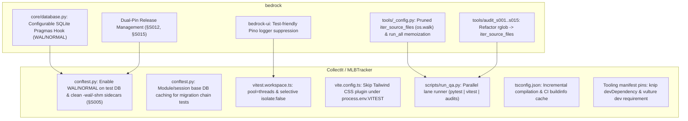

# QA Performance and Harness Acceleration Architecture Design

- **Status:** Approved
- **Date:** 2026-09-24
- **Scope:** Bedrock Platform (`bedrock-api`, `@djntechnic/bedrock-ui`, `bedrock.tools`) & Downstream Domain Guidance (`CollectIt`, `MLBTracker`)
- **Author:** Antigravity / Pair Architecture

---

## 1. Context & Motivation

Profiling `run_qa.py --mode full` across consumer repositories revealed that the end-to-end QA harness takes **~336 seconds (~5.6 minutes)** on standard 8-core workstations:

| Phase | Duration | Primary Bottleneck |
|---|---|---|
| `pytest` | **164 s (49%)** | SQLite default `DELETE` journal + `synchronous=FULL` costs **12.96 ms/commit** (fsync on NTFS). 43% of runtime is spent in fixture setup/teardown. |
| `vitest` | **132 s (39%)** | Fork isolation creates fresh jsdom instances per file; Tailwind CSS plugin transforms run in test environment; long-tail monoliths (e.g. `CsvImportSheet.test.tsx` at ~30s). |
| `bedrock.tools.run_all` | **24.3 s (7%)** | 21 unpruned `Path.rglob()` walks traverse `node_modules`, `.venv`, and `.git` (visiting 34,336 entries repeatedly instead of ~800 authored files). |
| Harness Orchestration | — | Sequential execution of independent test/audit suites; duplicate audits between `run_qa.py` and `run_audit.ps1`. |

Benchmarking with an experimental probe confirmed that injecting `PRAGMA journal_mode=WAL` and `PRAGMA synchronous=NORMAL` cuts pytest commit overhead to **0.04 ms/commit**, reducing pytest runtime from **161.6 s to 81.9 s** with zero test modifications. Furthermore, pruned directory traversal reduces single filesystem walks from **935 ms to 14 ms**.

This specification defines the platform-level primitives in `bedrock` required to unlock these gains cleanly, and establishes the blueprint for consumer domains (`CollectIt`, `MLBTracker`) to execute downstream optimizations.

---

## 2. Platform vs. Domain Responsibility Matrix

Per Bedrock standards §S001 and §S100, platform logic belongs strictly in `bedrock`, while test orchestration, application-specific fixtures, and domain suites reside in consumer repositories.



---

## 3. Platform Architecture (`bedrock`)

### 3.1 SQLite Pragmas & Durability Hook (`bedrock.core.database`)

#### Problem
`DatabaseManager._create_sqlite_connection` currently hardcodes only `foreign_keys = ON;` and `busy_timeout`. It lacks any mechanism to configure SQLite pragmas. In test harnesses where ACID guarantees against power loss are unnecessary, SQLite's default `DELETE` journaling and `FULL` synchronous disk flushing dominate runtime.

#### Architecture
1. **Configurable Settings:**
   - In `bedrock.core.config`, introduce:
     ```python
     SQLITE_PRAGMAS: dict[str, str | int] = {}
     ```
   - Support environment variable override via `BEDROCK_SQLITE_PRAGMAS` (e.g. JSON string `{"journal_mode": "WAL", "synchronous": "NORMAL"}` or delimited key-values `journal_mode=WAL,synchronous=NORMAL`).
2. **Whitelist Validation:**
   To guarantee safety against arbitrary SQL injection, pragmas are strictly validated against an allowed set:
   ```python
   ALLOWED_SQLITE_PRAGMAS: frozenset[str] = frozenset({
       "journal_mode",
       "synchronous",
       "cache_size",
       "temp_store",
       "mmap_size",
       "locking_mode",
       "wal_autocheckpoint",
   })
   ```
3. **DatabaseManager API:**
   - `DatabaseManager.__init__(..., sqlite_pragmas: dict[str, str | int] | None = None)` accepts instance-level pragmas, falling back to `config.SQLITE_PRAGMAS`.
   - `DatabaseManager.configure_sqlite_pragmas(pragmas: dict[str, str | int]) -> None` allows test harnesses (such as `conftest.py` session setup) to reconfigure or inject pragmas into subsequent connections created on that instance.
4. **Execution in `_create_sqlite_connection`:**
   After establishing `sqlite3.connect` and applying `foreign_keys` and `busy_timeout`, apply configured pragmas:
   ```python
   for pragma, val in self._sqlite_pragmas.items():
       norm_pragma = pragma.strip().lower()
       if norm_pragma in ALLOWED_SQLITE_PRAGMAS:
           # Validate value contains only alphanumeric characters or underscores
           norm_val = str(val).strip()
           if re.match(r"^[A-Za-z0-9_-]+$", norm_val):
               conn.execute(f"PRAGMA {norm_pragma} = {norm_val};")
   ```
5. **Sidecar Awareness:**
   Ensure `DatabaseManager` utilities and test fixtures are aware of SQLite `-wal` and `-shm` sidecar files created next to WAL databases when cleaning up or verifying paths.

---

### 3.2 Pruned File Traversal & Audit Memoization (`bedrock.tools`)

#### Problem
`bedrock.tools._config` defines `DEFAULT_IGNORED_DIRS` (`.venv`, `node_modules`, `.git`, etc.), but audits call `Path.rglob()` and filter matching files *after* traversing every ignored directory. On typical projects, 34,000+ files are walked per audit. With 15+ audits run sequentially in `run_all.py`, this wastes ~18 seconds of CPU and disk I/O.

#### Architecture
1. **Centralized Directory Walker (`bedrock.tools._config.iter_source_files`):**
   ```python
   def iter_source_files(
       root: Path,
       suffixes: tuple[str, ...],
       include_assets: bool = False,
   ) -> list[Path]:
       """Traverse root using os.walk, pruning ignored directories in-place."""
       ignored = set(DEFAULT_IGNORED_DIRS)
       if not include_assets:
           ignored.update(DATA_ASSET_DIRS)
       
       norm_suffixes = tuple(s.lower() for s in suffixes)
       matched: list[Path] = []
       
       for dirpath, dirnames, filenames in os.walk(root):
           dirnames[:] = [d for d in dirnames if d not in ignored]
           for f in filenames:
               if f.lower().endswith(norm_suffixes):
                   matched.append(Path(dirpath) / f)
       return matched
   ```
2. **In-Process Inventory & Manifest Cache (`run_all.py`):**
   - Add `@functools.lru_cache(maxsize=16)` for `load_config(root: Path)`.
   - Provide a shared, memoized file inventory cache during a single `run_all` process invocation so subsequent audits requesting `(".py",)` or `(".ts", ".tsx")` avoid re-walking the directory tree.
3. **Refactoring Audit Modules:**
   - Migrate `audit_s001.py` through `audit_s015.py` to source candidate files from `iter_source_files()` rather than calling `.rglob()` locally.
   - **Contract Invariant (§S001–§S015):** The set of evaluated files and the generated violation messages must match byte-for-byte with prior baseline outputs.

---

### 3.3 Test Logger Quiet Mode (`@djntechnic/bedrock-ui`)

#### Problem
Pino emits newline-delimited JSON logs to stdout during test executions, creating I/O contention in Node workers and generating noisy test outputs.

#### Architecture
1. **Automatic Test Detection:**
   In `@djntechnic/bedrock-ui` logger initialization:
   ```typescript
   const isTestEnv = typeof process !== 'undefined' && 
     (process.env.NODE_ENV === 'test' || Boolean(process.env.VITEST));
   ```
2. **Exposed Log Level Controls:**
   Provide `setLogLevel(level: LogLevel)` export, allowing test setup (`src/test/setup.ts`) to programmatically quiet logging during test suites while retaining debug capability when specifically needed.

---

## 4. Consumer Domain Architecture (Downstream Blueprint)

Once Bedrock platform changes land and are pinned (§S012), consumer domains (`CollectIt`, `MLBTracker`) apply the following optimizations:

### 4.1 Test Harness & Fixtures (`api/tests/conftest.py`)
1. **Session Pragma Configuration:**
   Inject `{"journal_mode": "WAL", "synchronous": "NORMAL"}` into the test `DatabaseManager` during session fixture setup.
2. **Teardown Guard Hardening (§S005):**
   Extend the database teardown guard to clean up `-wal` and `-shm` sidecars alongside the temporary database file, while verifying that the path is not the production database.
3. **Migration DB Caching:**
   Pre-generate migration baseline databases (e.g. for `test_migration_024`) once per session or module in a temporary location with `synchronous=OFF`, copying the snapshot to each test's `tmp_path` instead of re-running migration chains from scratch.
4. **Auth Fixture Optimization:**
   Cache `default_test_entity` at the session scope to eliminate redundant pandas SQL queries during per-test autouse fixtures.

### 4.2 Frontend Throughput (`frontend/`)
1. **Vitest Thread Pool:**
   Configure `pool: "threads"` in `vite.config.ts` / `vitest.workspace.ts`.
2. **Selective Isolation:**
   Set `isolate: false` for projects with no mutable shared state (`hooks-and-state`, `platform-contracts`).
3. **Tailwind Transform Bypass:**
   Skip Tailwind CSS Vite plugin when `process.env.VITEST` is present.
4. **Long-tail Test Decomposition:**
   Split `CsvImportSheet.test.tsx` (30s) and `StudioPage.test.tsx` into smaller, parallelizable test files. Replace slow `*ByRole` accessible-name computations with label/testid lookups in hot rendering loops.
5. **Coverage Rectification (§S005):**
   Include orphaned theme test files (`src/theme/**`) into the active Vitest workspace projects.

### 4.3 Parallel Lane Runner (`scripts/run_qa.py`)
Replace sequential step execution with 3 concurrent lanes:
- **Lane A (Backend):** `pytest` (single-core/disk-bound).
- **Lane B (Frontend):** `vitest` (capped at 6 workers) -> `tsc -b --noEmit` -> `knip`.
- **Lane C (Audits):** `python -m bedrock.tools.run_all` + domain audits (`s101..s103`).

Output is buffered per lane and printed cleanly upon lane completion. The orchestrator returns the worst exit code across all lanes.

### 4.4 Tooling & Dependencies
1. **Incremental Type-Checking:**
   Add `"incremental": true` to `tsconfig.app.json` and `tsconfig.node.json`, caching `.tsbuildinfo` in CI.
2. **Deterministic Manifests:**
   Pin `knip` as a devDependency in `package.json` and declare `vulture` in dev requirements.
3. **Evaluated Dependencies:**
   - `happy-dom`: Prototype for DOM-light projects (`hooks-and-state`).
   - `pytest-xdist`: Evaluate for parallel backend tests using isolated per-worker SQLite temporary directories.

---

## 5. Granular Test Execution Performance Telemetry (Behind the Scenes)

### 5.1 Objective & Behavior
To detect regressions immediately and track performance optimizations over time, the test harness must capture granular start, end, and duration metrics for **every individual test** (both backend and frontend) without adding overhead or polluting stdout.
- **Silent Execution:** Telemetry is gathered automatically behind the scenes during `run_qa.py` and local test invocations.
- **Single Overwriting Artifact:** Telemetry writes to `scratch/performance/test-execution-profile.json` (git-ignored), overwriting the previous run on each execution.
- **Zero Human Overhead:** No flags required for everyday runs; developers and agents inspect the generated JSON when diagnosing regressions.

### 5.2 Telemetry Artifact Schema
```json
{
  "metadata": {
    "timestamp": "2026-09-24T06:50:00Z",
    "git_commit": "d4b525a",
    "branch": "feat/qa-performance-platform-acceleration",
    "run_mode": "full",
    "total_wall_clock_ms": 115420
  },
  "summary": {
    "total_tests": 2661,
    "passed": 2660,
    "failed": 0,
    "skipped": 1,
    "slowest_outliers": [
      {
        "id": "frontend/src/components/bulk/CsvImportSheet.test.tsx > CsvImportSheet > Step 1",
        "duration_ms": 7240,
        "suite": "frontend"
      },
      {
        "id": "api/tests/test_migration_024.py::test_seed_legacy_rows",
        "duration_ms": 5310,
        "suite": "backend"
      }
    ]
  },
  "tests": [
    {
      "id": "api/tests/test_listing.py::test_create_listing",
      "suite": "backend",
      "file": "api/tests/test_listing.py",
      "status": "passed",
      "start_epoch_ms": 1790243400120,
      "end_epoch_ms": 1790243400145,
      "duration_ms": 25.4,
      "phases": {
        "setup_ms": 1.2,
        "call_ms": 23.8,
        "teardown_ms": 0.4
      }
    }
  ]
}
```

### 5.3 Backend (Pytest) Telemetry Collector (`bedrock.tools.pytest_timings`)
1. **Lightweight Built-in Pytest Plugin:**
   - Lives in `bedrock-api` under `packages/bedrock-api/bedrock/tools/pytest_timings.py`.
   - Hooks into:
     - `pytest_runtest_protocol`: Records high-precision wall timestamps (`time.perf_counter_ns()`).
     - `pytest_runtest_makereport`: Extracts per-phase setup, call, and teardown durations and status (`passed`, `failed`, `skipped`).
     - `pytest_sessionfinish`: Dumps structured backend test metrics to `.qa-perf/backend-raw.json`.
   - Enabled seamlessly by default in `run_qa.py` via `-p bedrock.tools.pytest_timings` or `pytest.ini`.

### 5.4 Frontend (Vitest) Telemetry Collector
1. **Vitest JSON Reporter Integration:**
   - `vitest run --reporter=json --outputFile=.qa-perf/frontend-raw.json`.
   - Vitest captures individual `task.result.startTime`, `duration`, and pass/fail state across all workspace projects.

### 5.5 Harness Consolidation (`scripts/run_qa.py`)
1. At the completion of any test tier (`fast`, `scoped`, `full`), `run_qa.py` calls an internal telemetry synthesizer:
   - Ingests `.qa-perf/backend-raw.json` and `.qa-perf/frontend-raw.json`.
   - Normalizes timestamps, calculates suite statistics, and ranks the top 20 slowest tests.
   - Atomically overwrites `scratch/performance/test-execution-profile.json`.
   - Automatically cleans up intermediate `.qa-perf/` raw files.

---

## 6. Verification & Testing Strategy

### Platform Level (`bedrock`)
1. **Unit Tests:**
   - `packages/bedrock-api/tests/test_database.py`: Test pragma whitelist filtering, syntax validation, environment variable parsing, and execution on SQLite connections.
   - `packages/bedrock-api/tests/test_tools_config.py`: Test `iter_source_files` pruning of `.venv`, `node_modules`, `.git`, handling of `DATA_ASSET_DIRS`, and suffix matching.
   - `packages/bedrock-api/tests/test_pytest_timings.py`: Test telemetry hook records start/end timestamps and phase durations without failing tests.
2. **Audit Parity:**
   Run `python -m bedrock.tools.run_all` on `bedrock` before and after the refactor to prove exact violation parity (0 behavioral drift).
3. **Speed Benchmarking:**
   Measure `run_all` execution time before (~24s) and after (~5-6s).

### Release & Downstream Hand-off (§S012, §S015)
1. Prepare CHANGELOG entry following required section ordering:
   - `Added / Changed`: Configurable SQLite pragmas hook in `bedrock.core.database`; pruned file walker `iter_source_files` in `bedrock.tools._config`; granular test execution telemetry plugin in `bedrock.tools.pytest_timings`.
   - `Platform Maintenance`: Memoized file inventory in `run_all`; test logging silence hook in `bedrock-ui`.
2. Bump versions in `packages/bedrock-api/pyproject.toml` and `packages/bedrock-ui/package.json`.
3. Tag the release and proceed with `/bump-bedrock-pin` in consumer repositories.

