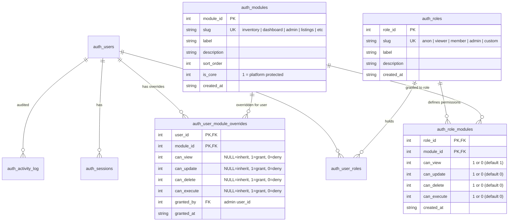

# Design Specification: Granular Security Model & Admin Management Hub

- **Date:** 2026-08-28
- **Status:** Approved for Implementation
- **Target Systems:** `djntechnic/bedrock` (Platform), `djntechnic/MLBTracker`, `djntechnic/CollectIt`

---

## 1. Executive Summary & Core Requirements

This specification establishes a robust, granular authorization engine and administrative management system across the Bedrock platform. 

### Key Capabilities
1. **Dual-Axis Capability Matrix**:
   - **Modules (`auth_modules`)**: Define functional domain boundaries and licensing feature sets (e.g. `dashboard`, `inventory`, `leaderboards`, `listings`, `admin`, `health`).
   - **Roles (`auth_roles`)**: Define user privilege tiers (`anon`, `viewer`, `member`, `admin`, plus custom dynamic roles).
   - **Granular Actions**: Four fundamental action flags per module: `can_view`, `can_update`, `can_delete`, and `can_execute`.
2. **Tri-State User Overrides**:
   - Per-user overrides in `auth_user_module_overrides` supporting `NULL` (inherit from role), `1` (force grant), and `0` (force deny) per action flag.
3. **Dynamic Role Support**:
   - System allows creation of arbitrary roles (e.g. `collector`, `analyst`, `seller`) purely through database configuration with zero Python code changes required.
4. **Navigation & Screen-Level Protection**:
   - Menu items for unauthorized pages are completely hidden from navigation menus and command palettes when a user lacks the required permission.
   - Unauthorized direct URL navigation renders an in-place `<PermissionDenied>` visual guard without leaking data.
5. **Full Admin Security Management Hub**:
   - Interactive Role $\times$ Module Permissions Matrix editor.
   - User account role assignments and granular user overrides drawer.
   - Module registry manager.
   - Read-only **Compiled User Access Profile Inspector** showing the complete computed permission tree per user.
   - Security activity log with IP address tracking for both authenticated and anonymous attempts.

---

## 2. Architecture & Data Model

### 2.1 Entity Relationship Diagram



### 2.2 Schema Definitions

```sql
-- Migration 005_granular_security_model.sql

-- 1. Ensure auth_roles supports description column
ALTER TABLE auth_roles ADD COLUMN description TEXT;

-- 2. Granular capability matrix for roles
CREATE TABLE IF NOT EXISTS auth_role_modules_new (
    role_id     INTEGER NOT NULL REFERENCES auth_roles(role_id) ON DELETE CASCADE,
    module_id   INTEGER NOT NULL REFERENCES auth_modules(module_id) ON DELETE CASCADE,
    can_view    INTEGER NOT NULL DEFAULT 1,
    can_update  INTEGER NOT NULL DEFAULT 0,
    can_delete  INTEGER NOT NULL DEFAULT 0,
    can_execute INTEGER NOT NULL DEFAULT 0,
    created_at  TEXT    NOT NULL DEFAULT (datetime('now')),
    PRIMARY KEY (role_id, module_id)
);

INSERT INTO auth_role_modules_new (role_id, module_id, can_view, can_update, can_delete, can_execute)
SELECT role_id, module_id, 1, 0, 0, 0 FROM auth_role_modules;

DROP TABLE auth_role_modules;
ALTER TABLE auth_role_modules_new RENAME TO auth_role_modules;

-- 3. Granular tri-state user overrides
CREATE TABLE IF NOT EXISTS auth_user_module_overrides_new (
    user_id     INTEGER NOT NULL REFERENCES auth_users(user_id) ON DELETE CASCADE,
    module_id   INTEGER NOT NULL REFERENCES auth_modules(module_id) ON DELETE CASCADE,
    can_view    INTEGER,  -- NULL=inherit, 1=grant, 0=deny
    can_update  INTEGER,
    can_delete  INTEGER,
    can_execute INTEGER,
    granted_by  INTEGER REFERENCES auth_users(user_id),
    granted_at  TEXT    NOT NULL DEFAULT (datetime('now')),
    PRIMARY KEY (user_id, module_id)
);

INSERT INTO auth_user_module_overrides_new (user_id, module_id, can_view, granted_by, granted_at)
SELECT user_id, module_id, granted, granted_by, granted_at FROM auth_user_module_overrides;

DROP TABLE auth_user_module_overrides;
ALTER TABLE auth_user_module_overrides_new RENAME TO auth_user_module_overrides;
```

---

## 3. Backend Implementation (`bedrock-api`)

### 3.1 Permission Resolution Logic (`security_service.py`)

A user's effective permissions map is computed as follows:
```python
def resolve_user_permissions(user_id: int | None, *, is_superuser: bool = False) -> dict[str, dict[str, bool]]:
    """
    Returns mapping of { module_slug: { 'view': bool, 'update': bool, 'delete': bool, 'execute': bool } }.
    - If is_superuser or holds 'admin' role: all registered modules have True for all 4 actions.
    - If user_id is None (anonymous): evaluates the 'anon' role's auth_role_modules.
    - Otherwise:
        1. Base capabilities = Bitwise OR across all roles assigned in auth_user_roles.
        2. Apply non-null overrides from auth_user_module_overrides.
    """
```

### 3.2 FastAPI Authorization Dependency (`dependencies.py`)

```python
ActionType = Literal["view", "update", "delete", "execute"]

def require_permission(
    module: str,
    action: ActionType = "view",
    *,
    allow_anon: bool = False,
):
    """
    FastAPI endpoint dependency.
    Raises 401 if unauthenticated and not allowed anon.
    Raises 403 with structured JSON envelope if action capability is missing.
    Logs denials to auth_activity_log with actor IP.
    """
```

### 3.3 Security API Endpoints (`routes/security.py`)

| Method | Path | Access | Description |
| :--- | :--- | :--- | :--- |
| `GET` | `/api/v1/security/me` | Public | Return caller's compiled permissions map & roles |
| `GET` | `/api/v1/security/roles` | Admin | List all roles, descriptions, and assigned user counts |
| `POST` | `/api/v1/security/roles` | Admin | Create custom application role |
| `PATCH` | `/api/v1/security/roles/{role_id}` | Admin | Update role label/description |
| `DELETE` | `/api/v1/security/roles/{role_id}` | Admin | Delete custom role (core roles protected) |
| `GET` | `/api/v1/security/matrix` | Admin | Full Roles $\times$ Modules capability matrix |
| `PUT` | `/api/v1/security/matrix` | Admin | Bulk-update capabilities for (role, module) |
| `GET` | `/api/v1/security/modules` | Admin | List all registered modules & core flags |
| `POST` | `/api/v1/security/modules` | Admin | Register/update domain module metadata |
| `GET` | `/api/v1/security/users/{user_id}/profile` | Admin / Self | Compiled read-only access profile breakdown |
| `PUT` | `/api/v1/security/users/{user_id}/roles` | Admin | Update assigned roles for a user |
| `PUT` | `/api/v1/security/users/{user_id}/overrides`| Admin | Bulk-update tri-state granular overrides |

---

## 4. Frontend Platform Contract (`@djntechnic/bedrock-ui`)

### 4.1 React Security Hook (`useSecurity.ts`)

```typescript
export interface ModulePermissions {
  view: boolean;
  update: boolean;
  delete: boolean;
  execute: boolean;
}

export interface SecurityContext {
  authenticated: boolean;
  roles: string[];
  permissions: Record<string, ModulePermissions>;
  can: (module: string, action?: "view" | "update" | "delete" | "execute") => boolean;
  hasRole: (role: string) => boolean;
  isAdmin: boolean;
  isLoading: boolean;
}
```

### 4.2 Navigation Tree & Rail Gating (`navRegistry.ts` & `AppSidebar.tsx`)

- `NavItem` and `SubItem` include `module` and `action` fields (`action` defaults to `"view"`).
- `isNavItemVisible(item)` logic:
  - If `item.role` is set and caller lacks the role $\to$ `false` (hidden).
  - If `item.module` is set and `can(item.module, item.action ?? "view")` is false $\to$ `false` (**completely hidden from sidebar and command palette**).
  - If a parent item's children are all hidden and parent itself is unauthorized $\to$ parent is hidden.

### 4.3 Route Guard (`ProtectedRoute.tsx`)

- Validates authentication state, roles, and granular action requirements.
- If unauthorized for direct navigation, renders `<PermissionDenied module={module} action={action} />` in place of page content.

### 4.4 In-Page UI Guards (`<Can>` and `<PermissionButton>`)

- `<Can module="inventory" action="update">` conditionally mounts UI elements.
- `<PermissionButton module="inventory" action="execute">` renders buttons disabled with descriptive tooltips when permission is absent.

---

## 5. Admin Security UI Hub Specifications

The Bedrock Admin Console provides 4 dedicated panels:

1. **Role Permissions Matrix Panel (`RoleMatrixPanel.tsx`)**:
   - Interactive grid of Modules (rows) $\times$ Roles (columns).
   - 4-way toggle buttons `[V] [U] [D] [E]` per cell.
   - `+ Add Custom Role` modal for creating dynamic application roles without code changes.
   - Protected `admin` column.
2. **User Accounts & Permissions Panel (`UsersSecurityPanel.tsx`)**:
   - User account list with role tags, activation toggle, and session revoker.
   - **Granular User Overrides Drawer (`UserPermissionsDrawer.tsx`)**:
     - Tri-state toggles: `Inherit (Role Default)` / `Force Grant` / `Force Deny`.
     - Live effective permission indicator badges.
3. **Compiled User Access Profile Inspector (`UserAccessProfileView.tsx`)**:
   - Read-only inspection dialog showing every registered screen and route with `ALLOWED` / `DENIED` status and the underlying reason (Role vs. User Override vs. Public).
   - Also embedded on `/profile` for self-service transparency.
4. **Module Registry Panel (`ModulesPanel.tsx`)**:
   - Overview of domain and core modules, descriptions, sort orders, and licensing flags.
5. **Security Log & IP Tracker (`SecurityLogViewer.tsx`)**:
   - Stream of security events capturing `event_type`, `actor_ip` (resolving proxies), `user_agent`, `path`, and target resource.

---

## 6. Downstream Consumer Integration Patterns

### 6.1 MLBTracker Integration
- Register modules in migrations: `dashboard`, `leaderboards`, `rankings`, `trends`, `players`, `inventory`.
- `navigation.ts`: Tag pages with `action="view"` (default), set submissions with `action="update"`, imports with `action="execute"`.
- Backend endpoints: Apply `dependencies=[require_permission("inventory", "execute")]` on import/sync endpoints.

### 6.2 CollectIt Integration
- Register modules in migrations: `dashboard`, `listings`, `photos`, `vault`, `export`, `templates`, `libraries`.
- `navigation.ts`: Tag `/export` with `action="execute"`, `/templates` with `action="update"`, etc.
- Backend endpoints: Apply `dependencies=[require_permission("listings", "update")]` on item edits.

---

## 7. Error Handling, Logging & Security Auditing

- **401 Unauthorized**: Intercepted by `apiClient`; redirects to `/login` preserving target path.
- **403 Forbidden**: Returns structured error envelope; triggers toast notification for actions or renders `<PermissionDenied>` for page routes.
- **Audit Logging**: Every permission denial, role change, matrix update, and user override mutation is logged to `auth_activity_log` with IP address and user-agent context.
- **Anonymous Tracking**: Public access and failed attempts by unauthenticated users log `user_id = NULL` with real client IP from `X-Forwarded-For`.

---

## 8. Testing & Verification Plan

1. **Unit & Matrix Tests (`test_security_service.py`)**:
   - Multi-role union resolution.
   - Tri-state override precedence (`NULL`, `1`, `0`).
   - Superuser and admin bypass rules.
   - Anonymous role permissions.
2. **API Endpoint Tests (`test_security_routes.py`)**:
   - Role creation, matrix update, user override endpoints.
   - 401/403 status code and error payload validation.
   - Denied access audit logging verification.
3. **Frontend Component & Hook Tests (`useSecurity.test.ts`, `ProtectedRoute.test.tsx`, `navRegistry.test.ts`)**:
   - Menu item hiding when `can_view = false`.
   - Route guard blocking unauthorized navigation.
   - Role matrix panel batch updates.
4. **End-to-End Consumer Verification**:
   - Test MLBTracker and CollectIt with multi-user personas (Reader, Importer, Full Admin) verifying navigation visibility and API gating.
